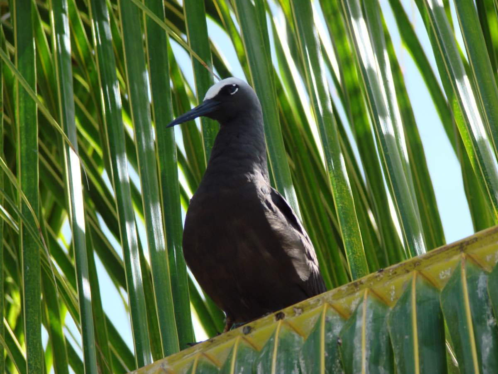
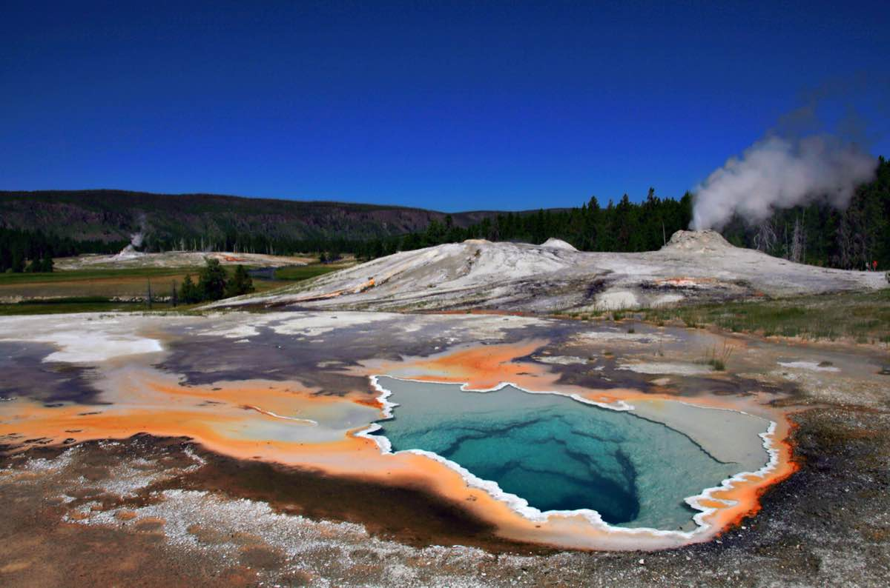

# Hi!

Welcome to the first lab for ENVX2001! Before we start, make sure you have access to [the latest versions](https://posit.co/downloads/) of R and RStudio.

This lab has three sections. Between each section, we suggest you take a short break. Step outside, have a drink, stretch your legs. The material is easier to work through when you give yourself a few minutes to reset between parts.

To complete the exercises, create a new Quarto document (`.qmd`) in RStudio. Copy the code from this page into code chunks in your document, add your own notes and answers, and render regularly to check your work.

You will come across two types of tasks in this lab. **Worked Examples** have solutions you can expand and check straight away. **Exercises** do not — solutions for these will be posted on Friday evening.

## Learning Outcomes

In this lab, we will learn how to:

1.  Explain the differences between (i) samples and populations (ii) standard error and standard deviation;
2.  Use R to perform basic data analysis tasks related to exploratory data analysis
3.  Present your code and results using Quarto.

## Specific goals

By the end of this lab, you should be able to:

-   [ ] Calculate means, medians, and standard deviations
-   [ ] Understand the difference between sample statistics and population parameters
-   [ ] Read external data files (csv, xlsx) into R
-   [ ] Subset and organise data using `[,]` and `$`
-   [ ] Create graphs using `ggplot2`

## Preparation

Your demonstrators will begin with a short presentation. You may also want to read the abstract of this article beforehand: [MacNulty et al., 2025](https://doi.org/10.1016/j.gecco.2025.e03899).

### Downloads

| File | Used in | Download |
|---|---|---|
| `browsing_data_2003_2020_2.csv` | Section 2 | [Download](data/browsing_data_2003_2020_2.csv) |
| `water.xlsx` | Section 3 | [Download](data/water.xlsx) |

Save both files into a folder called `data` inside your project folder. The code in this lab expects to find them at `data/browsing_data_2003_2020_2.csv` and `data/water.xlsx`. If you saved the files somewhere else, you will need to adjust the file paths in the code.

### Packages

This lab uses three packages. Run the following line **in your console** (not your script) to install any you are missing:

```r
install.packages(c("readr", "readxl", "ggplot2"))
```

If a package is already installed, R will simply reinstall it — no harm done.

<!-- ### A Note on Generative AI (GenAI)

GenAI is a powerful tool that can help you learn and understand the concepts we cover in ENVX2001. However, for the first six weeks of this course, we ask that you please refrain from asking GenAI for help.

There are two crucial skills we want to help you develop this semester:

-   Problem solving tenacity
-   Statistical intuition

In our experience, these skills are best learned without the help of AI. In weeks 7-12, when we introduce more complex statistical concepts, is where GenAI can really help. -->

# 1. Organising Data (~30 min)

## Blue Sea Stars

*The following exercise involves a fabricated story and simulated data*


A marine scientist (we will call her Stella) is studying benthic invertebrates on Lady Elliot Island, and notices that the blue sea stars (*Linckia laevigata*) from this island seem to be smaller than those in other parts of the Great Barrier Reef. She wonders if her eyes are deceiving her.

To get to the bottom of this, she collects 16 sea stars from Lady Elliot Island and measures one random arm from each of them to the nearest 0.1 cm. She knows that the typical length of a blue sea star's arm is around 11.5 cm [@thomson1982].

##
::: {.question}
### Exercise 1

Find out where Lady Elliot Island is located on a map. Why might the sea stars there be different in size to sea stars from other parts of the Great Barrier Reef? It is always a good idea to think about the context behind our data before we analyse it.
:::

:::: {.content-visible when-profile="solution"}
::: {.ans}
#### Food for thought

Lady Elliot Island marks the southern end of the Great Barrier Reef. According to a study by Thomson and Thompson (1982), blue sea stars shrink noticeably within a week of low food availability. The same study also notes that larger sea stars of this species tend to live in deeper waters.

It may be the case that the reefs of Lady Elliot Island are especially shallow. It could also be that there is less food for sea stars on Lady Elliot Island because it is so isolated from the rest of the Great Barrier Reef. We will leave you to look further into this topic if you are interested.
:::
::::

Here is the data Stella gathers. **Expand the block below, copy the code into your Quarto document, and run it** to load the data into R:


```{r}
stars <- c(
  10.3, 11.0, 10.5, 10.0, 11.3, 14.5, 13.0, 12.1, 12.1,
  9.4, 11.3, 12.0, 11.5, 9.3, 10.1, 7.6
)
```


Notice that we use the `c()` function to specify a data *vector*. A vector is a collection of similar objects; in this case, numbers.

To make it easier to recall this vector, we can give it the name '`stars`' using the `<-` symbol. Now, if we ever want to recall this list of numbers again, we can do so easily:


```{r}
stars # recalls Stella's data
```


The `#` symbol is used to make a *comment*. Comments are very useful, and you should get into the habit of including them in your code.

##
::: {.question}
### Exercise 2

Make a code chunk. You can do this using the **+C** button at the top of your RStudio screen (or with the shortcut `Ctrl+Alt+I` / `Cmd+Option+I` on Mac).

Type in the following lines of code:

```r
mean(c(1,2,3,4,5))

median(c(0,0,1,45,459,2,49,1))
```

And describe what each of them do using comments.
:::

:::: {.content-visible when-profile="solution"}
::: {.ans}
#### Food for thought

This is how we would have done it:

```{r}
mean(c(1,2,3,4,5)) # takes the average of 1,2,3,4,and 5

median(c(0,0,1,45,459,2,49,1)) # finds the median in the sequence: 0,0,1,1,2,45,49,459
```

Notice that the comments do not show up in your outputs. This is because the \# tells R not to read them as code.

Comments are not only great to help other people understand your code, but also to remind yourself of what you did at a later date. The \# key is your friend.
:::
::::

To find the average arm length of Stella's sea stars, we can use the `mean()` function:

```{r}
mean(stars) # Notice that instead of re-typing our data, we can recall it using the name we gave it earlier: 'stars'.
```

::: callout-tip
The average is not the only summary statistic we can calculate; here are some others:

```{r}
median(stars) # Median - the middle number in Stella's data
sd(stars) # Standard deviation - the spread of Stella's data
```
:::

The `summary()` function can give you many different summary statistics at once:

```{r}
summary(stars) # Also gives you the 1st and 3rd quartiles, minimum value, and maximum value
```

That is a lot of functions to remember. Do not worry, you can always ask R for help by typing `?` followed by a function name into your console (e.g. `?mean`).

::: {.column-margin}
Your console is the window at the bottom of the screen.
:::



## Even More Sea Stars

Stella tells her friends about her study, and they all decide to visit Lady Elliot Island to help her collect more samples. Here are the datasets that each of Stella's friends collects. **Expand the block below, copy the code into your document, and run it** to load the data into R:

::: {.callout-note collapse="true"}
### Data collected by Stella's friends

```{r}
stars_1 <- c(
  11.3, 15.0, 9.5, 10.0, 11.0, 11.2, 12.2, 8.5, 9.1, 9.5,
  11.4, 12.4, 13.0, 8.3, 11.0, 12.5
)
stars_2 <- c(
  14.0, 11.5, 6.5, 9.1, 9.3, 15.0, 11.0, 9.2, 12.7, 8.5,
  11.8, 8.8, 8.3, 9.1, 11.6, 14.0
)
stars_3 <- c(
  9.5, 12.3, 13.6, 8.2, 15.8, 7.7, 10.1, 11.3, 11.5, 12.9,
  10.1, 8.3, 7.5, 8.9, 9.1, 10.0
)
stars_4 <- c(
  10.0, 12.1, 16.0, 8.0, 11.3, 14.0, 12.0, 13.5, 10.1,
  10.5, 10.8, 9.1, 14.3, 9.0, 15.5, 8.5
)
stars_5 <- c(
  7.0, 8.5, 10.5, 7.1, 11.3, 9.0, 9.5, 12.1, 8.0, 9.3,
  10.9, 7.3, 8.5, 9.0, 8.1, 12.4
)
```
:::

##

::: {.question}
### Worked Example 1

Find the mean and standard deviation for each of these datasets.
:::

::: {.callout-tip collapse="true"}
### Solution

Apply the `mean()` and `sd()` functions to each dataset individually. For example:

```{r}
mean(stars_1)
sd(stars_1)

mean(stars_2)
sd(stars_2)
```

Repeat this for `stars_3`, `stars_4`, and `stars_5`. When you have many datasets, this process can become tedious! We will show you shortcuts in the coming weeks.
:::

What do we have here? Another collection of numbers? We can make a vector out of them!

##
::: {.question}
### Worked Example 2

Make a vector that contains the means of each of Stella and her friends' datasets.

Name this vector `stars_means`.

:::

::: {.column-margin}
Your vector should have 6 entries - one for the mean of Stella's own dataset `stars`, and one for the means of each of her friends' datasets `stars_1`, `stars_2`, etc.
:::

::: {.callout-tip collapse="true"}
### Solution

We can use the `c()` function to create our vector:

```{r}
stars_means <- c(
  mean(stars_1), mean(stars_2), mean(stars_3),
  mean(stars_4), mean(stars_5), mean(stars)
)
# The entries of this vector might look strange, but they are really just individual numbers; mean(stars_1) is a number, and so is mean(stars_2), etc.
```

Whenever you want to store a collection of numbers, you can make them into a vector. These vectors will stay under R's 'environment' tab (at the top right of your screen).
:::

Now we can see what our new vector looks like:

```{r}
stars_means # A vector with 6 entries.
```

We have just created a brand new dataset out of six pre-existing ones. Now we can find out more about it. What is its mean and standard deviation?

##

::: {.question}
### Worked Example 3

Calculate the mean and standard deviation of `stars_means`. How do these values compare to the mean and standard deviation of Stella's original dataset, `stars`?
:::

::: {.callout-tip collapse="true"}
### Solution

Because `stars_means` is a vector, we can apply the `mean()` and `sd()` functions to it:

```{r}
mean(stars_means) # The average value of stars_means
sd(stars_means) # The standard deviation of stars_means
```

Notice that `stars_means` has a very similar average to `stars` (10.6 vs 11), but a much smaller standard deviation (0.77 vs 1.62).
:::

The more friends Stella invites, and the more samples they gather, the smaller the standard deviation of `stars_means` will become.

The mean of Stella's original dataset, `stars`, is called the **sample mean**, and the standard deviation of `stars` is called the **sample standard deviation**.

The mean of our new dataset, `stars_means`, is called the **average of the sample means**, and the standard deviation of `stars_means` is an estimate of the **standard error** in Stella's data.

Depending on how many friends Stella has, and how many sea stars each of them measures, the average of the sample means may serve as a good estimate of the **population mean** (i.e. the true average arm length of all the blue sea stars on Lady Elliot Island, if we could measure each and every one of them). If Stella had hundreds of friends, `stars_means` would have hundreds of entries, and its mean would approach the true population mean while its standard deviation approaches the true standard error.

Stella was very lucky. In reality, we will not always have hundreds of friends (or even five) to help us collect additional data. Because of this, we often need to *approximate* the population mean and standard error based on a limited number of samples. We can do this using the following equations:

$$ \bar{X} \approx \mu $$ $$SE \approx \frac{s}{\sqrt{n}}$$

Where $\bar{X}$ is the sample mean, $\mu$ is the population mean, $SE$ is the true standard error, $s$ is the sample standard deviation, and $n$ is the sample size (how many sea stars Stella measured).

## Section Summary

So, what did Stella find? Were the blue sea stars of Lady Elliot Island really smaller than blue sea stars elsewhere? To answer that question, we need to carry out a statistical test.

We will learn how to answer this question using a one-sample *t*-test next week. Once you have learned the method, come back and try it on Stella's data.

Before we move onto the next section, now is a good time to take a 5-minute break.

# 2. Handling Complexity (~25 min)

## Yellowstone

*The following case study involves real data from @hobbs2024, which was used by Ripple et al. (2025) in their analysis*


A study by Ripple et al. (2025) found new evidence to support the already popular idea that wolves are a keystone species in Yellowstone National Park. By modelling the rate of willow regrowth before and after wolves were reintroduced to the park, Ripple and his team found that the wolves had an enormous, positive effect on the park's ecosystem [@ripple2025].

However, Ripple's study was criticized by another group of scientists; Daniel MacNulty and his team argued that Ripple's methods were flawed, and that while the wolves of Yellowstone National Park may have caused a weak trophic cascade in some areas of the park, this effect was not nearly as strong or as universal as Ripple had claimed [@macnulty2025].




### Read in data

The data from Hobbs et al. (2024) is stored in a csv file. To read it into R, we need to use the `readr` package (which you installed during Preparation). We will activate it now:

```{r}
library(readr) # activates the readr package
```

::: {.column-margin}
`readr` is also included in the `tidyverse` package.
:::

Now, we can read in our data using the function `read_csv()`:

```{r}
#| message: false
# we will name this dataset 'Yellowstone'
Yellowstone <- read_csv("data/browsing_data_2003_2020_2.csv")
```

##

::: {.question}
### Exercise 3

Use the `str()` function to check the structure of the `Yellowstone` dataset. What types of data does it contain?
:::

:::: {.content-visible when-profile="solution"}
::: {.ans}
#### Food for thought

This is what we did:

```{r}
str(Yellowstone)
```

Notice that words come up as `chr`, which stands for 'character'. Characters cannot be analysed statistically - they must first be converted into either numbers or factors.

In this case, we are not interested in running statistics; so we are fine to leave the characters as they are.
:::
::::

This dataset is the original one produced by Hobbs and his research team in 2024 from 21 control sites and 16 experimental sites.

However, when Ripple's team re-analysed the same dataset one year later, they did not include all 37 sites. Instead, for unknown reasons, they only chose 4 out of 16 experimental sites to study.

One of the major criticisms leveled at Ripple by MacNulty et al. (2025) was that such an odd choice of study sites jeopardised the validity of the rest of the study.

To see why MacNulty thought this, we will try to replicate Ripple's study design with our own dataset.

First, we have to remove all the sites in our dataset that Ripple excluded from his study. The code for this is a little bit tricky, so we will go through it step-by-step.

Here is a list of all the sites that Ripple excluded:

::: {.callout-note collapse="true"}
### Sites that Ripple excluded

```{r}
sites_excluded <- c(
  'wb-dx','wb-dc','wb-cx',
  'elk-dx','elk-dc','elk-cx',
  'eb2-dx','eb2-dc','eb2-cx',
  'eb1-dx','eb1-dc','eb1-cx'
) # Notice that this is a vector. We are used to seeing vectors with numbers by now, but we are also allowed to make vectors with characters.
```
:::

The challenge is to remove all of these sites from our dataset.

To do this, we can use the `[,]` operator. This operator lets you select specific rows and columns from a dataset — put the row selection before the comma `[*,]` and the column selection after it `[,*]`. Leave either side blank to select all rows or all columns.

##

::: {.question}
### Exercise 4

i)  Select the first row of the `Yellowstone` dataset.
ii) Select the first five rows of the `Yellowstone` dataset.
:::

:::: {.content-visible when-profile="solution"}
::: {.ans}
#### Solution

For part i), apply the `[,]` function directly:

```{r}
Yellowstone[1,] # selects the first row in the dataset
```

Part ii) is a bit more difficult. We need to use the `:` operator to select rows 1 to 5 before applying `[,]`:

```{r}
Yellowstone[1:5,] # selects rows 1 to 5 in the dataset
```
:::
::::

You can also use the operator `$` to select a specific column by name. For example, `Yellowstone$site_full` pulls out the `site_full` column as a vector. This is handy when you need to filter rows based on a column's values.

To select rows by name, combine `$` with `==` to match a specific value. For example, to select all the rows from the site "crescent-obs":

```{r}
head(Yellowstone[Yellowstone$site_full =="crescent-obs",])
```

We first have to specify `Yellowstone$site_full`, because `site_full` is the column that lists all the site names. Then, we use `==` to match the name `crescent-obs`.

::: {.column-margin}
The `head()` function limits R's output to the first few rows. You can omit it if you want to see the full list of results.
:::

Now, we do a little bit of coding magic and invoke the `%in%` function to pick out multiple row names at once.

:::{.callout-note collapse="true"}
#### Selecting all excluded sites
```{r}
head(Yellowstone[Yellowstone$site_full %in% sites_excluded,])
```
The `%in% sites_excluded` part picks out every site whose name matches the `sites_excluded` vector we made earlier.

Again, `head` is just to limit the number of rows R displays.
:::

Phew! That is the hard part done. All that is left is to use the `!` operator to tell R that we want to *exclude* these sites, not include them, and then give our new dataset a name.

```{r}
# remove rows and rename as 'Yellowstone_1'
Yellowstone_1 <- Yellowstone[!Yellowstone$site_full %in% sites_excluded, ]
```

### Visualising the study design

Ripple claims that his study occurred across 25 sites from 2001 to 2020. We will make a line graph to see how often each of these 25 sites were actually surveyed.

To do this, we will use the `ggplot2` package — a popular tool for creating graphs in R. We will explore `ggplot2` in much more depth in section 3, but for now, here is the basic template:

```{r}
library(ggplot2)
```

```r
ggplot(data_name, aes(x = column1, y = column2)) +
  geom_line()
```

`ggplot()` sets up the graph with your data and axes, and `geom_line()` draws lines. You can swap `geom_line()` for other geom types like `geom_point()` — we will cover these in section 3.

##

::: {.question}
### Exercise 5
Using the template above, make a line graph of the `Yellowstone_1` dataset with `year` on the x-axis and `site_full` on the y-axis.

What do you notice about the times each of these sites were surveyed?
:::

:::: {.content-visible when-profile="solution"}
::: {.ans}
#### Solution
Here is what we did:
```{r}
ggplot(Yellowstone_1, aes(x = year, y = site_full))+
  geom_line()+
  geom_point()+
  theme_classic() # Note that we added a scatter plot using geom_point() to see the timing of the surveys even more clearly. Each point is one survey.
```
While it is true that Ripple used survey data from 25 sites, only 4 of these sites had records tracing back to 2001. This means that most sites in Ripple's study did not have a reliable baseline to compare against. For a supposed 'before-after' study, Ripple was missing a lot of 'before' sites.
:::
::::

Ripple describes how willows in 2020 were, on average, twice as tall as they were in 2001; but the willows from 2020 were not the same as the ones from 2001, because new sites were added in between! While Ripple's study spanned 20 years in principle, the bulk of his evidence really only spanned 13 years in practice (from 2008 to 2020).

Before we move on, now is a good time to take a 5-minute break.

# 3. Making Graphs (~30 min)

## Water Chemistry

*The following exercise involves real data from @lovett2000*


In the year 2000, Gary Lovett and his research team measured water chemistry in the streams of the Catskill Mountains. They were concerned that growing levels of industrial activity in the area may affect surrounding forests, and they needed a way to keep track of pollutant levels in the environment.

For this exercise, we will focus on sulphates. It is worth noting that Lovett's original study focused on nitrates instead.

### Reading data

Unlike Stella's data, which we could type directly into R, Lovett's data is stored in a separate Excel file. We need the `readxl` package (also installed during Preparation) to read it:

```{r}
library(readxl) # Activates the package 'readxl'
water <- read_excel("data/water.xlsx") # Reads the file 'water.xlsx' into R as a table

# Note that we renamed this table 'water' using the <- operator.
```

::: {.column-margin}
A good way to organise your data is to keep it close to your script. Wherever you save your qmd file, make sure your data is also saved in the same folder.
:::

##

::: {.question}
### Exercise 6

After reading the data, it is good practice to verify that everything has been imported correctly. Use the `str()` function to check the structure of your new dataset, `water`.
:::

:::: {.content-visible when-profile="solution"}
::: {.ans}
#### Food for thought

This is what we found:

```{r}
str(water) # Checks the structure of the dataset named 'water'
```

Note:

"tibble" means R recognises your data as a table.

"\$ SO4" means SO4 is a column in this table. If there were other columns, each of them would have a "\$" in front as well.

"num" means R recognises the SO4 column as numeric.

"\[1:39\]" means there are 39 entries in the SO4 column.
:::
::::

### Subsetting data

Subsetting means keeping some parts of your data while excluding others. For example, we may want to keep a specific column, or remove a specific row.

We already used the `[,]` operator in section 2 to filter the Yellowstone data. We will practise on a smaller dataset. As a reminder: put the row selection before the comma `[*,]` and the column selection after it `[,*]`.

##
::: {.question}
### Exercise 7

i)  Use the `[,]` operator to select the third row and first column of the `water` dataset.

ii) Use the `[,]` operator to select the ninth row of the `water` dataset.

iii) Use the `[,]` operator to select the first column of the `water` dataset.
:::

:::: {.content-visible when-profile="solution"}
::: {.ans}
#### Food for thought

This is what we did:

i)

```{r}
water[3, 1] # Third row, first column
```

ii)

```{r}
water[9,] # Ninth row
```

iii)

```{r}
water[,1] # First column
```
:::
::::

Remember the `$` operator from section 2? We can use it here too, to select columns by name:

```{r}
water$SO4 # Selects the column named 'SO4'
```

Notice that we went from a table to a collection of numbers (recall that a collection of numbers is called a numerical *vector*).

You can apply functions to these numbers, as you would to any other numerical vector. For example, we can find out their median value:

```{r}
median(water$SO4) # The median value of column SO4
```

##

::: {.question}
### Exercise 8

Summary statistics are a great way to quickly make sense of your data.

Use the `summary()` function on column SO4. Do you think the values in this column are symmetrically distributed?
:::

:::: {.content-visible when-profile="solution"}
::: {.ans}
#### Food for thought

```{r}
summary(water$SO4) # summary statistics for the SO4 column.
```

The median and mean are very similar, so the distribution is probably close to symmetrical.

*Note that if the mean is greater than the median, the distribution would be right-skewed, and if the mean is less than the median, the distribution would be left-skewed.*
:::
::::


## Now You See Me

In section 2, we used `ggplot2` to make a quick line graph. Now we will explore this package properly. `ggplot2` is based on the [grammar of graphics](https://www.tandfonline.com/doi/abs/10.1198/jcgs.2009.07098) (as if the grammar of English was not enough), which you can look into in your own time.

We already have `ggplot2` loaded, but there are other ways to create graphs in R. We recommend `ggplot2` because it is flexible and intuitive.

::: {.column-margin}
If you started a fresh R session since section 2, you may need to reload `ggplot2` by running `library(ggplot2)` again.
:::

### Basically Yo-Chi

`ggplot2` is very similar to Yo-Chi (a frozen yoghurt shop where you build your own cup — pick a base, choose flavours, add toppings). Really, it is. What is the first thing you do at a Yo-Chi? You grab a cup. We will grab one:

##

::: {.question}
### Worked Example 4

The basic template for `ggplot2` is:

```r
ggplot(data = _, aes(x = _, y = _)) + 
  geom_()
```

Think of this as an empty cup. You can put things into it.

The argument `data =` tells R which dataset to reference (in this case, we will use `water`).

The `x =` and `y =` arguments specify which column we want to use as our x values, and which column we want to use as our y values. Play around with different columns here, and see what you find.

The argument `geom_()` tells R the type of graph you want. Here are some options you can try: `geom_boxplot()`, `geom_line()`, `geom_point()`.

Make a few different graphs from the `water` dataset, and pick your favourite one!
:::

::: {.callout-tip collapse="true"}
### Solution

These are the graphs we made; just plain yoghurt (signature tart) for now:

```{r}
ggplot(data = water,
       aes(x = Creek_Formally_Named, y = SO4)) +
  geom_boxplot() +
  theme_classic() # Box plot (we added a 'classic' theme to erase the grey background)

ggplot(data = water,
       aes(x = NO3, y = SO4)) +
  geom_line() +
  theme_classic() # Line plot (cool, but hard to interpret!)

ggplot(data = water,
       aes(x = NO3, y = SO4)) +
  geom_point() +
  theme_classic() # Scatter plot (good for plotting two continuous variables against each other)
```

Did you come up with something different?
:::

::: {.column-margin}
To keep your code neat, hit 'enter' after each `+` sign. This starts a new, indented line and prevents overcrowding.
:::

### Choose your flavour

We can customise our Yo- I mean our graphs by colour-coding them. To do this, we take our basic template and add the arguments `colour =` and `fill =` into the `geom_()` bracket:

```r
ggplot(data = _, aes(x = _, y = _)) +
  geom_(colour = _, fill = _)
```

##
::: {.question}
#### Worked Example 5

Take your favourite graph from before, and turn it into a different colour. Simple options you can try include: `colour = 'red'`,`colour = 'lightblue'`, `fill = 'grey'`, etc. Name a colour, and it probably exists. For any other colours, look up their [HEX codes](https://htmlcolorcodes.com).
:::

::: {.callout-tip collapse="true"}
### Solution

Our box plot, turned blue.

```{r}
ggplot(data = water,
       aes(x = Creek_Formally_Named, y = SO4)) +
  geom_boxplot(colour = 'black', fill = 'lightblue') +
  theme_classic()
```
:::

Out of all the graphs that `ggplot2` offers, histograms and bar plots are kind of special. This is because they do not take a y-argument; in fact, the y-argument for both of these graphs is by default 'count'. (If you are confused about why this is the case, reach out to one of your demonstrators.)

Now we will practise making a histogram:

##

::: {.question}
### Worked Example 6

Make a histogram of the SO4 column in `water`. Use `geom_histogram()` to create a histogram, and use the argument `geom_histogram(binwidth = _)` to adjust its appearance.

Earlier, we guessed from our summary statistics that the values in column SO4 are symmetrically distributed. Is that the case?
:::

::: {.callout-tip collapse="true"}
#### Solution

Here is our histogram:

```{r}
ggplot(data = water, aes(x = SO4)) +
  geom_histogram(colour = 'black', fill = 'lightblue',
                 binwidth = 3) +
  theme_classic()
```

The distribution does look reasonably symmetrical.
:::

::: {.column-margin}
As a rough guide, use `geom_point()` for very small datasets (under 5 observations), `geom_boxplot()` for moderate ones (6–20), and `geom_histogram()` for larger datasets. Skewness coefficients exist (e.g. the `moments` package) but can be misleading for multi-modal data — histograms are generally a safer bet.
:::

### Add toppings

We have our cup, we have chosen our flavours, and now it is time to add our toppings.

You can add a theme and change the axis labels using the `theme_()` and `labs()` arguments:

```r
ggplot(data = _, aes(x = _)) +
  geom_(...) +
  theme_() +
  labs(title = _, x = _, y = _)
```

##
::: {.question}
### Worked Example 7

Take your histogram from earlier and re-label its x-axis. Lovett's team measured sulphate concentration in micromoles per litre.

Choose a theme for your graph as well. Some cool themes to try out are: `theme_classic()`, `theme_minimal()`, `theme_bw()`, `theme_dark()`.
:::

::: {.callout-tip collapse="true"}
#### Solution

To change our x-axis label, we should use the argument `labs(x = _)`. We can leave `y_` and `title_` arguments out, since we are not interested in changing the y-axis label or the title.

```{r}
ggplot(data = water, aes(x = SO4)) +
  geom_histogram(colour = 'black', fill = 'lightblue',
                 binwidth = 3) +
  theme_classic() +
  labs(x = 'sulphate concentration (micromoles per litre)')
```

For theme, I stuck with `theme_classic()` - a personal favourite.
:::


## Section Summary

According to a study in Finland, it takes upwards of 500 micromoles/litre of sulphate to cause noticeable harm to aquatic crustaceans and molluscs [@karjalainen2023]. The values from Lovett's study were far below this (check our histograms from earlier). So, it might seem like the freshwater ecosystems of Catskill Park are safe... for now.

However, we must take note of two important things: Firstly, harmful pollutant levels can be very ecosystem-specific. It is entirely possible for one ecosystems to be more sensitive than another to the same level of sulphate pollution. Secondly, sulphate was not the only pollutant Lovett's team measured. In fact, their main concern was nitrate saturation (NO3).

We will leave it to you to figure out whether nitrate concentrations in the creeks of Catskill Park were above or below environmentally accepted levels at the time of Lovett's study.

# Conclusion

## Closing Thoughts

Is this all to say that wolves had no effect on the ecology of Yellowstone National Park? No. In fact, MacNulty himself believes that wolves did in fact cause a trophic cascade, but a much weaker one than what Ripple proposed.

Is it fair to say that Ripple was a charlatan? Certainly not. Dr William Ripple is a distinguished professor at Oregon State University, and has published many influential papers on ecological processes, including trophic cascades.

What this case study really shows is that even experienced researchers working on high-profile experiments can make mistakes. That should take some pressure off the rest of us, right?

The most important thing is to listen to the criticisms of others without taking it too personally. That way, we can help each other avoid costly pitfalls through collaboration.

::: {.question}
### Bonus Question

Think back to your first reaction to the MacNulty et al. study from the Preparation presentation. Now that you have worked with the actual data and seen how Ripple's study was designed, has your view changed? Was MacNulty fair in his criticism?
:::

:::: {.content-visible when-profile="solution"}
::: {.ans}
### What we think

While we disagree with MacNulty's claim that Ripple's study was 'invalid', we do agree that Ripple's survey methods could have used some improvements. In particular, we think each survey site should have been fixed through time, so that 'before' and 'after' measurements came from the same set of trees (i.e. a paired study design).

Otherwise, as MacNulty points out, it is difficult to say whether wolves had a positive impact on tree growth, or whether some trees were simply taller than others to begin with.

We will learn more about paired study designs next week.
:::
::::

## Thanks!

That is all for today. If you have any questions, please approach your demonstrators. Do not forget to save your Quarto document for future reference.
