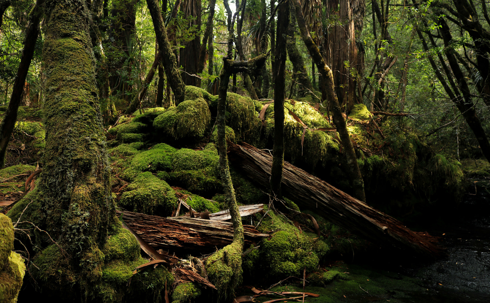

```{r}
#| include: false
library(tidyverse)
library(palmerpenguins)
```

# You're back!

Welcome to week 2! Today we will be sampling soil carbon, penguin flipper lengths, and kangaroo populations to find out why the way we collect data matters just as much as what we measure. The lab has three sections — between them, we suggest you take a short break.

You will come across two types of tasks in this lab. **Worked Examples** have solutions you can expand and check straight away. **Exercises** do not — solutions for these will be posted on Friday evening.

## Learning outcomes

In this lab, we will learn how to:

1.  Evaluate the benefits and drawbacks of different sampling methods
2.  Estimate confidence intervals for simple random and stratified random designs
3.  Recognise when a paired sampling design is appropriate

## Specific goals

By the end of this lab, you should be able to:

-   [ ] Decide when to use simple random sampling
-   [ ] Decide when to use stratified random sampling
-   [ ] Decide when to use a paired sampling design
-   [ ] Use R to estimate confidence intervals

## Preparation

You do not need to read any articles or download any data for this lab. Activate (or install, if you have not already) the following packages:

```r
install.packages(c("tidyverse", "palmerpenguins"))
```

Then load them at the top of your script:

```r
library(tidyverse)
library(palmerpenguins)
```

Take a moment to revise what you learned from this week's lectures. The following terms should sound familiar:

- Standard deviation
- Mean
- Confidence interval
- *t*-distribution

If any of these are unfamiliar, ask your demonstrators before we begin.



# 1. Stratified random sampling (~25 min)

## What makes a good sample?

Data is power — at least, that is the way it works in science. With data, you can test ideas, form hypotheses, and understand the natural world. But data takes effort and time. We have to be selective about where, when, and how we gather it. This process is called **sampling**.

Good sampling designs produce high-quality datasets that tell us a lot about the world. Poor sampling designs produce low-quality datasets that tell us very little, and in some cases even mislead us.

We can apply many criteria to judge whether our samples are good, but two factors stand out above the rest: good samples are **representative**, and good samples are **independent**.


When we sample from a site or population, we usually only take a small subset. Our samples are **representative** if they accurately depict the main characteristics of the population as a whole, despite only making up a small portion of it.

::: {.column-margin}
If we sample the music preferences of university students, but only ask postgraduates, our samples will not be representative of all university students.
:::

Members of a population can influence one another, sometimes in ways substantial enough to sway results. Samples are said to be **independent** if the amount of cross-influence between them is kept to a minimum.

::: {.column-margin}
If we sample herbicide runoff effects on fish, but pick all sites along the same river, our samples will not be very independent — herbicide flows downstream and fish migrate. Although [some statistical techniques](https://doi.org/10.1016/j.mex.2022.101660) exist to adjust for non-independent samples, it is still worth making your samples as independent as you can to begin with.
:::

In the real world, samples can never be completely representative, nor can they be truly independent. We can still use these two criteria as targets — the closer we get, the better.

## Soil carbon in Cox's Creek

Living things are made out of carbon. When leaves, roots, and animal remains break down underground, some of this carbon [stays inside the soil](https://www.nature.com/scitable/knowledge/library/soil-carbon-storage-84223790/) in the form of humus or soil microbes. Converting atmospheric CO~2~ into soil organic carbon is one of the main ways to combat climate change.

In 2012, @karunaratne2014 measured soil organic carbon percentage in Cox's Creek catchment, northern NSW, using a stratified random sampling scheme. Here are their results:

```{r}
#| echo: false
knitr::kable(data.frame(
    use = c("Forest", "Dryland Cropping", "Pasture-Vertosol", "Pasture-Other", "Irrigated"),
    n = c(9, 14, 14, 2, 5),
    mean = c(0.65, 0.96, 1.06, 1.31, 0.78),
    variance = c(1.4, 0.4, 0.8, 0.4, 0.8),
    percent_area = c(20, 35, 35, 6, 4)
))
```

Copy the table into R as a data frame:

```{r}
soil <- data.frame(
  use = c("Forest", "Dryland Cropping", "Pasture-Vertosol",
          "Pasture-Other", "Irrigated"),
  n = c(9, 14, 14, 2, 5),
  mean = c(0.65, 0.96, 1.06, 1.31, 0.78),
  variance = c(1.4, 0.4, 0.8, 0.4, 0.8),
  percent_area = c(20, 35, 35, 6, 4)
)
```

::: {.column-margin}
If you want extra practice with `c()` and `data.frame()`, try typing each column as a separate vector before combining them.
:::

::: {.column-margin}
What does each column mean?

- **use** — land use type (the strata)
- **n** — number of samples collected
- **mean** — mean soil organic carbon (%)
- **variance** — variance in soil carbon
- **percent_area** — percentage of the catchment area represented by each land use
:::


Now the challenge is to combine the means from each stratum into a single **weighted mean** for the whole catchment. Before reading on, think about how you would do this.

You might be tempted to take a simple average of the five stratum means. The problem is that each land use covers a different proportion of the catchment — dryland cropping and vertosol pastures together make up 70% of the area, while forests and irrigated land together account for only 24%. A simple average would treat them all equally. Instead, we multiply each stratum mean by the proportion of catchment area it represents. Since forests cover 20% of the catchment, we multiply their mean soil carbon (0.65) by 0.20.

##
::: {.question}
### Worked Example 1

Calculate the weighted mean of soil organic carbon across Cox's Creek catchment. Multiply each stratum mean by its proportion of the catchment area, then add the results together.
:::

::: {.column-margin}
To multiply two vectors term-by-term, use `*`. To convert percentages to proportions, divide by 100.
:::

::: {.callout-tip collapse="true"}
### Solution

```{r}
weighted_mean <- sum(soil$mean * soil$percent_area / 100)
weighted_mean
```

On average, the soils in Cox's Creek catchment are made up of about 0.95% organic carbon.
:::

![The Cape Freshwater Wetlands in South Africa. Wetlands make up only about 6% of Earth's land surface, but hold almost a third of the world's soil organic carbon [@stewart2024]. From Wikimedia Commons (2010), by Abu Shawka.](images/cape-wetlands-south-africa.jpg)

### Weighted variance of the mean

Mean and variance come hand in hand. We have the weighted mean, but what about the **weighted variance**? We cannot simply average the variances the same way we did for the means. Instead, we need to transform the **variances** of each stratum into **variances of the mean** first.

::: {.column-margin}
The variance of the mean is not the same as the variance. They are related by: $Var(\bar{y}_i) = Var(y_i) / n_i$. If you are confused about the difference, ask your demonstrators to clarify.
:::

##
::: {.question}
### Worked Example 2

Calculate the weighted variance of the mean for the stratified estimate. Use these formulas:

$$Var(\bar{y}_i) = \frac{Var(y_i)}{n_i}$$

$$Var(\bar{y}_s) = \sum_{i=1}^{L} w_i^2 \times Var(\bar{y}_i)$$

where $w_i$ is the proportion of area for stratum $i$.
:::

::: {.callout-tip collapse="true"}
### Solution

First, transform each stratum's variance into a variance of the mean:

```{r}
var_of_mean <- soil$variance / soil$n
```

Then multiply each by the **square** of its weight and add them together:

```{r}
weight <- soil$percent_area / 100
weighted_var <- sum(var_of_mean * weight^2)
weighted_var
```

The result is about 0.018. There is no straightforward interpretation for this number on its own, but we will need it for our confidence interval calculation.
:::


### Confidence interval

We have the weighted mean and the weighted variance of the mean. Now we can calculate the 95% confidence interval, assuming our data came from a *t*-distribution:

$$CI = \bar{y}_s \pm t_{critical} \times \sqrt{Var(\bar{y}_s)}$$

We already have $\bar{y}_s$ (the weighted mean) and $Var(\bar{y}_s)$ (the weighted variance of the mean). All that is left is $t_{critical}$, which we can find using the `qt()` function.

##
::: {.question}
### Worked Example 3

Use `qt()` to find the *t*-critical value for a 95% confidence interval, then calculate the upper and lower bounds.
:::

::: {.column-margin}
Degrees of freedom = total samples minus number of strata = $44 - 5 = 39$. Use `p = 0.975` (not 0.95) because the *t*-distribution is two-tailed — think about why this is the case.
:::

::: {.callout-tip collapse="true"}
### Solution

```{r}
tcrit <- qt(p = 0.975, df = sum(soil$n) - nrow(soil))

lower <- weighted_mean - tcrit * sqrt(weighted_var)
upper <- weighted_mean + tcrit * sqrt(weighted_var)

c(mean = weighted_mean, L95 = lower, U95 = upper)
```

The soil in Cox's Creek catchment is, on average, made up of about 0.95% organic carbon. We can say with 95% confidence that this value lies between about 0.68% and 1.22%.
:::

Before we move on, now is a good time to take a 5-minute break.


# 2. Choosing your strata (~25 min)

In the last section, our strata were pre-specified for us. But what if there are multiple ways to stratify the same experiment, and we have to choose between them?

One way to decide is through **k-means clustering**, a technique from multivariate analysis that we will cover in week 11. For now, you are going to pick your strata based on what you think makes statistical sense and what you know about penguins.

## Palmer penguins


The `penguins` dataset comes from the `palmerpenguins` package, originally published by @gorman2014. Check out [this link](https://allisonhorst.github.io/palmerpenguins/) to learn more.

##
::: {.question}
### Exercise 1

Check the structure of the `penguins` dataset using `str()`. What types of variables does it contain? Which of the factor variables could act as strata for a stratified sampling design?
:::

:::: {.content-visible when-profile="solution"}
::: {.ans}
#### Solution

```{r}
str(penguins)
```

We have 5 numeric variables (4 measurements in millimetres and sampling year) and 3 factors: species, island, and sex. Any of these three factors could act as strata.
:::
::::

Turn your eye to the three **factors** in this dataset. Factors are discrete variables, which means they can only take on a countable number of values: `species` takes on 3 values (Adelie, Chinstrap, Gentoo), `island` also takes on 3 (Biscoe, Dream, Torgersen), and `sex` takes on 2 (female, male).

From @gorman2014, we know that this data was not collected with a stratified sampling design in mind. However, we can ask ourselves how we would choose to sample if we were suddenly called to conduct a penguin survey on the same islands.

Suppose we want to find the average flipper length of all the penguins on Biscoe, Dream, and Torgersen Island as a combined population. Should we stratify by island, sex, or species?

##
::: {.question}
### Exercise 2

Which variable would you choose as your strata? Pick the one that sounds best to you and try to convince your classmates why you are right. Remember that "we should not stratify at all" is also a perfectly valid opinion.
:::

:::: {.content-visible when-profile="solution"}
::: {.ans}
#### Solution

Out of the three factors, species may be the best one to use as strata. We expect species to have a bigger influence over flipper length than either sex or island.
:::
::::

We leave this as an open-ended discussion for your demonstrators to oversee. Use plots, statistics, facts about penguins — anything goes. Listen to your classmates' ideas, and try to challenge them with reasonable questions.


## Penguin plots

To support your argument, explore the penguin dataset visually using box plots and scatter plots. This is also a good chance to practise the `ggplot2` skills you learned last week.

##
::: {.question}
### Exercise 3

Make a box plot of the `penguins` dataset. You decide which variables to put on the x and y axes. Does this change your opinion on which factor to use as strata? Why or why not?
:::

:::: {.content-visible when-profile="solution"}
::: {.ans}
#### Solution

We plotted flipper length on the y-axis and species on the x-axis.

```{r}
ggplot(penguins, aes(x = species, y = flipper_length_mm)) +
  geom_boxplot(colour = "black", fill = "lightblue") +
  theme_classic()
```

There is not quite as much separation between the three species as we first thought. Chinstrap and Adelie look especially close in terms of their flipper lengths. Could one of the other factors show a better separation?
:::
::::

##
::: {.question}
### Exercise 4

Make a scatter plot of the `penguins` dataset. Does this change your opinion on which factor to use as strata?
:::

:::: {.content-visible when-profile="solution"}
::: {.ans}
#### Solution

We plotted flipper length against bill depth, colour-coded by sex.

```{r}
ggplot(penguins, aes(x = bill_depth_mm,
                     y = flipper_length_mm,
                     colour = sex,
                     fill = sex)) +
  geom_point(stroke = 1, shape = 24) +
  scale_colour_manual(values = c("black", "black")) +
  scale_fill_manual(values = c("lightblue", "red")) +
  theme_classic()
```

There are two distinct clusters. Maybe they can tell us what factors influence flipper length — or maybe not. What do you think?
:::
::::

::: {.column-margin}
If you want to go further down the statistics rabbit hole, here are some papers on stratified random sampling: [Fisher (1958)](https://doi.org/10.1080/01621459.1958.10501479), [Elliot (2011)](https://doi.org/10.1016/j.annepidem.2010.11.016).
:::

Before we move on, now is a good time to take a 5-minute break.

# 3. Paired sampling designs (~25 min)

*The following section involves simulated data and a fictional story.*

## Kangaroo surveys in Sturt National Park


Suppose we decide to survey kangaroos in [Sturt National Park](https://www.nationalparks.nsw.gov.au/visit-a-park/parks/sturt-national-park), inland NSW. We want to know if the abundance of kangaroos in this park differs between spring and autumn. Maybe kangaroos migrate towards the coast during spring to escape the summer heat, or maybe they migrate further inland to take advantage of new plant growth. We do not know, so we sample.

We visit the park in spring and pick 5 random sites to count the kangaroos. In autumn, we revisit the park and pick 5 new sites at random.

```{r}
spring <- c(4, 2, 6, 1, 3)
autumn <- c(9, 7, 18, 14, 7)
```


"But hang on", says one of the scientists on our team, "sites 3 and 4 from our autumn survey are near water holes, while all the other sites are on dry, flat plains." She is right. We did not intend for that to be the case, but the random sampling procedure worked out that way.

Sites 3 and 4 are statistical outliers. Animals tend to gather around water holes in semi-arid habitats, so we would expect to see more kangaroos there. However, we cannot remove these sites from our analysis — that may introduce bias, and we only have 10 sites total. Removing 2 would be a serious loss of statistical power.

Random sampling is important to remove personal bias and keep our samples representative, but it also adds variation that we cannot control.


Perhaps in hindsight, it was better to stratify our study sites by water body and no water body. But water bodies were not the only features we had to account for. What if we accidentally picked a site near a rock face in autumn, but not in spring? What if we picked a site under a grove of trees in spring, but not in autumn? There are too many variables to control for.

Try as we might, we cannot seem to get around the inherent variation present in our sampling units. Or can we?

## The paired design


Paired sampling designs may sound like the most obvious trick in the book — too obvious to be useful — and yet they are useful indeed.

The strategy is simple: we still randomly choose our sample sites in the first round of surveys, but in the second round, we revisit the same sites instead of picking new ones. This way, we keep our sites representative thanks to the initially random selection, but we avoid adding new sources of variation with a second round of random site selection.

Re-sampling the same sites at two different times is only one form of paired design. The split-mouth test [@xu2021] is a common procedure in dentistry studies, where two different treatments are applied to the same person at once — one on the left side of the mouth, and the other on the right side.

##
::: {.question}
### Exercise 5

Come up with some examples of paired study designs. Try to think of one example where a paired design is very useful, and another where it is not as useful.
:::

:::: {.content-visible when-profile="solution"}
::: {.ans}
#### Solution

Here are some examples of useful paired study designs:

1. Sampling the same sites in a forest (called fixed quadrats) over time to track vegetation recovery following a bushfire.
2. Tracking heart rates in the same set of patients before and after a two-month medication cycle.

Here are some examples of not-so-useful paired study designs:

1. Conducting a beep test on a group of people, giving them an energy drink, and immediately conducting another beep test on the same group. The first beep test tires participants out for the second.
2. Giving university students a statistics exam in semester 1, signing them onto a tuition project over the break, and giving the same exam in semester 2. The first exam prepares students for the second.
:::
::::

## Paired vs unpaired *t*-tests

When we analyse paired data, we have to treat it differently from unpaired data. In a *t*-test, this is straightforward — we include the argument `paired = TRUE` in the `t.test()` function.

##
::: {.question}
### Worked Example 4

Run an unpaired *t*-test on the spring and autumn kangaroo survey data.
:::

::: {.callout-tip collapse="true"}
### Solution

We use the `t.test()` function and specify `paired = FALSE`:

```{r}
t.test(spring, autumn, paired = FALSE)
```

The things to look out for are: df (degrees of freedom), t (the *t*-statistic), and p (the *p*-value). In this case, there is a significant difference between the average number of kangaroos per site in spring and autumn according to an unpaired *t*-test.
:::

##
::: {.question}
### Worked Example 5

Now run a paired *t*-test on the same data. Compare the results.
:::

::: {.callout-tip collapse="true"}
### Solution

We use the `t.test()` function and specify `paired = TRUE`:

```{r}
t.test(spring, autumn, paired = TRUE)
```

Both tests show a significant difference, but notice the degrees of freedom are different. In a paired *t*-test, df equals the number of pairs minus 1. In an unpaired *t*-test with unequal variances, df is adjusted to a decimal value.
:::

*t*-tests are nice like that — R carries them out in a flash. But what is really happening behind the scenes?

##
::: {.question}
### Exercise 6

Come up with a dataset (it does not have to be big) that shows a statistically significant difference when analysed using an unpaired *t*-test, but **no** significant difference when analysed using a paired *t*-test. What does this tell you about how paired tests work?
:::

:::: {.content-visible when-profile="solution"}
::: {.ans}
#### Solution

For a paired *t*-test to be significant, it matters how the numbers are arranged in each group. Big numbers have to match with big numbers, and small with small. For an unpaired *t*-test, it only matters whether one group is greater than the other on average.

Here is an example:

```{r}
group_1 <- c(4, 4, 4, 9, 9, 9)
group_2 <- c(11, 11, 11, 8, 8, 8)

t.test(group_1, group_2, paired = TRUE)
t.test(group_1, group_2, paired = FALSE)
```

The paired *t*-test finds no significance because the order of the two groups is mismatched — big numbers in one group match with small numbers in the other.

If we reverse the order of `group_1`:

```{r}
group_1 <- c(9, 9, 9, 4, 4, 4)
group_2 <- c(11, 11, 11, 8, 8, 8)

t.test(group_1, group_2, paired = TRUE)
t.test(group_1, group_2, paired = FALSE)
```

Suddenly the paired *t*-test shows a significant difference as well — an even more significant one than the unpaired test.

You can think of this intuitively as a paired *t*-test looking for **consistent trends** across each of its pairs. If some numbers increase but others decrease, the paired *t*-test is confused. The unpaired *t*-test only cares if the averages are different, and by how much.
:::
::::

# Conclusion

## Closing thoughts

That is all for this week. How you design your sampling scheme matters just as much as what you measure — stratified random sampling, paired designs, and simple random sampling are all options, and the trick is knowing when to reach for each one.

If you have any questions, please approach your demonstrators.

### Attribution

This lab was developed using resources that are available under a
[Creative Commons Attribution 4.0 International license], made available
on the [SOLES Open Educational Resources repository].

  [Creative Commons Attribution 4.0 International license]: http://creativecommons.org/licenses/by/4.0/
  [SOLES Open Educational Resources repository]: https://github.com/usyd-soles-edu/
