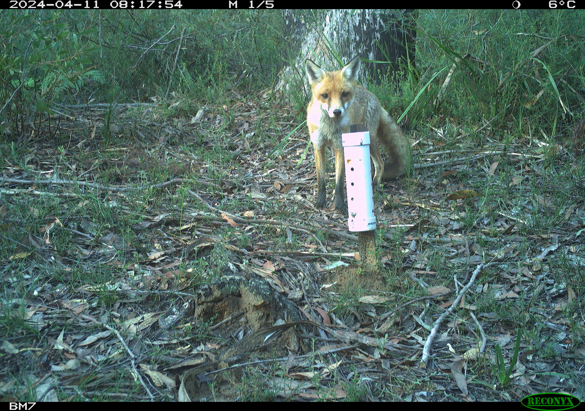
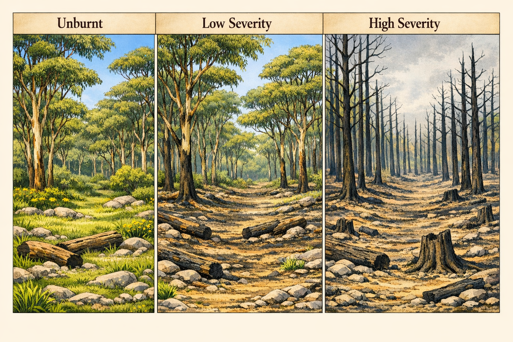

# Welcome!

This week we will analyse two experiments using one-way ANOVA: a completely randomised design investigating dingo and fox activity from camera trap data, and a randomised complete block design examining fire severity effects on small mammal abundance.

You will come across **Exercises** in this lab. Solutions will be posted on Friday evening.

## Learning outcomes

In this lab, we will learn how to:

1. Use R to analyse CRDs and RCBDs.
2. Assess the usefulness of blocking.

## Specific goals

By the end of this lab, you should be able to:

- [ ] Fit and interpret a one-way ANOVA for a CRD
- [ ] Check ANOVA assumptions using diagnostic plots
- [ ] Perform post-hoc tests using `emmeans`
- [ ] Fit a one-way ANOVA with a blocking term for an RCBD
- [ ] Calculate the percentage of variation explained by blocking

## Preparation

This lab uses `emmeans`. Install it if you are missing it by running the following **in the console**:

```r
install.packages("emmeans")
```

### Downloads

| File | Used in | Download |
|---|---|---|
| `crd_dingo_fox_exclusion.csv` | Section 1 | [Download](data/crd_dingo_fox_exclusion.csv) |
| `rcbd_mammals.csv` | Section 2 | [Download](data/rcbd_mammals.csv) |

Save the files into a folder called `data` inside your project folder.


# 1. Completely randomised design (~25 min)

You are tasked with analysing data from an experiment that investigated the effect of dingo activity on fox activity. You set out camera traps at 36 sites for 36 days at sites with high, medium and no dingoes (exclusion). You recorded the number of foxes that were captured on camera. Our measure of activity is the number of images per 100 trap nights. This was calculated by:

$$FoxRatePer100 = \frac{FoxDetections}{TrapNights} \times 100$$


{fig-align="center" width="767"}


We predict Higher fox activity → lower dingo activity based on mesopredator release hypothesis.


Data is in the **crd_dingo_fox_exclusion.csv** file.

- Experimental units: Sites (randomly assigned to treatments; no blocking)
- Factor: DingoActivity (3 levels: High, Medium, Exclusion)
- Response: FoxRatePer100 (images per 100 trap-nights)
- Replicates: n = 12 sites per treatment (36 total)

Other variables:

- SiteID: unique identifier for each site
- TrapNights: number of nights the camera trap was active at each site (max of 36, but some cameras surveyed for less)
- FoxDetections: number of images of foxes captured by the camera trap at each site

Statistical model for CRD:
$$Y_{ij} = \mu + \alpha_i + \epsilon_{ij}$$
Where:

- $Y_{ij}$ is the observed fox activity (FoxRatePer100) at the $j$-th site in the $i$-th dingo activity level.
- $\mu$ is the overall mean fox activity across all dingo activity levels.

OR:

$$fox\ activity = overall\ mean + dingo\ activity + random\ error.$$

## Analysis

::: {.question}
### Exercise 1

*(i)* Test the assumptions of the ANOVA and transform the data (if needed). Hint first run the model using the `aov()` function and then use the `plot()` function to check the assumptions.

```{r}
#
```

*(ii)* Use an ANOVA to analyse the CRD and report on the results.

```{r}
#
```

*(iii)* Explore any significant results using post-hoc tests from `emmeans` package and its `emmeans()` function. Include any plots that you think are useful to visualise the results.

```{r}
#
```
:::

::: {.content-visible when-profile="solution"}
::: {.ans}
#### Solution

##### (i) Check assumptions
```{r}
foxes<-read.csv("data/crd_dingo_fox_exclusion.csv", header=TRUE)
head(foxes)
```

```{r}
fox.anova<-aov(FoxRatePer100~DingoActivity,data=foxes)

par(mfrow=c(2,2))
plot(fox.anova)
par(mfrow=c(1,1))
```

Assumptions of normality and homogeneity of variance appear to be met, so we can proceed with the ANOVA results.

##### (ii) ANOVA results
```{r}
summary(fox.anova)
```
There is a significant effect of dingo activity on fox activity (F~1,18~ = 17.49; P < 0.01).


##### (iii) Perform post-hoc tests.
```{r}
library(emmeans)
emmeans(fox.anova, pairwise ~ DingoActivity )
```

There are significantly more foxes at sites with no dingo activity (mean = 17.91; t = 5.83, df = 22, P < 0.01) than at sites with high dingo activity (mean = 4.22) or medium dingo activity (mean = 9.07; t = 3.77; df = 33; P = 0.002).


```{r}
plot(emmeans(fox.anova, "DingoActivity"), comparisons = TRUE)
```

Conclusion: The results support the mesopredator release hypothesis, with higher fox activity at sites with no dingo activity. Interestingly, there is no significant difference in fox activity between sites with medium and high dingo activity, suggesting that even moderate dingo activity may suppress fox activity.

:::
:::

Before we move on, now is a good time to take a 5-minute break.


# 2. Randomised complete block design (~25 min)

A researcher designs a study to investigate the effect of fire treatment (unburnt, low severity and high severity) on small mammal abundance. They set up four blocks (Block_1, Block_2, etc) and select sites that were unburnt, low severity and high severity fire within each block. At each site to survey small mammal abundance.  The data is in the **rcbd_mammals.csv** file.

{fig-align="center" width="767"}

## Analysis


::: {.question}
### Exercise 2

*(i)* Write out the statistical model for the ANOVA model for this experiment.  Define all the terms in the model. You can write out in words or in mathematical notation.

```{r}
# Answer here
```


*(ii)* Test the assumptions of the ANOVA and transform the data (if needed). Hint first run the model using the `aov()` function and then use the `plot()` function to check the assumptions.


```{r}
#
```


*(iii)* Use an ANOVA to analyse the RCBD and report on the results.


```{r}
#
```


*(iv)* Explore any significant results using post-hoc tests from `emmeans` package and its `emmeans()` function. Include any plots that you think are useful to visualise the results.


```{r}
#
```


*(v)* Calculate the variation explained by the blocking term.


```{r}
#
```
:::

::: {.content-visible when-profile="solution"}
::: {.ans}
#### Solution

```{r}
fire<-read.csv("data/rcbd_mammals.csv", header=TRUE)
head(fire)

block.anova<-aov(Abundance~Block+Treatment,data=fire)
```

##### (i) Statistical model
The statistical model for the RCBD can be written in mathematical notation as:
$$Y_{ijk} = \mu + \alpha_i + \beta_j + \epsilon_{ijk}$$

Where:

- $Y_{ijk}$ is the observed abundance of small mammals at the $k$-th site in the $i$-th block and $j$-th treatment.
- $\mu$ is the overall mean abundance of small mammals across all treatments and blocks.
- $\alpha_i$ is the effect of the $i$-th block (i = 1, 2, 3, 4).
- $\beta_j$ is the effect of the $j$-th treatment (j = unburnt, low severity, high severity).
- $\epsilon_{ijk}$ is the random error term associated with the $k$-th site in the $i$-th block and $j$-th treatment, assumed to be independently and identically distributed with mean 0 and variance $\sigma^2$.

OR:

$$Abundance\ of\ small\ mammals = overall\ mean + block + fire\ treatment + random\ error$$


##### (ii) Check assumptions
```{r}
par(mfrow=c(2,2))
plot(block.anova)
par(mfrow=c(1,1))
```
Assumptions of normality and homogeneity of variance appear to be met, so we can proceed with the ANOVA results.

##### (iii) ANOVA results
```{r}
summary(block.anova)
```
There is a significant effect of fire treatment on small mammal abundance (F~2,6~ = 35.06; P = 0.0005).


##### (iv) Perform post-hoc tests.

```{r}
library(emmeans)
emmeans(block.anova, pairwise ~ Treatment)
```

There are significant differences in mean abundance of small mammals between High and low fire severity (t = -6.72; df = 6; P = 0.001) and high fire severity and unburnt sites (t = -7.68 df = 6; P = 0.0006), but no difference in abundance between low severity and unburnt sites (t = -0.96; df = 6; P = 0.63). Sites that burnt at high severity had significantly lower mean abundance (9.25) of small mammals than both low severity (21.5) and unburnt sites (23.25).

```{r}
plot(emmeans(block.anova, "Treatment"), comparisons = TRUE)
```

Conclusion: The results suggest that high severity fire has a significant negative effect on small mammal abundance, while low severity fire does not differ significantly from unburnt sites.


##### (v) Calculate the variation explained by the blocking term

The proportion of variation explained by the Blocking is:

$\frac{Block\ SS}{Total\ SS}\times 100$


```{r}
# Note you can just use a calculator and ANOVA table to do this, but here is how you would do it in R for repeatability.

summary(block.anova)
anova_table <- summary(block.anova)[[1]]

ss_total <- sum(anova_table$`Sum Sq`)
ss_treatment <- anova_table$`Sum Sq`[2]
ss_block <- anova_table$`Sum Sq`[1]

percent_treatment <- (ss_treatment / ss_total) * 100
percent_block <- (ss_block / ss_total) * 100

cat("\n")
cat("Percentage of variation explained by treatments:", round(percent_treatment, 1), "%\n")
cat("Percentage of variation explained by blocks:", round(percent_block, 1), "%\n")
```

:::
:::


# Conclusion

## Closing thoughts

We analysed two experimental designs this week: a CRD using camera trap data to test the mesopredator release hypothesis, and an RCBD examining fire severity effects on small mammal abundance. These designs and analysis techniques will continue to be used as we work with more complex models throughout the course.

### Attribution

This lab was developed using resources that are available under a
[Creative Commons Attribution 4.0 International license], made available
on the [SOLES Open Educational Resources repository].

  [Creative Commons Attribution 4.0 International license]: http://creativecommons.org/licenses/by/4.0/
  [SOLES Open Educational Resources repository]: https://github.com/usyd-soles-edu/
