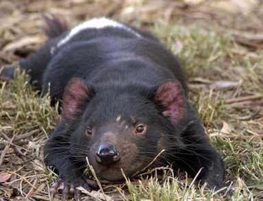

# Welcome!

This week we will analyse a factorial experiment using ANOVA: first as a completely randomised design (CRD), then as a randomised complete block design (RCBD). The experiment investigates aggressive interactions in Tasmanian devils.

You will come across **Exercises** in this lab. Solutions will be posted on Friday evening.

## Learning outcomes

At the end of this practical students should be able to:

* use R to analyse experiments with a factorial treatment structure where the experimental design is a CRD or RCBD;

## Specific goals

By the end of this lab, you should be able to:

- [ ] Fit and interpret a factorial ANOVA for a CRD
- [ ] Check ANOVA assumptions and apply transformations when needed
- [ ] Fit a factorial ANOVA with a blocking term for an RCBD
- [ ] Perform post-hoc tests using `emmeans`
- [ ] Calculate the percentage of variation explained by blocking

## Preparation

This lab uses `emmeans`. Install it if you are missing it by running the following **in the console**:

```r
install.packages("emmeans")
```

### Downloads

| File | Used in | Download |
|---|---|---|
| `tasmanian_devil_aggression.csv` | Sections 1 and 2 | [Download](data/tasmanian_devil_aggression.csv) |


# 1. Factorial ANOVA as CRD (~30 min)

You are interested in investigating if aggressive interactions between Tasmanian devil individuals are influenced by eating in a group or alone, and if they are male or female. You conduct an experiment where you observe the number of aggressive interactions between individuals in a 10 minute trial.  You have 12 nights to conduct the experiment and each night you observe one trial for each of the 4 treatment combinations.

Analyse the data using a factorial ANOVA as if it was collected by a CRD.

The data is in the **tasmanian_devil_aggression.csv** file.

Factors:

- feeding_context: Alone vs Group
- sex: Female vs Male

Response variables:

- aggression_count (integer count per trial)
- log_aggression = log(aggression_count + 1)


Blocking factor (we will ignore this for the CRD analysis but it will be used in the RCBD analysis):

- block: Night_01 … Night_12 (each night includes all 4 treatment combinations)
- Total N: 12 blocks × 2 sexes × 2 contexts = 48 trials (1 obs per cell per block)




## Analysis

::: {.question}
### Exercise 1

*(i)* Write out the statistical model for the factorial ANOVA for this experiment.  Define all the terms in the model. You can write out in words or in mathematical notation.

```{r}
# Answer here
```


*(ii)* Test the assumptions of the factorial ANOVA and transform the data (if needed). Hint first run the model using the `aov()` function and then use the `plot()` function to check the assumptions.

```{r}
#
```

*(iii)* Use an ANOVA to analyse the CRD and report on the results.

```{r}
#
```

*(iv)* Explore any significant results using post-hoc tests from `emmeans` package and its `emmeans()` function. Include any plots that you think are useful to visualise the results.

```{r}
#
```
:::

::: {.content-visible when-profile="solution"}
::: {.ans}
#### Solution

##### *(i)* The statistical model for the factorial ANOVA is:
$$
Y_{ijk} = \mu + \alpha_i + \beta_j + (\alpha\beta)_{ij} + \epsilon_{ijk}
$$

Where:

- $Y_{ijk}$ is the response variable (aggression count) for the $k$th observation in the $i$th level of feeding context and $j$th level of sex
- $\mu$ is the overall mean aggression count
- $\alpha_i$ is the effect of the $i$th level of feeding context (Alone vs Group)
- $\beta_j$ is the effect of the $j$th level of sex (Female vs Male)

- $(\alpha\beta)_{ij}$ is the interaction effect between feeding context and sex
- $\epsilon_{ijk}$ is the random error term for the $k$th observation in the $i$th level of feeding context and $j$th level of sex and is assumed to be normally distributed with mean 0 and constant variance $\sigma^2$.

OR:

$$Aggression\ count = overall\ mean +  feeding\ context +  sex + feeding\ context\times sex + random\ error$$


##### *(ii)* Test the assumptions of the factorial ANOVA and transform the data (if needed).

Read in the data and convert to `factor` if required.
```{r}
devil <- read.csv("data/tasmanian_devil_aggression.csv")
str(devil)
devil$feeding_context <- as.factor(devil$feeding_context)
devil$sex <- as.factor(devil$sex)
str(devil)

```

Run the model and check the assumptions with the `plot()` function.
```{r}
devil.aov <- aov(aggression_count ~ feeding_context*sex, data=devil)

par(mfrow=c(1,2))
plot(devil.aov, which=1)
plot(devil.aov, which=2)
par(mfrow=c(1,1))

```
The residual diagnostics show that the data is not normally distributed, has unequal variance (fanning).  A log transformation is applied to the response variable to try and meet the assumptions.

```{r}

devil.log.aov <- aov(log(aggression_count+1) ~ feeding_context*sex, data=devil)

par(mfrow=c(1,2))
plot(devil.log.aov, which=1)
plot(devil.log.aov, which=2)
par(mfrow=c(1,1))

```

The residual diagnostics show that the data is not normally distributed, but now has equal variance.  Given ANOVA is robust against non-normality, we will proceed with the analysis using the log transformed response variable.

##### *(iii)* Use an ANOVA to analyse the CRD and report on the results.

```{r}
summary(devil.log.aov)
```
The ANOVA table shows that there is not a significant interaction between `feeding_context` and `sex` with a P-value of 0.60.  This means we can now move to the main effects and see that both `feeding_context` and `sex` have a significant influence on `log_aggression`.

##### *(iv)* Explore any significant results using post-hoc tests from `emmeans` package and its `emmeans()` function. Include any plots that you think are useful to visualise the results.

Main effect of `feeding_context` is significant so we can use `emmeans()` to conduct post-hoc tests to determine which pairs are significantly different.  The results show that the `log_aggression` is significantly higher when feeding in a group compared to alone.

```{r}
library(emmeans)
emmeans(devil.log.aov, pairwise ~ feeding_context)

```


Plotting the marginal means for `feeding_context` shows that the `log_aggression` is higher when feeding in a group compared to alone.
```{r}

plot(emmeans(devil.log.aov, pairwise ~ feeding_context), comparisons = TRUE)

```

The main effect of `sex` is significant so we can use `emmeans()` to conduct post-hoc tests to determine which pairs are significantly different.  The results show that the `log_aggression` is significantly

```{r}
emmeans(devil.log.aov, pairwise ~ sex)
```
Males have a significantly higher `log_aggression` compared to females.

Plotting:

```{r}
plot(emmeans(devil.log.aov, pairwise ~ sex), comparisons = TRUE)
```
:::
:::


Before we move on, now is a good time to take a 5-minute break.


# 2. Factorial ANOVA with blocking (~30 min)

Now we will analyse the same experiment as above but this time we will include the blocking factor of `block` (night) in the analysis.  This means we will be analysing the data as if it was collected by a RCBD.

## Analysis

::: {.question}
### Exercise 2

*(i)* Write out the statistical model for the factorial ANOVA with blocking for this experiment.  Define all the terms in the model. You can write out in words or in mathematical notation.

```{r}
# Answer here
```


*(ii)* Test the assumptions of the ANOVA model and transform the data (if needed). Hint first run the model using the `aov()` function and then use the `plot()` function to check the assumptions.

```{r}
#
```

*(iii)* Use an ANOVA to analyse the RCBD and report on the results.

```{r}
#
```

*(iv)* Calculate how much variation the blocking term captured.

```{r}
#
```
:::

::: {.content-visible when-profile="solution"}
::: {.ans}
#### Solution

##### *(i)* The statistical model for the factorial ANOVA with blocking is:
$$
Y_{ijkl} = \mu + \alpha_i + \beta_j + (\alpha\beta)_{ij} + \gamma_k + \epsilon_{ijkl}
$$
Where:

- $Y_{ijkl}$ is the response variable (aggression count) for the $l $th observation in the $i$th level of feeding context, $j $th level of sex and $k$th block (night)
- $\mu$ is the overall mean aggression count
- $\alpha_i$ is the effect of the $i$th level of feeding context (Alone vs Group)
- $\beta_j$ is the effect of the $j $th level of sex (Male vs Female)
- $(\alpha\beta)_{ij}$ is the interaction effect between feeding context and sex
- $\gamma_k$ is the effect of the $k$th block (night)
- $\epsilon_{ijkl}$ is the random error term for the $l$th observation in the $i$th level of feeding context, $j $th level of sex and $k$th block (night) and is assumed to be normally distributed with mean 0 and constant variance $\sigma^2$.

OR:

$$Aggression\ count = overall\ mean + block + feeding\ context + sex + feeding\ context \times sex + random\ error$$

##### *(ii)* Test the assumptions of the ANOVA model and transform the data (if needed).
Run the model and check the assumptions with the `plot()` function.
```{r}
devil.block.aov <- aov(aggression_count ~ block + feeding_context * sex, data=devil)
par(mfrow=c(1,2))
plot(devil.block.aov, which=1)
plot(devil.block.aov, which=2)
par(mfrow=c(1,1))
```
The residual diagnostics show that the data is not normally distributed, but has equal variance.  A log transformation is applied to the response variable to try and meet the assumption of normality.

```{r}
devil.block.log.aov <- aov(log(aggression_count+1) ~ block + feeding_context * sex, data=devil)
par(mfrow=c(1,2))
plot(devil.block.log.aov, which=1)
plot(devil.block.log.aov, which=2)
par(mfrow=c(1,1))
```
The residual diagnostics show that the data is close to being normally distributed.  Given ANOVA is robust against non-normality, we will proceed with the analysis using the log transformed response variable.

##### *(iii)* Use an ANOVA to analyse the RCBD and report on the results.

```{r}
summary(devil.block.log.aov)
```
The ANOVA table shows that there is not a significant interaction between `feeding_context` and `sex` with a P-value of 0.59.  However, both main effects are significant.


##### *(iv)* Calculate how much variation the blocking term captured.

The sum of squares for the block term is 4.115
Total sum of squares is:

```{r}
Total.SS <- 4.115+4.937+2.752+0.082+8.943

Total.SS

```
The percentage of variation captured by the block term is:
```{r}
(4.115/Total.SS)*100

```
The block term captured 19.76% of the variation in the data, so it was useful using a RCBD for this experiment.
:::
:::


# Conclusion

## Closing thoughts

We analysed a factorial experiment this week using Tasmanian devil aggression data: first as a CRD to test for main effects and interactions, then as an RCBD to account for night-to-night variation. These factorial designs and analysis techniques extend the one-way ANOVA methods from previous weeks.

### Attribution

This lab was developed using resources that are available under a
[Creative Commons Attribution 4.0 International license], made available
on the [SOLES Open Educational Resources repository].

  [Creative Commons Attribution 4.0 International license]: http://creativecommons.org/licenses/by/4.0/
  [SOLES Open Educational Resources repository]: https://github.com/usyd-soles-edu/
