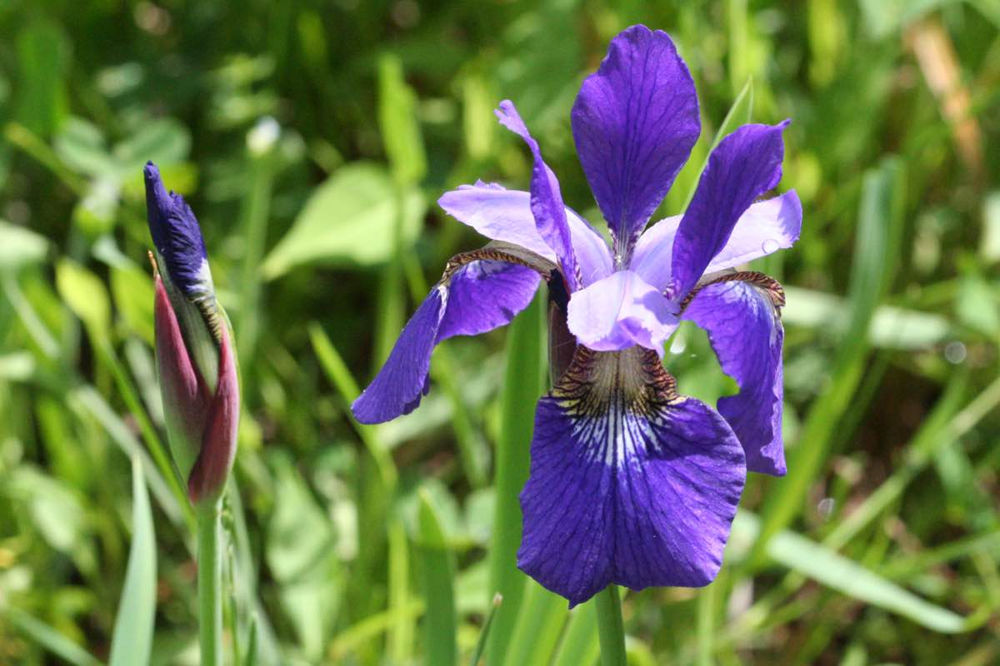

# Buckle up!

Welcome to week 10. We hope you've had fun so far in ENVX2001 :) From now until the end of the course, we will dive into the world of multivariate statistics.

We've saved the best for last. Out of all the topics in this unit, multivariate statistics might just be the coolest one. In the beginning, you may find some aspects of this topic a little confusing; if that's the case, please approach one of your demonstrators -- they will happily help you out.

By the end of this lab, you will know how to explore multivariate datasets in a simple and intuitive way.

In particular, we will learn about a very common multivariate analysis technique: Principle Component Analysis, or PCA.

## Learning outcomes

In this lab, we will learn how to:

1.  Perform Principal Component Analysis (PCA) on various datasets
2.  Interpret the output of PCA and Factor Analysis (FA) -- Loadings, biplot, screeplot, rotations

## Specific goals

By the end of this lab, you should be able to:

-   [ ] Decide if a dataset is suitable for multivariate analysis
-   [ ] Perform a PCA in R
-   [ ] Make a scree plot
-   [ ] Interpret loadings

## Preparation

This lab uses `readr` and `ggplot2`. Install any you are missing by running the following **in the console**:

```r
install.packages(c("readr", "ggplot2"))
```

Then load them in your script:

```{r}
library(readr)
library(ggplot2)
```

### Downloads

| File | Used in | Download |
|---|---|---|
| `kangaroo.csv` | Sections 1--2 | [Download](data/kangaroo.csv) |
| `FactBeer.csv` | Section 2 | [Download](data/FactBeer.csv) |
| `bumpus_sparrows_clean.csv` | Section 3 | [Download](data/bumpus_sparrows_clean.csv) |

Save all files into a folder called `data` inside your project folder.

If you are a fan of learning from textbooks, here are some we recommend:

-   Quinn, G. P. and Keough, M. J. (2002, 2024) *Experimental Design and Data Analysis for Biologists*. Cambridge University Press.

-   Han, S. Y., Filippi, P., Román Dobarco, M., Harianto, J., Crowther M. S., and Bishop, T. F. A. (2023). Multivariate analysis for soil science. In *'Encyclopedia of Soils in the Environment (Second Edition)'*. (Ed. M. J. Goss and M. Oliver) pp. 499-508. Academic Press: Oxford.

It is also a good idea to have pen and paper (or stylus and ipad) in hand while you go through this lab. One of the best ways to make sense of multivariate statistics is to draw lots of pictures.

Ready? Let's get started!

# 1. Why PCA? When PCA? Who PCA? (~30 min)

In the last 9 weeks of ENVX2001, we learned about t-tests, ANOVAs, simple linear regressions, multiple linear regressions, interactions, blocking terms ...

That's a lot of statistical tools already. Do we really need more?

Well, let's see.

## Irises



One of my personal favourite datasets to explore, for almost any kind of analysis, is the iris dataset, which contains floral measurements from three different species of irises: *Iris versicolour*, *Iris setosa*, and *Iris virginica*.

This dataset actually has a rather shady past; it was originally published in the 'Annals of Eugenics' by Ronald Fisher, one of the most influential figures in 20th Century Statistics, and a pretty controversial person. [^1]

[^1]: FISHER, R. A. (1936). THE USE OF MULTIPLE MEASUREMENTS IN TAXONOMIC PROBLEMS. *Annals of Eugenics, 7*(2), 179–188. https://doi.org/10.1111/j.1469-1809.1936.tb02137.x

Fisher invented brilliant statisical concepts such as the F-Distribution (F for Fisher, if you were wondering) and the Analysis of Variance (ANOVA), but he also endorsed eugenics, feuded with his fellow academics, and refused to believe that smoking could increase the risk of lung cancer. [^2]

[^2]: FISHER, R. A. (1958). Cancer and Smoking. *Nature, 182*(4635), 596–596. https://doi.org/10.1038/182596a0

A good example of how complex people can be, I suppose.

Fortunately for us, the 'Annals of Eugenics' was brought down a long time ago, but the iris dataset survived as a training tool for statisticians.

The iris dataset is built into R itself, and conveniently named `iris`. We can summon it like this:

::: {.callout-note collapse="true"}
#### The iris dataset

```{r}
iris # It's LONG
```
:::

##
::: {.question}
### Worked Example 1

Build the habit of inspecting your data before you do anything else. Check the structure of the iris dataset using the `str()` function.
:::

::: {.callout-tip collapse="true"}
### Solution

```{r}
str(iris) # All variables are numeric, except for 'Species', which is a factor.
```

Everything in this dataset is either a number or a factor. Perfect. We are ready for analysis.
:::

It looks like the `iris` dataset contains quite a few variables. In particular, we have four response variables to test: sepal width, sepal length, petal width, and petal length (check out [this page](https://australian.museum/learn/teachers/learning/bugwise/plant2pollinator-support-materials/) to learn more about flower anatomy). All of these are measured in centimeters.

Our first instinct might be to analyse them one at a time. Let's see how that works out:

##
::: {.question}
### Worked Example 2

Choose one of the four response variables in `iris`, and use `ggplot2` to make a box plot. What do you think? Is there a difference between the three iris species?
:::

::: {.callout-tip collapse="true"}
### Solution

Here is a box plot for sepal length:

```{r}
ggplot(iris, aes(x = Species, y = Sepal.Length)) +
  geom_boxplot(colour = 'black', fill = 'lightblue')+
  theme_classic()
```

There seems to be a difference in sepal length between the three species, but we need to run statistical tests to be sure.
:::

Depending on which response variable you chose, you may or may not have seen much of a difference between the three species.

For example, *Iris setosa* certainly seems to have shorter petals than the other two species:

```{r}
ggplot(iris, aes(x = Species, y = Petal.Length)) +
  geom_boxplot(colour = 'black', fill = 'lightblue')+
  theme_classic()
```

Let's run a one-way ANOVA to check.

##
::: {.question}
### Exercise 1

Use a one-way ANOVA to test whether petal length differs between the three iris species.
:::

::: {.column-margin}
To run a one-way ANOVA in R, use `aov()`. Petal length is the response variable, iris species is the explanatory variable. Structure your call as `aov(response ~ explanatory, data = iris)`.
:::

:::: {.content-visible when-profile="solution"}
::: {.ans}
#### Solution

Here's what we did:

```{r}
ANOVA_petal_length <- aov(Petal.Length ~ Species, data = iris) # Runs the test

summary(ANOVA_petal_length) # Prints the output
```

We found a p-value of \< 0.001, which means that at least one of the three iris species has a different average petal length to the others.
:::
::::

So... case closed? The irises are different, time to move on?

Not so fast. Petal length is just one out of four response variables we could have analysed. What about the other three? Should we run 3 more ANOVAs?

Unfortunately, performing multiple ANOVAs will run us into a series of problems.

First, we have the multiple comparisons problem. We won't discuss this topic in detail; but if you want to read up on it, I have linked an article here. [^3]

[^3]: Ranganathan, P., Pramesh, C., & Buyse, M. (2016). Common pitfalls in statistical analysis: The perils of multiple testing. *Perspectives in Clinical Research, 7*(2), 106. https://doi.org/10.4103/2229-3485.179436

Second, we have the problem of wasting our time. Really. You should be hanging out with your friends instead of running ANOVAs over and over.

Remember the plot for petal length from earlier? Check out this plot for petal width:

```{r}
ggplot(iris, aes(x = Species, y = Petal.Width)) +
  geom_boxplot(colour = 'black', fill = 'lightblue')+
  theme_classic()
```

Looks... almost the same, right?

That is because in our dataset, petal length and petal width are **positively correlated** -- the iris species with long petals also tend to have wide petals. In fact, we could really combine petal width and length into a single characteristic: petal size.

By now, we are used to thinking about correlations between explanatory and response variables -- these are often the "effects" we look for in our experiments. We have also learned how to handle correlations between multiple explanatory variables -- recall our labs in weeks 7-9, where we learned about linear regression.

However, this time we need to deal with correlations between multiple *response* variables, a situation we have never encountered before.

How do we do that? Enter multivariate statistics.


## Take a picture

All forms of multivariate statistics share a common goal: to distill a large collection of response variables into a small set of useful information.

This process is called **dimension reduction**. I like to think of it as using mathematics to create a simple, low-dimensional (usually 2D) picture out of a complex, higher-dimensional (usually 4D+) situation.

To push this analogy further, think of all the different tools and techniques artists use to depict the world around them. As science students, we also have a rich collection of tools with which to handle multivariate data.

**Principle Component Analysis (PCA)** is very much like an artist's camera. Next week, we will learn about **Cluster Analysis**, which works more like a paintbrush. In week 12, we will encounter **Non-metric Multidimensional Scaling (nMDS)**, which I like to think of as the pen-and-ink doodles of the statistical world.


I say PCA is like a camera, because it reduces the dimension of our sample space by directly projecting each sample point onto a lower dimensional plane. In technical terms, this is known as creating a **linear map**.

Not all dimension reduction techniques work this way. Some preserve the **relative distance** or **rank distance** between points instead. We will talk more about these **ordination techniques** in week 12.

::: {.callout-tip collapse="true"}
#### How come my sample points live in multi-dimensional space?

Each time we take a sample of anything (plants, soil, fur, etc.) we can measure many different characteristics.

In univariate analysis, we only measure one characteristic; for example, soil pH. This gives us a single value per sample, which we can then plot on a number-line. The corresponding analysis will then be an ANOVA.

In multivariate analysis, however, we can measure multiple characteristics; for example, soil pH along with soil texture, soil moisture, and soil nutrients. We can't plot these measurements on a single number line anymore -- we need one axis for each measurement.

This is how your sample points can end up in multi-dimensional space. If you measure 8 response variables from each of your samples, then your data must occupy an 8-dimensional mathematical space.

In the case of the `iris` dataset, we have 4 response variables. This means our sample points live in 4-dimensional space. We have to find a way to bring them down to 3 or 2-dimensions if we want to plot them nicely.
:::

##
::: {.question}
### Exercise 2

Import the `kangaroo.csv` dataset using `read.csv()`, and name it `kangaroo`. Check the structure of this dataset using `str()`. Compare it to the structure of the `iris` dataset.

i)  How many response variables does `kangaroo` have? Is this more or fewer than `iris`? What dimensional space does each of these datasets occupy?

ii) Recall that petal width and petal length were positively correlated in `iris`. Which response variables in `kangaroo` are positively correlated with each other?
:::

::: {.column-margin}
To check which variables are correlated in a dataset, use the `pairs()` function. Try it with the iris dataset first: `pairs(iris)`.
:::

::: {.callout-note collapse="true"}
#### Kangaroo column names

-   BLEN = basillar length
-   PLEN = palatilar length
-   OLEN = occipitonasal length
-   NLEN = nasal length
-   PWID = palate width
-   SPECIES = 1: Eastern Grey Kangaroo *(M. giganteus)*, 2: Western Grey Kangaroo *(M. fuliginosus)*
:::

:::: {.content-visible when-profile="solution"}
::: {.ans}
#### Solution

First, we read in the dataset and check its structure:

```{r}
kangaroo <- read.csv('data/kangaroo.csv')
str(kangaroo)
```

i)  There are 5 response variables here (BLEN, PLEN, OLEN, NLEN, and PWID), and one explanatory variable (SPECIES). In the `iris` dataset, we only had 4 response variables.

This means the sample points in `kangaroo` occupy 5 dimensional space, while the sample points in `iris` occupy 4 dimensional space.

Now, we can look for correlations between our variables. But we have to be a little bit clever here -- we don't want to include our explanatory variable `SPECIES` in our pairs plot, so we use `[,]` to select only the first 5 columns before applying `pairs()`:

```{r}
pairs(kangaroo[,1:5])
```

It looks like just about all of our response variables are positively correlated with each other. This means that kangaroos with longer noses also had longer and wider palattes, etc.
:::
::::

Earlier, we mentioned that a PCA works by taking a 2D photograph of a multi-dimensional situation. This is only partly true. In reality, the real power of a PCA lies in what it does *before* it takes this photograph.

### Thought experiment

Picture a bicycle -- a real, solid bicycle that you can push around and ride. One day, you are commissioned to take a photograph of this bicycle for an information brochure. This brochure is meant to help people understand how a bicycle works by pointing out its various parts. Which angle would you take your photograph from?

This angle?


Or this angle?


When we reduce the number of dimensions in our data, we inevitably **lose information**. Even the best photographs cannot show you all sides of an object. Because of this, we need to be very careful which angle we take our photograph from, so as to lose the least amount of information.

In the bicycle example, the first angle is the one I would prefer. This is because it shows me **more of the bicycle** than the second. The second picture is lovely, but it would make a poor addition to any information brochure, because most of the bicycle parts are hidden.

The real power of a PCA is in its ability to **rotate** a multidimensional sample space until it finds the **best angle** from which to take a photograph of your data points. It does this through either one of two mathematical procedures: eigenvalue decomposition, or singular value decomposition.

In our case, we will use the built-in R function `prcomp()` to perform our PCAs, which is based on singular value decomposition. Do not worry if you are not familiar with singular value decomposition; R will handle that step for you automatically.

Step away for 5 minutes. Grab a drink, stretch your legs, look at something that isn't your screen.

# 2. How to perform a PCA without panicking (~30 min)


## Go home, eigenvalues. You're drunk.

What makes a good beer? That was not my attempt to distract you -- in fact, it was questions like these that first led psychologists and mathematicians to join forces and develop multivariate techniques. [^4]

[^4]: Groenen, P. J. F., Borg, I., Blasius, J., & Greenacre, M. J. (2014). The Past, Present, and Future of Multidimensional Scaling. *Visualization and verbalization of data* (pp. 96–116). Crc Press, Taylor & Francis Group.

Psychologists realised that people made even very simple decisions, such as which restaurants to visit or what clothes to buy, based on a huge number of interacting variables where the weight of any one variable is unclear. [^5]

[^5]: Ikasari, D. M., & Lestari, E. R. (2019). Analysis of fast food restaurant competition based on consumer perception using multidimensional scaling (MDS) (case study in Malang City, East Java, Indonesia). *IOP Conference Series: Earth and Environmental Science, 230*. https://doi.org/10.1088/1755-1315/230/1/012060

For example, if you could walk out of this lab right now (don't do it) and have a bite to eat, what would you go for? Rice paper rolls? Ramen? Pizza? How many variables might contribute to that decision? Price would be one, for sure. Taste might be another. What about the distance to the nearest Italian restaurant vs the nearest Japanese restaurant?

Some of these variables might turn out to correlate with one another. For example, you may find that people who prefer restaurants that are nearby also tend to prefer restaurants that are affordable. We can combine these two variables together into one: "accessibility".

PCA deals with this by creating new set of response variables called principle components, or PCs -- but more on that later.

I'll stop tempting you with food for now. Let's get back to beer instead. Here are seven variables that people normally use to judge the quality of a beer:

1.  Cost
2.  Bottle size
3.  Alcohol content
4.  Brand reputation
5.  Colour
6.  Aroma
7.  Taste

220 customers were asked to rate each of these variables from 0 to 100 based on how important they judge that variable to be. For example, a customer who scores "Cost" as 0 and "Brand Reputation" as 100 cares more about beer clout than financial security; whereas a customer who scores "Cost" as 100 and "Brand Reputation" as 0 just wants some free booze.

Let's take a look at this dataset.

##
::: {.question}
### Worked Example 3

Read the dataset `FactBeer.csv` into R and check its structure. Rename the dataset `beer`.
:::

::: {.callout-tip collapse="true"}
### Solution

We can use the `read.csv()` function to read in our dataset, and the `str()` function to check its structure.

```{r}
beer <- read.csv("data/FactBeer.csv")
str(beer)
```

All the variables in this dataset are numeric.
:::

##
::: {.question}
### Worked Example 4

How many variables does the `beer` dataset have? Can we treat all of them as response variables?
:::

::: {.callout-tip collapse="true"}
### Solution

This might seem like a trick question at first glance, because how can every variable be a response variable? We need an explanatory variable somewhere, don't we?

As strange as it might seem, we *can* in fact treat all 7 variables in `FactBeer` as response variables, and this is exactly what we will do for this exercise. What this means, however, is that our subsequent analyses will be **descriptive** rather than **deductive/inferential**.

Researchers often use descriptive studies to refine their research questions. Then, they follow up on these questions with more rigorous, inferential tests. Think of descriptive statistics as a special case of Exploratory Data Analysis (EDA), if you will.
:::

No strict rule dictates whether your study should be univariate or multivariate. As a researcher, you are free to choose your response and explanatory variables depending on your research question. Whether you decide to choose multiple response variables or not is up to you.

As a rule of thumb, whenever you are given a large dataset with more than three numeric variables, be aware that multivariate analysis is an option available to you.

Our `beer` dataset definitely fits the criteria for multivariate analysis. We will treat all 7 variables in this dataset as response variables, and see if we can spot any patterns in them using a PCA.

To run the PCA, we use the `prcomp()` function in R:

```{r}
pca_beer <- prcomp(beer, scale = TRUE)
```

PCA done -- it's that easy! Everything is over in a flash, just like taking a photograph. 

R stores the results of our PCA as a dataset, from which we need to pull out the very important 'rotation' column:

::: {.callout-note collapse="true"}
#### The 'rotation' column
```{r}
round(pca_beer$rotation,6) 
# I used the `round()` function to round everything to 6dcp. You don't have to do this.
```
:::

We can then see our results by running `summary()`:

::: {.callout-note collapse="true"}
#### A summary of our PCA results
```{r}
summary(pca_beer) # Tells us how much variance each PC explains.
```
:::

What do these numbers mean? We will talk about that in the next section. For now, let's practice running a few more PCAs using the `prcomp()` function to get you comfortable with the process.


## You're multidimensional (I think that's a compliment)

Your turn! Let's bring back the `iris` and `kangaroo` datasets.

##
::: {.question}
### Worked Example 5

Re-open the `iris` and `kangaroo` datasets and check their structure. You will notice that both have categorical variables (`Species` for `iris` and `SPECIES` for `kangaroo`) as their last columns. Remove these columns using `[,]` and give the cropped datasets their own names with `<-`.
:::

::: {.callout-tip collapse="true"}
### Solution

We named these datasets earlier, so we can check their structure with `str()`:

```{r}
str(iris) # the iris dataset
str(kangaroo) # the kangaroo dataset
```

To filter for columns, the syntax is `dataset[, columns]`:

```{r}
iris_cropped <- iris[,1:4] # columns 1 to 4 of the iris dataset
kangaroo_cropped <- kangaroo[,1:5] # columns 1 to 5 of the kangaroo dataset
```
:::

Now go for it. Run a PCA on the cropped `iris` dataset and inspect the results.

##
::: {.question}
### Exercise 3

Use the `prcomp()` function to perform a PCA on the cropped `iris` dataset, then select the `rotation` column from your PCA and run `summary()` on your results.
:::

::: {.column-margin}
You can use `scale = FALSE` for this PCA — you do not need to scale variables that are all measured in the same units (centimeters here). Select columns by name with `$`.
:::

:::: {.content-visible when-profile="solution"}
::: {.ans}
#### Solution

One line of code does the trick. Remember to use the cropped dataset, not the original `iris`:

```{r}
pca_iris <- prcomp(iris_cropped, scale = FALSE)
```

The "rotation" column:

```{r}
pca_iris$rotation
```

Results summary:

```{r}
summary(pca_iris)
```
:::
::::

### Visualising the iris PCA

The PCA summary tells us how much variation each principal component explains, but the easiest way to understand the result is to plot the first two principal components.

```{r}
iris_scores <- data.frame(
  pca_iris$x,
  Species = iris$Species
)

head(iris_scores)

ggplot(iris_scores, aes(x = PC1, y = PC2, colour = Species, shape = Species)) +
  geom_point(size = 3, alpha = 0.8) +
  theme_classic() +
  labs(
    title = "PCA of iris flower measurements",
    x = "PC1",
    y = "PC2"
  )
```

We can also use a scree plot to visualise how much variation is explained by each component.

```{r}
screeplot(pca_iris, type = "lines")
```

Each point is one iris flower, plotted according to its scores on PC1 and PC2. Points close together have similar combinations of sepal and petal measurements.

The plot usually shows that *Iris setosa* separates clearly from the other two species. This tells us that *setosa* has a distinct combination of floral traits, especially petal traits.

*Iris versicolor* and *Iris virginica* usually overlap more. This does not mean they are identical. It means their differences are weaker or more subtle along the main PCA axes.

Because PC1 explains most of the variation and is strongly influenced by petal length and petal width, PC1 can be interpreted mainly as a petal-size axis.

That's it! You have just performed your first PCA. Do you think you can do the whole thing by yourself without any hints? Give it a try.

##
::: {.question}
### Exercise 4

Perform a PCA on the `kangaroo_cropped` dataset, extracting both the "rotation" column and the results summary.
:::

:::: {.content-visible when-profile="solution"}
::: {.ans}
#### Solution

Check the structure of `kangaroo_cropped`:

```{r}
str(kangaroo_cropped)
```

We have 5 response variables and they are all numeric, so we can proceed with multivariate analysis.

Perform the PCA:

```{r}
pca_kangaroo <- prcomp(kangaroo_cropped)
```

Extract the "rotation" column:

```{r}
pca_kangaroo$rotation
```

Summarise the results:

```{r}
summary(pca_kangaroo)
```
:::
::::

### Visualising the kangaroo PCA

Now we can plot the first two principal components for the kangaroo skull measurements. This lets us ask whether Eastern and Western grey kangaroos separate in multivariate space.

```{r}
kangaroo_scores <- data.frame(
  pca_kangaroo$x,
  SPECIES = kangaroo$SPECIES
)

kangaroo_scores$Species_name <- factor(
  kangaroo_scores$SPECIES,
  levels = c(1, 2),
  labels = c("Eastern grey kangaroo", "Western grey kangaroo")
)

head(kangaroo_scores)

ggplot(kangaroo_scores, aes(x = PC1, y = PC2, colour = Species_name, shape = Species_name)) +
  geom_point(size = 3, alpha = 0.8) +
  theme_classic() +
  labs(
    title = "PCA of kangaroo skull measurements",
    x = "PC1",
    y = "PC2",
    colour = "Species",
    shape = "Species"
  )
```

A biplot shows both the sample scores and the variable loadings in the same figure.

```{r}
biplot(pca_kangaroo, xlabs = kangaroo$SPECIES)
```

The kangaroo PCA plot is different from the iris plot. PC1 explains almost all of the variation, and the points usually form one long cloud rather than two clearly separated species groups.

This tells us that the dominant pattern in the skull measurements is overall skull size. Kangaroos with larger skulls tend to have larger values for most skull measurements.

Because the two species overlap strongly, these skull measurements do not clearly separate Eastern and Western grey kangaroos in the PCA. The PCA is mainly finding a size gradient, not a species-separation gradient.

This is an important lesson: PCA finds the strongest source of variation in the data, but that source of variation is not always the grouping variable we are interested in.

How did you go?

Take 5 minutes off. Walk around, refill your water, rest your eyes.

# 3. Admiring your handiwork (~25 min)


Now that the technical part is done, let's take some time to admire what we have created. 

We will revisit the results of our `beer` dataset and see what they tell us.

## New year, new me, new variables

As a reminder, here are the results from our beer PCA:

::: {.callout-note collapse="true"}
#### The "rotation" column, rounded to 6dcp
```{r}
round(pca_beer$rotation,6) 
```
:::

::: {.callout-note collapse="true"}
#### Results summary
```{r}
summary(pca_beer) 
```
:::

Let's interpret them one at a time.

### The loadings table

Take a look at `pca_beer$rotation`. What do you think the numbers stand for? The "rotation" column of `pca_beer` is also called its **loadings table**. We will refer to it as such going forward.

The easiest way to read a loadings table is to consider one column at a time. Each column in this table is a principle component, and the numbers in that column tells you which combination of variables went into creating that component.

You can think of these principle components as a new set of axes. 

Remember that PCAs are good for finding the best angle from which to view multidimensional datasets. The 7 original variables in `FactBeer` (cost, reputation, etc.) represented our original point of view, while the 7 PCs (PC1, PC2, etc.) represent our new point of view.

However, these new axes did not come out of nothing. The PCA used combinations from our 7 original variables to create them. 

Which combinations? The loadings table will tell us.

##
::: {.question}
### Exercise 5

Look at the fourth column in our loadings table. Which of our 7 original variables went into creating PC4? Are some numbers in the column larger than others? What do you think this means?
:::

:::: {.content-visible when-profile="solution"}
::: {.ans}
#### Solution

All 7 original variables went into creating PC4. However, some variables contributed more than others.

For instance, cost and alcohol contributed the most (with loadings of +0.78 and -0.58 respectively), while reputation contributed the least (with a loading of only 0.02).

This means that PC4 represents a preference for using cost as a way to judge beer quality (+ve loading for cost), and a preference against using alcohol levels to do the same (-ve loading for alcohol), but does not have much to do with reputation either way (~0 loading for reputation).
:::
::::

#### Giving names to our PCs

For the moment, our principle components are named: "PC1, PC2, PC3, etc."; but we can give them new names based on our loadings table. 

You can be creative with these names -- as long as they make sense. For example, let's take a look at PC1.

##
::: {.question}
### Worked Example 6

Look at the first column in our loadings table. Which of our original variables went into creating PC1? Which ones contributed the most? Are their loadings positive or negative?
:::

::: {.callout-tip collapse="true"}
### Solution

Reputation contributed positively to PC1 (+0.40), but every other variable contributed negatively. The strength of the contributions are spread quite evenly between the variables.
:::

Here, we see that PC1 is made up of a positive contribution from 'reputation' combined with negative contributions from the other 6 variables. 

This means that customers who scored high on the PC1 axis thought reputation was an important signal of beer quality (+ve loading), but every other variable was unimportant (-ve loading). On the other hand, customers who scored low on the PC1 axis thought precisely the opposite.

In other words, PC1 separated customers who valued reputation from customers who valued other factors instead.

Therefore, we can name PC1 something like "pretentiousness". 

##
::: {.question}
### Exercise 6

What would you name the other six PCs?
:::

:::: {.content-visible when-profile="solution"}
::: {.ans}
#### Solution

Here's what I went with for PCs 1 to 4:

PC2 = "drunk for buck". This axis separates customers who prefer to judge a beer on its taste, colour, and aroma from those who prefer to get as much alcohol as possible for the least amount of money.

PC3 = "aesthetic appeal". This axis separates customers who value the reputation, size, and colour of beer from those who are indifferent to these characteristics.

PC4 = "financial and moral consciousness". This axis separates customers who value money from those who value alcohol.

I will leave the rest up to you!
:::
::::

At this point, you may have noticed a problem. If the point of a PCA is to reduce the number of variables in our study, why do we still have 7 PCs? 

It seems that while we did successfully rotate our dataset to a new perspective, we are still working in 7D space. 

The good news is that going from 7D space to 2D space is actually very *easy* now that we have our PCs. The photograph has already been taken -- all that is left is to print it out. 


### The scree plot

One very important thing to realise about our PCs is that they are ranked by the amount of variance they explain. In other words, sample points are more spread out along the PC1 axis than along the PC2 axis, and more spread out along the PC2 axis than along the PC3 axis, etc.

Think back to the bicycle pictures from earlier. A bike is more 'spread out' in its side view, with all its features visible. On the other hand, these same features would be squished together in a front view. 

PC1 is like the side view of our data, while PC7 is like the front view. Along PC1, we can see more of our data because it is more spread out; along PC7, the same data looks like a congested cloud. 

```{r, echo = FALSE}
pca_beer_new_coordinates <- as.matrix(pca_beer$x)
ggplot(data = pca_beer_new_coordinates, 
       aes(x = PC1, y = PC2)) +
  geom_point(pch = 24, stroke = 3, 
             size = 4, colour = 'black',
             fill = 'lightblue')+
  theme_classic() +
  coord_cartesian(xlim = c(-3, 3.1), ylim = c(-3, 3.1))
```
*Our dataset with principle components 'PC1' and 'PC2' as the two viewing axes. Notice how the data is nicely spread out.*
  
```{r, echo = FALSE}
ggplot(data = pca_beer_new_coordinates, 
       aes(x = PC6, y = PC7)) +
  geom_point(pch = 24, stroke = 3, 
             size = 4, colour = 'black',
             fill = 'red')+
  theme_classic() +
  coord_cartesian(xlim = c(-3, 3.1), ylim = c(-3, 3.1))
```
*The same dataset with principle components 'PC6' and 'PC7' as the two viewing axes. Notice how congested the data becomes.*

If we remove the PC1 axis from our analysis, we will lose a lot of information. If we remove PC7, however, we will not lose much information at all. 

This is the key to dimension reduction -- getting rid of all the bad photography angles, and keeping only the good ones. 

Let's use a scree plot to decide which PCs we should keep, and which ones we should remove.

##
::: {.question}
### Exercise 7

Take a look at the results summary of `pca_beer`. You should see a row in this table called "Proportion of Variance". How much variance does each of the PCs explain? Which ones do you think we can remove without losing too much information?
:::

:::: {.content-visible when-profile="solution"}
::: {.ans}
#### Solution

Here is the summary for `pca_beer` we extracted earlier:

```{r}
summary(pca_beer)
```

PC1 explains around 47% of the variance, while PC2 explains 37%. The two of them explain almost 85% of the variance together. This means that we can remove PCs 3 to 7 and still retain a lot of information about our dataset.

A scree plot will show us the same information in visual form.
:::
::::

To make a scree plot, we will use base R instead of ggplot (one of the few instances where I recommend base R over ggplot). The function we will use is called `screeplot()`.

```{r}
screeplot(pca_beer, type = "lines")
```

See the big drop-off after PC2? This is called the **elbow** of the scree plot. We can remove every PC after the elbow from our analysis; in this case, PCs 3 to 7.

Another common protocol for removing PCs is **Kaiser's criterion**, which says to remove every PC lower than 1 on the y-axis of your screeplot. In our case, that still means removing PCs 3 to 7.

In most situations, I prefer the elbow protocol anyway.

At this point, we can consider our exploratory PCA more or less complete. Out of 7 original variables, we created 2 new ones. These 2 new variables explain almost as much variation as the original 7, but take up far fewer dimensions. 

Pretty neat, right?

### Other forms of factor analysis

PCA is one of many techniques that fall under the broad category of **factor analysis**. Factor analysis, in turn, is a subtopic under multivariate statistics.

For your interest, here is a different function in R (called `factanal`) that executes a slightly different type of factor analysis using a type of rotation called "varimax rotation". (Note: varimax rotation can be applied to PCAs as well, but we chose not to do so.)

The outputs of this factor analysis are similar to those of a PCA; but instead of creating PCs, `factanal` creates **latent variables** (also called factors).

Here is `factanal` applied to our `beer` dataset. See if you can spot some key differences between the loadings tables of this analysis and the PCA we performed earlier.

```{r}
fa1 <- factanal(beer, 3, rotation="varimax")
fa1$loadings
```

::: {.callout-tip collapse="true"}
### What you might notice

It seems that the factors from our factor analysis are a little bit easier to interpret than the PCs from our PCA. This is because the varimax rotation constructed each factor so that they are influenced by only a few of the original variables.

Recall that in our PCA, all 7 original variables contributed to PC1 in roughly equal proportions. In our factor analysis, however, Factor 1 is made up mostly of colour, aroma, and taste, with very little contribution from the other four variables.

Sometimes this is a good thing, sometimes not. For more on this topic, please see the week 10 lectures.
:::

## Sparrows

We have come to the end of the lesson, so now it is time to explore a multivariate dataset on your own from start to finish.

Your demonstrators will be there to help you, and so will your classmates. We strongly encourage you to collaborate with your peers on this exercise.


In 1898, after a heavy storm, Professor Hermon Bumpus of Brown University came across a collection of house sparrows that had been injured in the storm. [^6] Some of these sparrows were dead, but others had just about survived.

Professor Bumpus wondered whether he could learn something about natural selection by studying these sparrows. In his study, he used a series of univariate analyses. Your task is to examine the same dataset using multivariate techniques.

##
::: {.question}
### Exercise 8

The name of the dataset is `bumpus_sparrows_clean.csv`. Load this dataset into R and analyse it using multivariate techniques.

We will leave it up to you to decide which variables to analyse and how to analyse them. Share your ideas with your classmates, and see what they think.
:::

# Conclusion

## Closing thoughts

That's all for this week! We hope you had fun. Multivariate statistics opens up a whole new way of looking at data, and PCA is one of the most useful tools in the toolbox. Next week we will pick up where we left off with cluster analysis.

### Attribution

This lab was developed using resources that are available under a [Creative Commons Attribution 4.0 International license], made available on the [SOLES Open Educational Resources repository].

  [Creative Commons Attribution 4.0 International license]: http://creativecommons.org/licenses/by/4.0/
  [SOLES Open Educational Resources repository]: https://github.com/usyd-soles-edu/

[^6]: Johnson, R. F., Niles, D. M., & Rohwer, S. A. (1972). Hermon Bumpus and Natural Selection in the House Sparrow Passer domesticus. Evolution, 26(1), 20. https://doi.org/10.2307/2406980
