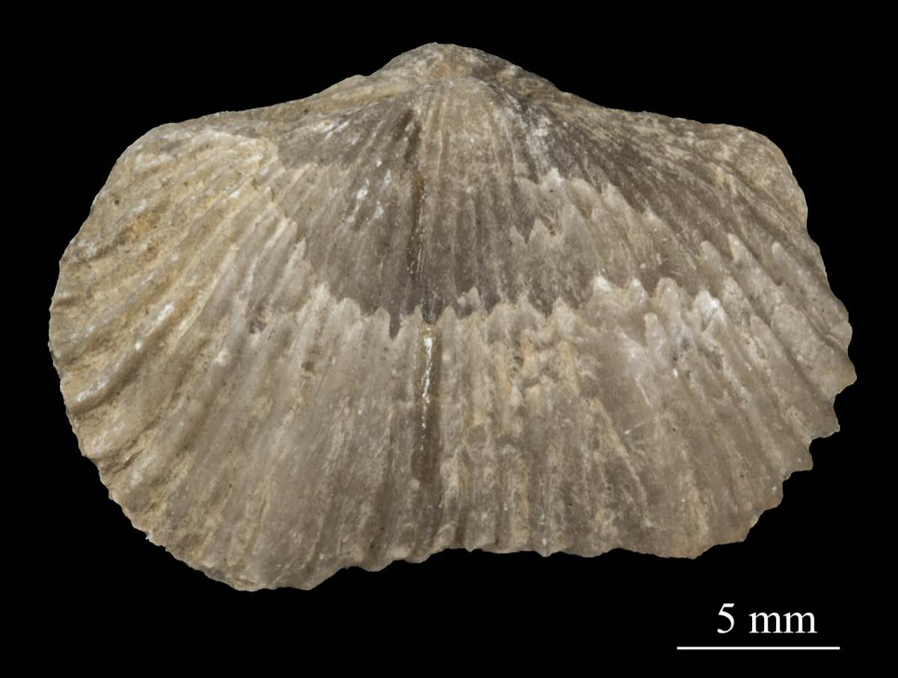
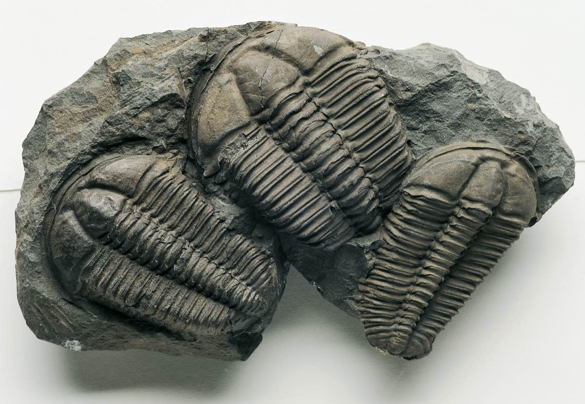

```{r}
#| include: false
library(tidyverse)
library(vegan)
```

# A new tool

Welcome to week 11. Last week, we learned about Principal Component Analysis (PCA), which works like a multidimensional camera. This week, we will learn about Cluster Analysis, which you can think of as a multidimensional paintbrush.

By the end of this lab, you will know how split a multidimensional dataset into neat subcategories using computer algorithms. The different ways of making these categories are called **clustering techniques**.

We will learn about a common clustering technique called **k-means clustering**.

You will come across two types of tasks in this lab. **Worked Examples** have solutions you can expand and check straight away. **Exercises** do not — solutions for these will be posted on Friday evening.

## Learning Outcomes

In this lab, we will learn how to:

1.  Calculate distances (non-Euclidean) using R.
2.  Use k-means clustering to determine sampling strata in R.
3.  Visualise clusters in R and in Google earth.

## Specific goals

By the end of this lab, you should be able to:

-   [ ] Decide if a dataset is suitable for cluster analysis
-   [ ] Perform a k-means cluster analysis in R
-   [ ] Interpret the results of a k-means cluster analysis

## Preparation

This lab uses `tidyverse` and `vegan`. Install any you are missing by running the following **in the console**:

```r
install.packages(c("tidyverse", "vegan"))
```

The 'vegan' package is especially useful for advanced multivariate statistics. Check out [this link](https://www.r-bloggers.com/2014/12/tim-bowles-on-multivariate-stats-with-vegan/) for more information.

Then load them at the top of your script:

```r
library(tidyverse)
library(vegan)
```

### Downloads

| File | Used in | Download |
|---|---|---|
| `fossils.csv` | Section 1 | [Download](data/fossils.csv) |
| `fairfax.csv` | Section 2 | [Download](data/fairfax.csv) |
| `mccue2.csv` | Section 3 | [Download](data/mccue2.csv) |

Save all files into a folder called `data` inside your project folder.

Just like last week, we strongly recommend that you go through this lab with pen and paper in hand.

We will be talking about painting, after all.


*Paintbrushes belonging to Charlyn Marina Khater, Lebanese designer and painter. We can use colour to represent different subcategories within our data. From Wikimedia Commons (2014), by Fox212121.*

# 1. No pictures just yet (~25 min)

Before we reach for our paintbrushes, we have to understand the fundamental idea behind splitting datasets into subcategories. Why might we want to do this?

The simple reason is that being humans, we enjoy subcategories. They are useful. Think about the way books are organised in a library, or pet food is organised in a pet store. Similar items belong together -- that way, they are easier to find.

::: {.callout-note collapse="true"}
#### When do we need subcategories in scientific research?

Think about the way we collect our data in a **stratified sampling design**, where we first divide our study site into different **strata** and then sample randomly within each one (see lab 2 for more information).

How do we decide what these strata should be in the first place? We may need to split our study site into a collection of sensible sub-sites.
:::

Sometimes, the way we create subcategories is very obvious. For example, it is common practice for restaurants to offer their foods and drinks on separate menus. There is very little ambiguity over how to do this -- if it comes in a glass and you can slurp it, it is a drink (soups and consumes might add some difficulty, but usually not much), and it belongs on the drink menu.

Sometimes, however, things are not so easy. For example, how do you organise books on your bookshelf? Do you group books by subject -- science, history, art, home and gardening? Do you group them by length? By how likely you are to read them in the next few days? A combination of the above?

```{r, echo = FALSE}
knitr::include_graphics('images/old-books.jpg')
```

*Old books collected by the Basking Ridge Historical Society. Some of these books have no titles on their cover pages. From Wikimedia Commons (2008), by William Hoiles from Basking Ridge, NJ, USA.*

The difference between sorting food/drink items on a menu and sorting books on your bookshelf is that in the case of food/drink, there is only one distinguishing characteristic -- to slurp or not to slurp; but in the case of books, there are multiple characteristics to consider, none of which take obvious precedent over the others.

In this case, the food/drink divide is a univariate problem, while book organisation is a multivariate problem.

### Distances

```{r, echo = FALSE}
knitr::include_graphics('images/euclids-elements.jpg')
```

*A page with marginalia from the first printed edition of Euclid's* 'Elements', *printed by Erhard Ratdolt in 1482. The* 'Elements' *is one of the oldest surviving mathematical treatises. It was written in 300BC, and exclusively tackles the subject of angles, distances, and geometric arrangements on a flat surface, a field of maths known today as 'Euclidean Geometry'. From Folger Shakespeare Library Digital Image Collection, original link: http://luna.folger.edu/luna/servlet/s/2c163w.*

##
::: {.question}
### Exercise 1

Here's an exercise. Think about your favourite foods. Picture them in your mind. Hungry? Perfect.

If you are attending this lab in person, you will see a pair of signs on the classroom walls. One of these signs will read "Sweet/Savory", and the other "Pungent/Mild". Align yourself on these axes according to your food preferences. If you have no preference on either front, stay in the middle of the room.

Once you have made your choice, look around you. The people nearby are the ones who like similar foods to you. The people on the other side of the room are those who like different foods to you.
:::

```{r, echo = FALSE}
knitr::include_graphics('images/food-basket.jpg')
```

*Food basket. Vegetables come in a range of flavours and textures. Different people prefer different ones. From Wikimedia Commons (2012), by liz west from Boxborough, MA.*

Notice what we did here -- we represented food preferences using physical distance. Food preference is an abstract concept, but physical distance is something we can measure concretely. By rearranging ourselves in a physical space, we saved the trouble of having to ask every other person in the room: "Do you like savory foods?" or "Do you prefer mild flavours?" to find out who likes the same types of foods we do -- all we need to do is look at who is nearby.

This way of using distance to represent similarity is the key to a subtopic of multivariate statistics called **distance-based ordination**. These techniques work differently to the PCA methods we learned about last week, though they share the common goal of reducing dimensions in our data.

::: {.callout-warning collapse="true"}
#### When should I use distance-based ordination instead of PCA?

As a rule of thumb, distance-based ordination is better for datasets where you expect **non-linear relationships** between response variables. Many types of ecological data fall under this category -- for example, species abundance data.
:::

In our food example just now, we used the intuitive definition of 'distance' -- the straight-line distance between two points on a flat surface. This type of distance is called **Euclidean distance**. We can certainly use Euclidean distance in multivariate analysis, but it is not the only type of **distance metric** we can use. In fact, sometimes we can even get away with using what are known as **semi-metrics** or **dissimilarity measures** instead of true metrics.

::: {.column-margin}
If you are interested in the mathematics behind metrics and semi-metrics, check out [this page](https://uw.pressbooks.pub/appliedmultivariatestatistics/chapter/properties-of-distance-measures/) by the University of Washington.
:::

##
::: {.question}
### Exercise 2

Imagine if we added a third characteristic of food: Crunchy/Soft. How would you modify the previous exercise to accomodate this extra variable?

What happens if we add even more variables?
:::

:::: {.content-visible when-profile="solution"}
::: {.ans}
#### Solution

To accomodate for a third variable, we need a third axis. Since we have already used the width and breadth of the room, the only physical dimension left to us is height (you could also call it depth).

Here are some of our ideas:

-   Arrange people on different levels of the building -- crunchy on the lower levels and soft on the higher levels. Unfortunately this means not everybody will be able to see each other.
-   Find stools/steps of different heights that people can stand on; tall stools for soft food lovers, and short stools for crunchy food lovers.
-   Have people who like crunchy food lie or sit down on the floor, while people who like soft food stand upright.

What did you come up with?

If we were to add even more variables, we would run out of physical dimensions! This means we cannot no longer represent abstract concepts as distances in real life -- but do not worry, we can still do it mathematically.

Distance measures are not limited to 3 dimensions in the mathematical world -- in fact, they generalise to any number of finite dimensions. Distance-based ordination takes advantage of this fact to reduce 4D+ situations into 2D or 3D graphs.
:::
::::

In the next example, we will use a semi-metric known as the **Bray-Curtis Dissimilarity**. The Bray-Curtis Dissimilarity is very popular in ecological studies. It is especially useful when analysing species abundance data.

```{r, echo = FALSE}

```

*Photo of a* Platystrophia biforata *fossil from Schlotheim (1820).* Platystrophia *belongs to a group of animals called brachiopods, which were common in the late Ordovician Period (\~ 450 mya). When fossilised, brachiopods look like clams. When living, many brachipods have a long, fleshy pedicle/stalk that anchors them to the seabed. Specimen stored in the Estonian Museum of Natural History. From Wikimedia Commons (2015), uploaded by Tõnis Saadre.*

## Fossils

The Cincinnati region of Ohio, USA, is [a hot spot for fossils](https://www.cincymuseum.org/2022/10/07/the-cincinnati-arch/) of ancient marine organisms. These fossils date from the Late Ordovician Period, around 450 million years ago.

##
::: {.question}
### Worked Example 1

Read the dataset 'fossils.csv' into R, and name it `fossils`.

When you read in this dataset using the `read.csv()` function, include the extra argument: `row.names = 1`.
:::

::: {.column-margin}
We use the `row.names = 1` argument for two reasons: 1. our dataset has an 'ID' column that does not fit in with the rest of our data, and 2. the columns of our dataset have names, but its rows do not.

The `row.names = 1` argument solves both problems at once -- it removes the first column in our dataset (which is the misfit 'ID' column), and use its entries as the names for our rows.
:::

::: {.callout-tip collapse="true"}
#### Solution

Read in the data, including the `row.names = 1` argument:

```{r}
fossils <- read.csv('data/fossils.csv', row.names = 1)
```
:::

Each row in our data is an individual rock sample with its own 'ID'. In each sample, we may find a different collection of fossilised animals. This is the standard way to organise abundance data -- samples as rows, and genera/species as columns.

##
::: {.question}
### Worked Example 2

Look at sample 2D002, the second row in our dataset. What is the most abundant animal genus in this sample?
:::

::: {.callout-tip collapse="true"}
#### Solution

It seems like 'Rafin' (which stands for *Rafinesquina*, a type of brachiopod) is the most common genus in sample 2D002, with a count of 7 individuals.

Also notice there are many genera with 0 abundance in this sample. Zero data is a common theme in ecological surveys, which is another reason why we prefer to use distance-based ordination techniques instead of PCA for these types of datasets.
:::

Now, suppose we asked the question: which rock samples are similar to each other, and which are different? Take a moment to think about how you would answer this question. Would you compare the samples one at a time, or is there a better way?

```{r, echo = FALSE}

```

*Trilobite fossils (the ones in this picture are not from Cincinnati). Trilobites are a famous group of extinct arthropods from the palaeozoic era (539\~251 mya). From Wikimedia Commons (2006), by Muzejní komplex Národního muzea.*

There is a better way. We can use the Bray-Curtis dissimilarity measure. We do this using the `vegdist()` function. This function is part of the 'vegan' package, and is very useful for calculating all kinds of distance metrics and dissimilarity measures.

Here is how we do it:

```{r}
fossils_BC_dissimilarity <- vegdist(fossils, method = 'bray')
# Specify `method = '...'` to tell R which distance metric or semi-metric you want to use.
# In this case, we used `method = 'bray'` for Bray-Curtis dissimilarity, a semi-metric.
```

You will see a new item pop up in your R environment under the 'Values' tab called 'fossils_BC_dissimilarity'. This is the dissimilarity matrix generated by `vegdist()`. To turn this matrix into a table we can inspect, use the `as.matrix()` function.

##
::: {.question}
### Worked Example 3

Use the `as.matrix()` function to turn `fossils_BC_dissimilarity` into a table, and rename it `fossil_BC_dissimilarity_table`.
:::

::: {.callout-tip collapse="true"}
#### Solution

```{r}
fossil_BC_dissimilarity_table <- as.matrix(fossils_BC_dissimilarity)
```
:::

You should see a new item appear in your R environment, this time under the 'Data' tab, called 'fossil_BC_dissimilarity_table'. Click on this item to open it in a new window.

##
::: {.question}
### Worked Example 4

What do you think this table means?

Why are there cells with values of 0?
:::

::: {.callout-tip collapse="true"}
#### Solution

This table tells us the dissimilarity between our samples. The higher the number, the less similar the two samples are. You can picture these numbers as the distances between samples, just like the distances between you and your classmates in the food exercise from earlier.

Cells with values of 0 mean the samples are identical. It is no accident that these cells appear along the top-left/bottom-right diagonal -- each sample is identical to itself.
:::

Based on this table, we can answer a few simple questions. For example:

##
::: {.question}
### Worked Example 5

Which rock sample is the least similar to sample 2D001? Which one is the most similar (besides itself)?
:::

::: {.column-margin}
A useful shortcut to pick out the largest number in any row is the `which.max()` function.
:::

::: {.callout-tip collapse="true"}
#### Solution

The least similar sample to 2D001 is the one with the greatest Bray-Curtis dissimilarity index in the first row.

Let's use `which.max()` to see where this number is:

```{r}
which.max(fossil_BC_dissimilarity_table[1,])
```

It seems that sample 2S025, in column 103, is the least similar to sample 2D001. They share a Bray-Curtis dissimilarity of \~0.93.

Similarly, `which.min()` tells us where to find the smallest number in the first row.

```{r}
which.min(fossil_BC_dissimilarity_table[1,])
```

Which returns no other than sample 2D001, because it has a Bray-Curtis dissimilarity of 0 with itself. To get around this problem, let's exclude the first column:

```{r}
which.min(fossil_BC_dissimilarity_table[1,-1])
# [1,-1] filters for the first row, excluding the first column (due to the minus sign).
```

Which tells us that sample 2D002 is in fact the most similar to sample 2D001, with a Bray-Curtis dissimilarity of 0.\~43.
:::

Give it a try yourself:

##
::: {.question}
### Exercise 3

Which rock sample is the least similar to sample 2D003? Which one is the most similar (besides itself)?
:::

:::: {.content-visible when-profile="solution"}
::: {.ans}
#### Solution

We can use the `which.max()` and `which.min()` functions again, but this time on the third row:

```{r}
which.max(fossil_BC_dissimilarity_table[3,])
```

Sample 2D046 is the least similar to sample 2D003, with a Bray-Curtis dissimilarity of \~0.95.

To find the most similar sample, we have to remove sample 2D003 itself. This means excluding the third column:

```{r}
which.min(fossil_BC_dissimilarity_table[3,-3])
```

Sample 2D005 is the most similar to sample 2D003, with a Bray-Curtis dissimilarity of \~0.18.
:::
::::

::: {.callout-warning collapse="true"}
#### Similarity or dissimilarity?

So far, we have talked extensively about Bray-Curtis **dissimilarity**. However, we could just as easily talk about Bray-Curtis **similarity**.

To convert from one to the other, use the following trick:

$$BC_{similarity} = 1-BC_{dissimilarity}$$
:::

Earlier, we mentioned that the Bray-Curtis dissimilarity is only one of many metrics/semi-metrics that exist. You may be itching to try some different metrics, just to see what they are like:

##
::: {.question}
### Worked Example 6

Generate a dissimilarity matrix with `vegdist(fossils, method = ...)` using a distance metric or semi-metric other than the Bray-Curtis dissimilarity. Some fun ones to try are: `method = 'manhattan'`, `method = 'euclidean'`, `method = 'jaccard'`.

Rename this matrix fossils\_''\_dissimilarity_table, where '' is the method you used (e.g. fossils_euclidean_dissimilarity_table)
:::

::: {.column-margin}
Type `?vegdist` into your console to see what other distance metrics exist.

Remember you can make your matrix into a nice table with the `as.matrix()` function.
:::

::: {.callout-tip collapse="true"}
#### Solution

Let's try `method = 'euclidean'`

```{r}
fossils_euclidean_dissimilarity_table <- as.matrix(vegdist(fossils, method = 'euclidean'))
```

Unlike when we used Bray-Curtis dissimilarity, the numbers are no longer between 0 and 1. This is because Euclidean distance is an **unbounded** metric.
:::

That's a lot of numbers. Time for pictures, what do you say?

```{r, echo = FALSE}
knitr::include_graphics('images/watercolour-painting.jpg')
```

*A watercolour painting titled: 'Nature and peoples life in cht', by artist Mong kyaw sing marma. Cluster Analysis uses the distance matrices we learned about just now to colour-code multivariate datasets. From Wikimedia Commons (2019).*

# 2. Paintbrushes out (~25 min)

Now that we have learned what happens behind the scenes of a Cluster Analysis, it is time for the real deal. Dissimilarity measures are well and good, but they are only the means to an end.

The ultimate goal of Cluster Analysis is... well, clusters. Let's get some of those going.

## K-means, a non-hierarchical clustering method

For this exercise, we will bring back the iris dataset from last week.

##
::: {.question}
### Exercise 4

Check the structure of the `iris` dataset using the `str()` function. Remember that this dataset is already built into R.
:::

:::: {.content-visible when-profile="solution"}
::: {.ans}
#### Solution

```{r}
str(iris)
```

4 numeric variables and 1 categorical variable. We will be using the numeric variables for our Cluster Analysis.
:::
::::

Last week, we saw that the `iris` dataset has 4 numeric variables. For the sake of visualisation, let's pick 2 of them to be our x and y axes respectively.

##
::: {.question}
### Worked Example 7

Use `ggplot()` to make a scatter plot of the `iris` dataset. You can choose any two of the four numeric variables: `Sepal.Length`, `Sepal.Width`, `Petal.Length`, or `Petal.Width` to be your x and y axes.
:::

::: {.callout-tip collapse="true"}
#### Solution

I chose sepal length and petal width as my axes:

```{r}
ggplot(data = iris,
       aes(x = Sepal.Length, y = Petal.Width)) +
  geom_point(shape = 1, stroke = 1)+
  theme_classic()
# shape = 1, stroke = 1 arguments give the graph its rimmed circles.
# Stick with normal circles if you like them better; it's up to you.
```
:::

We can already see that some points seem to group together, and we can try to guess where these groups start and end -- but that is not easy to do by eye. Also, remember we are only seeing a 2-dimensional picture of a 4-dimensional situation. If you chose a different set of axes from me, you might have seen a different picture with different groups.

We need the help of the multivariate paintbrush -- **k-means** clustering.

K-means is a **non-hierarchical** clustering technique. You can think of it as colouring a random set of starting points and letting those colours spread from one point to the next until every point is coloured -- similar to the way patches of watercolour paint spread out over a piece of paper. In reality, the process is a little more complicated than this -- your demonstrators and lectures will happily elaborate.

::: {.callout-tip collapse="true"}
#### Hierarchical vs non-hierarchical

When should you use hierarchical clustering as opposed to non-hierarchical clustering?

Hierarchical clustering is more 'powerful' in the sense that you can see how every site/sample relates to every other site/sample at once -- from the closest relations to the furthest ones, each one nested in the next like the branches of a phylogenetic tree.

K-means, being a non-hierarchical technique, offers an entirely different advantage -- it allows you to specify exactly how many clusters you want to create. This is useful if you have logistic constraints and/or prior knowledge about your data.
:::

To perform k-means clustering, we can use the `kmeans()` function. Let's apply it to the `iris` dataset -- remember to first exclude the 'Species' column. We will specify 3 clusters for now.

```{r}
iris_k_means_3_clusters <- kmeans(iris[,-5], centers = 3, nstart = 20)
# [,-5] excludes the fifth column, which is our 'Species' column.
# kmeans(..., centers = 3) tells R we want 3 clusters.
# kmeans(..., nstart = 20) tells R we want to try 20 different initial configurations
```

Done! Let's see the results.

The k-means analysis has assigned each of our samples to one of three clusters. This information is stored in the 'cluster' column.

##
::: {.question}
### Worked Example 8

Pick out the 'cluster' column from `iris_k_means_3_clusters`. Remember you can pick columns by name using the `$` operator.
:::

::: {.callout-tip collapse="true"}
#### Solution

```{r}
iris_k_means_3_clusters$cluster
```

We see that the first batch of samples were sorted into cluster 3, the next batch into 2, etc. There are some alternating assignments in between, which is interesting.
:::

Now we can bring back our original scatter plot and colour-code it based on this 'cluster' column:

##
::: {.question}
### Worked Example 9

Re-make your scatter plot from earlier, but this time colour-coded by cluster.
:::

::: {.callout-tip collapse="true"}
#### Solution

You can introduce colours to your plot in one of two ways: directly in the `geom_point()` section, or in the `aes()` section, which is the way I prefer.

First, make `iris_k_means_3_clusters$cluster` into a factor:

```{r}
iris_clusters <- as.factor(iris_k_means_3_clusters$cluster)
```

Then use it to colour-code your plot:

```{r}
ggplot(data = iris,
       aes(x = Sepal.Length, y = Petal.Width,
       colour = iris_clusters)) +
  geom_point(shape = 1, stroke = 1,)+
  scale_colour_manual(values = c('steelblue','red','black'))+
  theme_classic()
```
:::

Notice something strange? K-means is supposed to group the closest points together so that each cluster is completely separated from the others, but why are some of the clusters mixed up?

##
::: {.question}
### Worked Example 10

Why do you think the clusters in your graph are not separated properly? Did k-means fail?
:::

::: {.callout-tip collapse="true"}
#### Solution

The good news is that k-means did not fail! In fact, you could say it was our scatter plots that 'failed'.

The reason some of the clusters look mixed-up is because our scatter plots were only 2-dimensional. K-means, on the other hand, was operating in 4 dimensions.

Try picking a different set of axes for your scatter plot. Here is one with sepal length and petal length as the x and y axes respectively:

```{r}
iris_clusters <- as.factor(iris_k_means_3_clusters$cluster)
ggplot(data = iris,
       aes(x = Sepal.Length, y = Petal.Length,
       colour = iris_clusters)) +
  geom_point(shape = 1, stroke = 1,)+
  scale_colour_manual(values = c('steelblue','red','black'))+
  theme_classic()
```

From this perspective, you can see that the clusters are much better separated. If we could plot in 4 dimensions, we would see that the clusters are in fact perfectly separated.
:::

What do these 3 clusters correspond to? Time for the big reveal:

##
::: {.question}
### Worked Example 11

Re-make your scatter plot again, but this time colour-coded by species.
:::

::: {.callout-tip collapse="true"}
#### Solution

To colour-code by species, use the argument `colour = Species` in the `aes()` section.

```{r}
iris_clusters <- as.factor(iris_k_means_3_clusters$cluster)
ggplot(data = iris,
       aes(x = Sepal.Length, y = Petal.Width,
       colour = Species)) +
  geom_point(shape = 1, stroke = 1,)+
  scale_colour_manual(values = c('black','red','steelblue'))+
  theme_classic()
```

Look familiar?
:::

It turns out the 3 k-means clusters correspond nicely with the 3 iris species!

Why is this interesting? Remember that we actually *removed* the species column before applying k-means clustering, so k-means had no idea which sample belonged to which species. It was guessing blind, and still more or less reached the right conclusion.

Magic?

Well, sort of. The truth is that the `iris` dataset is very suitable for k-means clustering because each species is morphological distinct from the others. In other cases, k-means might not work so well. However, even a less-than-perfect k-means analysis can still be useful in the real world.

*Side note: this exercise was inspired by a guided demonstration of k-means clustering from [R bloggers](https://www.r-bloggers.com/k-means-clustering-in-r/).*

::: {.callout-warning collapse="true"}
#### How many clusters should I choose?

One of the main questions we glossed over in this exercise was how to choose the right number of clusters.

Personally, I cheated a little -- I knew there were 3 iris species in the dataset, so I picked k = 3 clusters. In the real world, we might not have this kind of information.

One way to pick the right number of clusters mathematically is to look at the **within sum of squares (wss)** as we incrementally increase the number of clusters. Once we see diminishing returns, we stop.

Visually, we can use a skree plot -- just like we did for our PCAs last week. The code is a little bit complicated, but I've left it here for your interest:

```{r}
wss <- (nrow(iris[,3:4])-1)*sum(apply(iris[,3:4],2,var))
for (i in 2:15) wss[i] <- sum(kmeans(iris[,3:4], centers=i,nstart=20)$withinss)
plot(1:15, wss, type="b", xlab="Number of Clusters", ylab="Within groups sum of squares")

```

In this case, 2 clusters would have sufficed. But I wanted 3 to drop the cool reveal :P
:::

```{r, echo = FALSE}
knitr::include_graphics('images/iglesia-blanca.jpg')
```

*A field of sunflowers in Cardejón, Spain. Dividing a single field into multiple sampling strata is one instance where k-means clustering can be useful. From Wikipedia (2012), by Diego Delso.*

## Using k-means to stratify a field

When you sample in a field, your sites may vary by slope, elevation, clay content, vegetation type, biomass, etc. You want to sort these sites into distinct strata so that you can sample similar sites together, but how do you do this?

Consider the following example.

##
::: {.question}
### Worked Example 12

Read the file `fairfax.csv` into R, rename it `fairfax_field_soil_properties`, and check its structure.

Just like with the `fossils` dataset, please include the argument `row.names = 1` when you read in your data using the `read.csv()` function.
:::

::: {.callout-tip collapse="true"}
#### Solution

```{r}
fairfax_field_soil_properties <- read.csv("data/fairfax.csv", row.names = 1)

str(fairfax_field_soil_properties)
```

We see this dataset has a HUGE number of observations (\> 70,000), many of which are 'NA's. We will not be able to detect any patterns by looking through this dataset manually.

What we can see from the structure of the dataset is that it contains 8 numeric variables. The variables 'x' and 'y' are co-ordinates, 'clay 1-4' are clay contents at different depths (in %), valsSlope is the slope at each point in the field (as a gradient), and valsDem is the elevation of each point in the field (in metres).
:::

The first thing we can do is remove the 'NA's from our dataset using the `na.omit()` function:

##
::: {.question}
### Worked Example 13

Use the `na.omit()` function to remove the 'NA's from `fairfax_field_soil_properties`. Rename this new file `fairfax_field_soil_properties_tidy`, and check its structure.
:::

::: {.callout-tip collapse="true"}
#### Solution

```{r}
fairfax_field_soil_properties_tidy <- na.omit(fairfax_field_soil_properties)

str(fairfax_field_soil_properties_tidy)
```

Success!
:::

::: {.callout-warning collapse="true"}
#### When can I remove 'NA's, and when must I keep them?

The most important question ask yourself when you decide to remove 'NA' values is: Why is the value 'NA' in the first place? Usually, you will have the reason recorded in your dataset somewhere -- under a 'metadata' tab, for instance.

Here are the situations where it is usually OK to remove 'NA's:

1.  If you made no attempt to collect any data at that point.
2.  If removing the rows/columns containing an 'NA' does not remove other, non-'NA' values.

Here are the situations where you may want to think twice about removing 'NA's:

1.  If you made an attempt to collect data, but detected nothing (in which case, your 'NA's should actually be 0s).
2.  If removing the rows/columns containing an 'NA' inadvertently removes other, non-'NA' values.
:::

Let's plot our data. Since the 'x' and 'y' columns are co-ordinates, what we will end up with is a map of the field.

##
::: {.question}
### Worked Example 14

Make a scatter plot of `fairfax_field_soil_properties_tidy`, with column 'x' as the x-axis, and 'y' as the y-axis. Your plot should look like a map.
:::

::: {.column-margin}
There are lots of sample points in our data! To see the shape of the field more clearly, include the arguments: `size = 0.5` and `alpha = 0.5` in the `geom_point()` section; the former decreases point size, and the latter increases point transparency.

If you are working on a small screen, you may need to shrink your point size even further (try 0.1, for example).
:::

::: {.callout-tip collapse="true"}
#### Solution

```{r}
ggplot(fairfax_field_soil_properties_tidy,
       aes(x = x, y = y)) +
  geom_point(size = 0.5, alpha = 0.5) +
  theme_classic()
```

That is the shape of our field.
:::

We want to paint this map into different colours using cluster analysis, which will tell us how we should stratify the field. Before we do this, take a moment to look back on the structure of the dataset. Do you notice anything strange?

##
::: {.question}
### Worked Example 15

Look back at the structure of `fairfax_field_soil_properties_tidy`. Do you notice anything different about this dataset compared to, say, the `iris` dataset?
:::

::: {.callout-tip collapse="true"}
#### Solution

Unlike the `iris` dataset, which has 1 categorical variable and 4 numeric variables, `fairfax_field_soil_properties_tidy` has 6 numeric variables (8, if you include the x and y co-ordinates).

More importantly, these 6 numeric variables are measured in different units! Clay content is a percentage, slope is a gradient, and elevation is measured in metres. We have to standardise these units before performing a cluster analysis.
:::

When our measurements come in different units, we first have to standardise them before performing a cluster analysis (and many other multivariate analyses, for that matter). We can do this easily using the `scale()` function.

##
::: {.question}
### Worked Example 16

Select columns 3-8 of `fairfax_field_soil_properties_tidy`, and apply the `scale()` function to them. Name this new dataset `fairfax_field_soil_properties_scaled`
:::

::: {.callout-tip collapse="true"}
#### Solution

```{r}
fairfax_field_soil_properties_scaled <- scale(fairfax_field_soil_properties_tidy[,3:8])
```

To be specific, `scale()` performs two separate operations on each column of your dataset: first it **centres** (subtracts each value from the column mean), then it **standardises** (divides each value by the column standard deviation).
:::

Now we are ready to paint the map. How many colours should we choose? It's up to you; but I'm going with 3, just like last time. I will also include the `nstart = 20` argument again, as 20 \~ 25 initial configurations is standard practice for k-means clustering.

##
::: {.question}
### Worked Example 17

Perform a non-hierarchical cluster analysis on `fairfax_field_soil_properties_scaled` using the `kmeans()` function. Name this analysis `fairfax_k_means_?_clusters`, where '?' is the number of clusters you choose to use.
:::

::: {.callout-tip collapse="true"}
#### Solution

I went with 3 clusters:

```{r}
fairfax_k_means_3_clusters <- kmeans(fairfax_field_soil_properties_scaled, 3, nstart = 20)
```
:::

Now to plot our results:

##
::: {.question}
### Worked Example 18

Extract the `cluster` column from `fairfax_k_means_3_clusters`, and use this column to colour-code your original scatter plot.
:::

::: {.callout-tip collapse="true"}
#### Solution

Extract the `cluster` column and turn it into a factor:

```{r}
fairfax_clusters <- as.factor(fairfax_k_means_3_clusters$cluster)
```

Use it to colour-code your map:

```{r}
ggplot(fairfax_field_soil_properties_tidy,
       aes(x = x, y = y,
           colour = fairfax_clusters)) +
  geom_point(size = 0.5, alpha = 0.5) +
  scale_colour_manual(values = c('red','steelblue','black'))+
  theme_classic()
```

Done :)
:::

Now we have painted similar regions in the same colour. If we decide to undertake stratified random sampling on this field in the future, these can be our 3 different strata.

##
::: {.question}
### Worked Example 19

Why are the clusters on this map poorly separated? i.e. Why are the red regions interspersed with the black and blue regions, instead of each colour forming its own cluster as you would expect from a cluster analysis?
:::

::: {.callout-tip collapse="true"}
#### Solution

Recall that we encountered a similar problem with the `iris` dataset. However, this time the reason is completely different.

The reason this time is that our plot does not have response variables on the x and y axes. Instead, it is a map of the real world with co-ordinates on the x and y axes.

Here is the same plot if our axes had been the response variables clay2 and clay3 instead:

```{r}
ggplot(fairfax_field_soil_properties_tidy,
       aes(x = clay2, y = clay3,
           colour = fairfax_clusters)) +
  geom_point(size = 0.5, alpha = 0.5) +
  scale_colour_manual(values = c('red','steelblue','black'))+
  theme_classic()
```

You can see that the three clusters are, in fact, nice and distinct. If we could plot all 6 response variables on a 6D plot, we would see that the clusters are perfectly separated.
:::

That's all for k-means clustering!

```{r, echo = FALSE}
knitr::include_graphics('images/clarkia-pulchella.jpg')
```
*The vibrant* Clarkia pulchella, *a woody annual plant native to North America. In the next exercise, we will look at genetic data gathered from a closely related species,* Clarkia springvillensis. *From Wikimedia Commons (2016), by Dinkum.*

# 3. From scatter plots to dendrograms (~25 min)

The last part of our lab moves away from non-hierarchical clustering and into **hierarchical clustering**. There are many hierarchical clustering methods, but the one we will use today is called the Unweighted Pair Group Method with Arithmetic Mean, or **UPGMA**.

```{r, echo = FALSE}
knitr::include_graphics('images/phylogenetic-tree.png')
```
*A dendrogram, or 'tree'. Trees are useful ways to depict ranked relationships between objects; in this case, the relationship between different mammal species. From Wikimedia Commons (2007), by Fred Hsu.*

## Hierarchical clustering

In 1996, Kimberlie McCue and her research team sampled the genetic material of 240 *Clarkia springvillensis* plants along the North fork of the Tule River.[^1]

[^1]: McCue, K. A., Buckler, E. S., & Holtsford, T. P. (1996). A Hierarchical View of Genetic Structure in the Rare Annual Plant Clarkia springvillensis. *Conservation Biology, 10*(5), 1425–1434. JSTOR. https://doi.org/10.2307/2386917

These 240 plants came from 8 different sub-populations. 3 of these sub-populations came from a site called Bear Creek (BC), another 3 came from Springville *Clarkia* Ecological Reserve (SCER), and the last 2 sub-populations came from a site called Gauging Station (GS).

The question we want to answer is whether sub-populations from the same site share similar genetic markers.

##
::: {.question}
### Worked Example 20

Read the dataset `mccue2.csv` into R, rename it `Clarkia_genetics`, and check its structure. Once again, please include the `row.names = 1` argument.
:::

::: {.callout-tip collapse="true"}
#### Solution
```{r}
Clarkia_genetics <- read.csv("data/mccue2.csv", row.names = 1)
str(Clarkia_genetics)
```
That's interesting... we have our sub-populations as columns (BC1, BC2, etc.), and every number is a decimal. What is going on?
:::

The structure of this dataset seems rather strange. Let's print out the whole table to see what is happening:

::: {.callout-note collapse="true"}
#### The `Clarkia_genetics` dataset

```{r}
Clarkia_genetics
```
:::

##
::: {.question}
### Worked Example 21

Take a look at the `Clarkia_genetics` table. What do you think the values in this table represent?
:::

::: {.column-margin}
Notice the long diagonal of 0s stretching from the top left to the bottom right corner.
:::

::: {.callout-tip collapse="true"}
#### Solution

This table is a dissimilarity matrix! Each number represents how different the genetic markers are between any two sub-populations. This is why we have the sub-population names as both the row and column headings.
:::

In fact, our data already comes in the form of a dissimilarity matrix. Dr McCue and her team used a special dissimilarity measured called the [Cavalli-Sforza chord genetic distance](https://doi.org/10.1093/genetics/144.1.389) to generate this matrix.

Because of this, we do not need to scale our data or generate our own dissimilarity matrices like we did for the previous exercises. Instead, we can jump straight into clustering.

The function we will use is called `hclust`, 'h' for 'hierarchical'.

##
::: {.question}
### Worked Example 22

Run the hierarchical clustering analysis and plot the dendrogram.
:::

::: {.callout-tip collapse="true"}
#### Solution

The following line of code should do the trick:

```{r}
hc <- hclust(as.dist(Clarkia_genetics), method = "average")
```

To see our results, we use the base-R function `plot()`:

```{r}
plot(hc,
     main="Dendrogram of *Clarkia* Sub-Populations",
      ylab="Cavalli-Sforza chord distance")
```
:::

How do we interpret this graph?

If you are familiar with how to read a phylogenetic tree, then you can read this dendrogram in the same way -- just mentally replace the phrase "common ancestor" with "shared node", and the phrase "closely related" with "similar"; then you pretty much have the right idea.

If you are not familiar with phylogenetic trees, consider this your official introduction to them. Start from the tips of the tree, which in this case would be our eight sub-populations. To see how similar one sub-population is to another, trace both of them back until you find the branch where they split from one another. The further back this branch is, the less similar the two sub-populations are.

In biology, this 'splitting branch' is called the **last common ancestor** of two taxa. In Cluster Analysis, this branch... does not really have a name, but I like to call it the **last shared node** between two samples. The difference, of course, is that there is no evolution going on in Cluster Analysis, so the concept of 'ancestors' and 'descendants' do not apply.

##
::: {.question}
### Worked Example 23

Based on the above dendrogram, would you say that *Clarkia springvillensis* sub-populations in the same site shared similar genetic markers?
:::

::: {.callout-tip collapse="true"}
#### Solution

We think there is no obvious similarity between *C. springvillensis* sub-populations in the same site. Otherwise, we would see all the BC sub-populations grouped together, and all the SCER sub-populations grouped together.

What we actually see, however, is that the BC1 sub-population is more genetically similar to the SCER1 and SCER3 sub-populations than it is to other BC sub-populations.

The GS sites represent a clear "outgroup", in that GS1 and GS2 are very different from every other sub-population, and also from each other.
:::

```{r, echo = FALSE}
knitr::include_graphics('images/mountain-ash-eucalyptus.jpg')
```
*An open forest dominated by Mountain Ash* (Eucalyptus regnans). *Mountain Ash are native to Tasmania, and adult Mountain Ashes can grow to be some of the tallest trees in the world, beaten only by the redwoods of North America. From Wikimedia Commons (2000), by the Commonwealth Scientific and Industrial Research Organisation (CSIRO).*

## Clustering cars

Now it is your turn to perform a clustering procedure of your own. Just like last week, we recommend that you collaborate with your peers on this exercise, and ask your demonstrators for help if you get lost.

Good luck!

##
::: {.question}
### Exercise 5

Perform a clustering procedure on the `mtcars` dataset. This dataset is built into R just like `iris`. To find out more, type `?mtcars` into your console.

We will leave you to decide what type of clustering procedure to perform, how much of the dataset to use, and what the aim of your analysis is.
:::

That's all for this lab. Have a good rest of the week!
