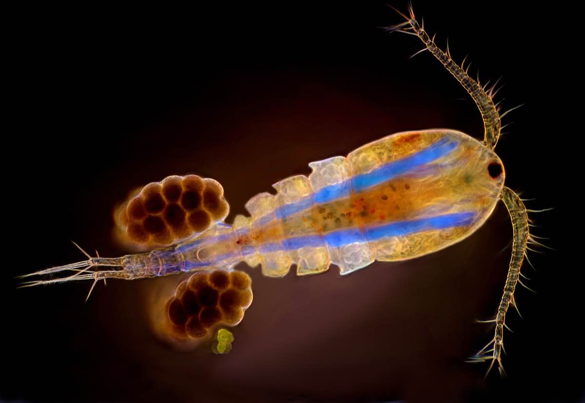
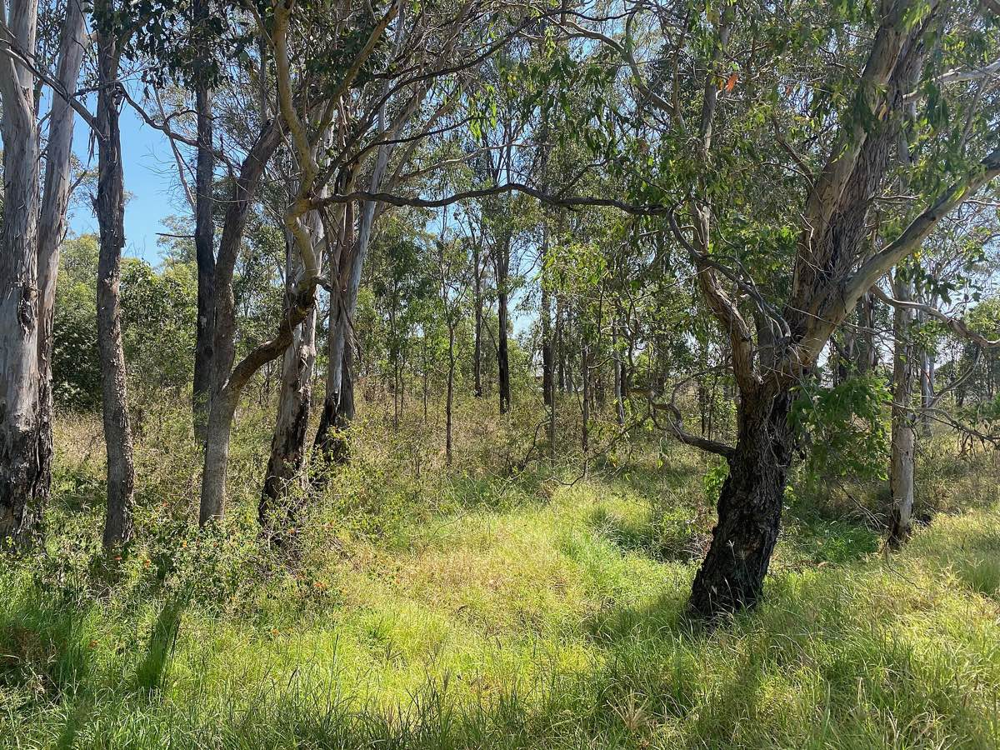
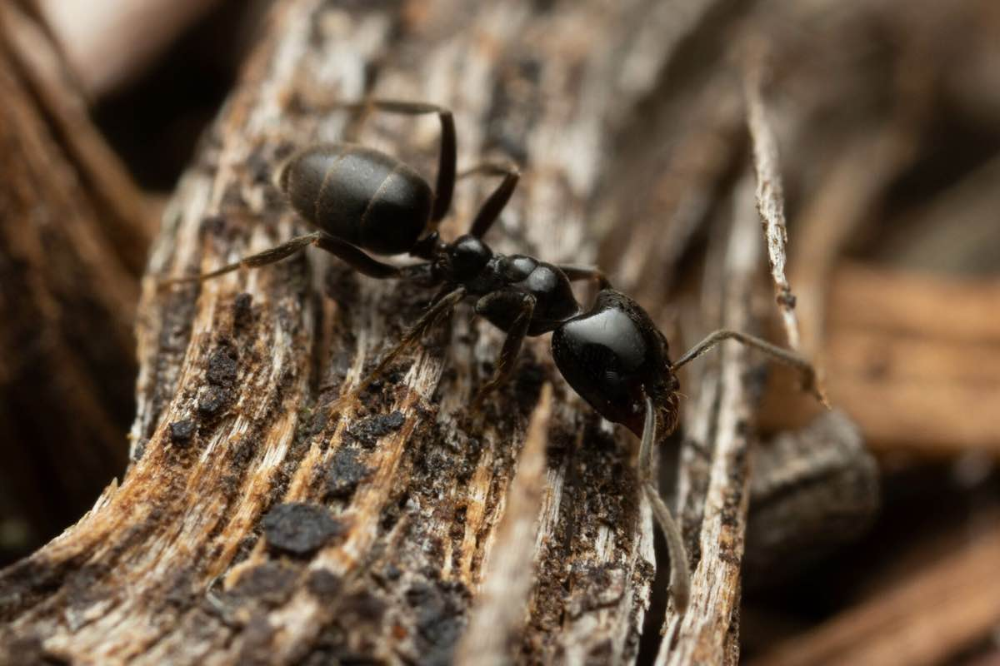
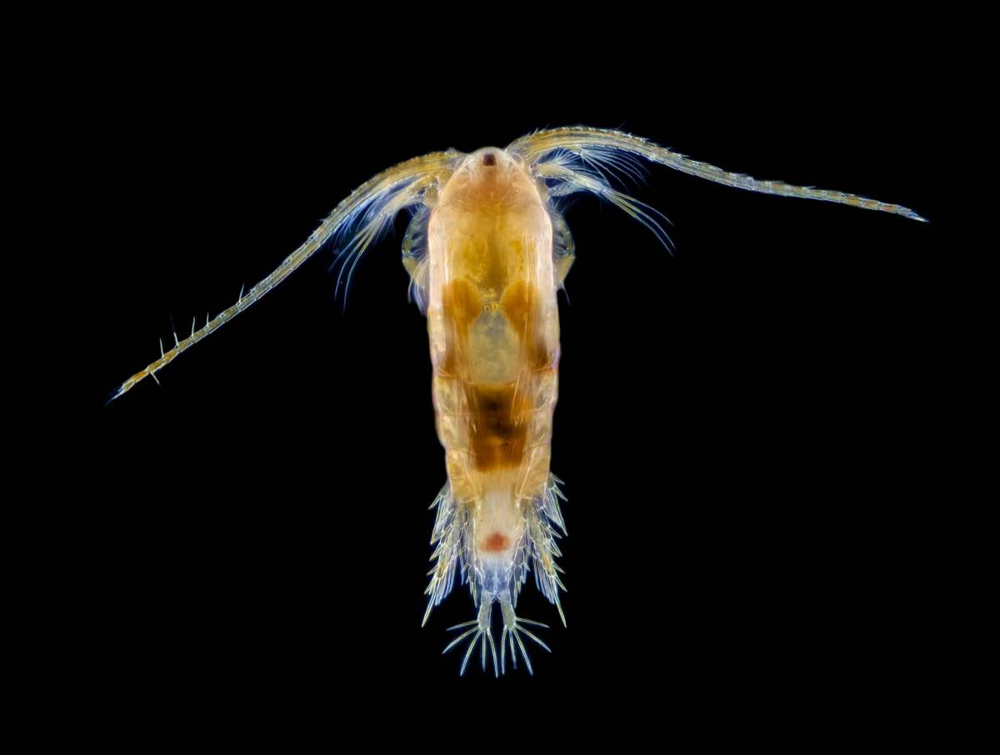
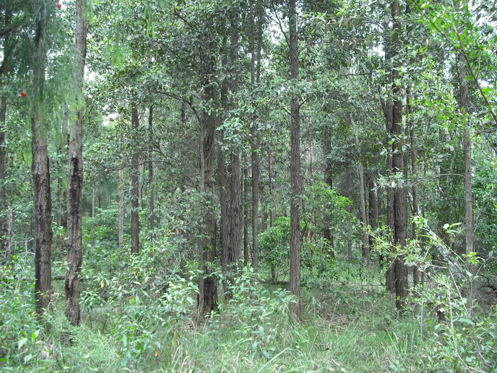
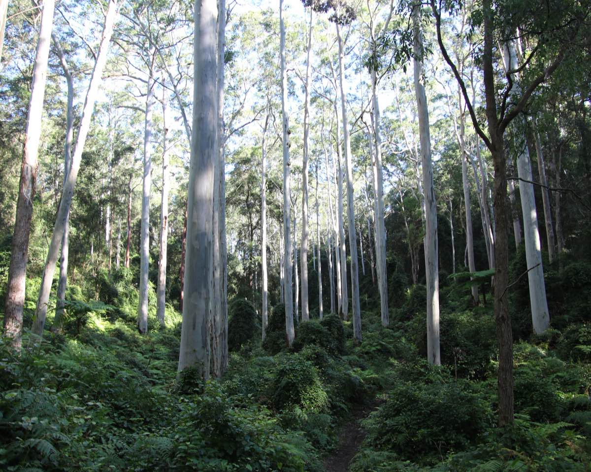
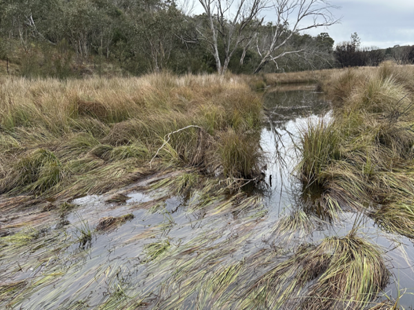
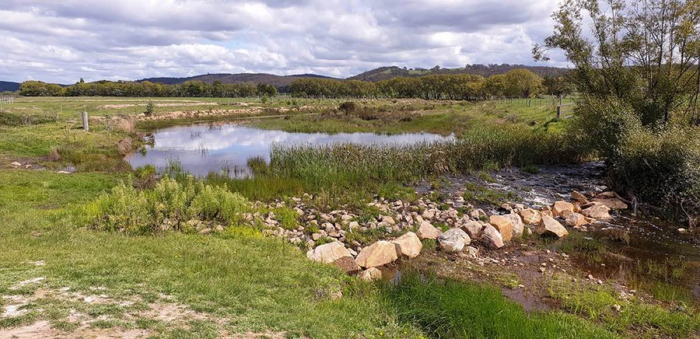

```{r}
#| include: false
library(tidyverse)
library(vegan)
```

# The final lab

Welcome to week 12! This is the final lab for ENVX2001. We hope you found this unit helpful, and had some fun along the way. Don't forget to give us some feedback via the Unit of Study Surveys (USS) that will be made available to you soon.

In this lab, we will tackle the last of our three multivariate visualisation tools: non-Metric Multidimensional Scaling (nMDS). We will also explore the main statistical analyses that accompany this tool: Permutational Analysis of Variances (PERMANOVAs), and Similarity Percentages (SIMPERs).

In week 10, we learned how to use PCA, the multidimensional camera. Last week, we met Cluster Analysis, the multidimensional paintbrush. This week is all about nMDS, the multidimensional pen.

You will come across two types of tasks in this lab. **Worked Examples** have solutions you can expand and check straight away. **Exercises** do not — solutions for these will be posted on Friday evening.

## Learning Outcomes

In this lab, we will learn how to:

1.  Pick the right transformations for a multivariate dataset
2.  Calculate similarity matrices on transformed data
3.  Generate ordination plots using Non-metric Multidimensional Scaling (nMDS)
4.  Statistically test for differences between factors using a PERMANOVA
5.  Determine what contributes most to these differences using a SIMPER analysis

## Specific goals

By the end of this lab, you should be able to:

-   [ ] Transform your data
-   [ ] Calculate similarity matrices
-   [ ] Produce nMDS plots
-   [ ] Interpret PERMANOVAs
-   [ ] Interpret SIMPERs

```{r, echo = FALSE}

```
*Ink doodles of a giant tortoise. While cameras are constrained by the forms, perspectives, and proportions of real-world objects, pens give artists the power to change these proportions to suit their liking. By Alex Sun, original work.*

## Preparation

This lab uses `tidyverse` and `vegan`. Install any you are missing by running the following **in the console**:

```r
install.packages(c("tidyverse", "vegan"))
```

Then load them at the top of your script:

```r
library(tidyverse)
library(vegan)
```

### Downloads

| File | Used in | Download |
|---|---|---|
| `CopepodData.csv` | Sections 1--4 | [Download](data/CopepodData.csv) |
| `AntDataTotal.csv` | Sections 1--4 | [Download](data/AntDataTotal.csv) |
| `LeakyWeir.csv` | Section 5 | [Download](data/LeakyWeir.csv) |

Save all files into a folder called `data` inside your project folder.

As for the previous multivariate labs, we recommend that you go through this lab with pen and paper in hand.

# 1. When the pen beats the camera

NMDS lets us work with datasets that are too 'messy' for other kinds of multivariate analyses (including PCAs) to handle. A common use of nMDS in biology is the visualisation of patterns in ecological communities, which may consist of tens, hundreds, or even thousands of species scattered across vast regions of land and water.

```{r, echo = FALSE}

```
*Paperbark (*Melaleuca spp.*) wetlands in the Northern Territory, Australia. Biologists use nMDS to analyse and compare different ecological communities. From Wikimedia Commons (2007), by Susanbelperio.*

What do we mean by a 'messy' dataset? In multivariate analysis, 'messiness' usually comes down to one of two things:

- Too many 0s
- Too many non-linear relationships

## Messy or not?

Let's see what 'messiness' means with an example. Consider `CopepodData.csv`:

```{r, warning = FALSE, message = FALSE}
copepod_data <- read_csv('data/CopepodData.csv')
```

For context, copepods are small, aquatic organisms that form part of the [zooplankton](https://www.sciencedirect.com/topics/immunology-and-microbiology/copepod) in marine ecosystems. They exist in freshwater habitats as well.

```{r, echo = FALSE}

```
*A copepod specimen from the genus *Cyclops*, one of the most common freshwater copepod genera in the world. Image was taken under 50x magnification. From Wikimedia Commons (2019), by MarekMiś.*

The copepods in our dataset are marine species that come from Solbergstrand, Norway [^1]. Researchers placed these copepods in twelve separate tanks, and allocated each tank to one of three different treatment groups. These are listed under the column `Treatment`:

- Control (C): tanks received no nutrient input
- Low (L): tanks received low levels of nutrient input in the form of organic sediments
- High (H): tanks received high levels of nutrient input in the form of organic sediments

[^1]: Gee, J.Michael., Warwick, R.M., Schaanning, M., Berge, J.A. and Ambrose, W.G. (1985). Effects of organic enrichment on meiofaunal abundance and community structure in sublittoral soft sediments. *Journal of Experimental Marine Biology and Ecology*, 91(3), pp.247–262. doi:https://doi.org/10.1016/0022-0981(85)90179-0.

::: {.question}
### Worked Example 1

What is the sampling unit in this experiment? What is the experimental unit? How many replicates do we have for each treatment group?

**Bonus question**: What dimensional space do our data points occupy?
:::

::: {.callout-tip collapse="true"}
#### Solution

Both the sampling and the experimental units are tanks. The treatments are applied per tank, and each tank is then sampled for its copepods.

Importantly, the sampling unit is **not** copepods. The abundance of copepods per tank is our response variable.

Consequently, we have 4 replicates per group, since we have 4 tanks for each level of treatment.

Our data points occupy 19-dimensional space, since there are 19 response variables (abundances for each of our 19 copepod species).
:::

Take a look at `copepod_data`. Notice how many 0s are present. This is very common in ecological data. Species distributions tend to be 'patchy' -- a species may be very abundant in some sites, but entirely absent in others.

When this happens, we say our data is **zero-inflated**. Many multivariate analysis techniques, such as PCAs, require [heavy modifications](https://doi.org/10.1016/j.csda.2024.107989) to handle zero-inflated datasets. NMDS, on the other hand, can deal with zero-inflation no problem.

Now, consider this scatterplot of one copepod species against another.

```{r, echo = FALSE}
ggplot(copepod_data,
       aes(x = `Tisbe sp 5`, y = `Tisbe sp 4`)) +
  geom_point(shape = 21,
             fill = 'lightblue',
             size = 3,
             stroke = 1.5) +
  theme_classic()
```

Notice how the relationship between them is non-linear. Non-linear relationships between response variables is another problem for PCAs. NMDS, on the other hand, works just fine with non-linear relationships.

In summary, nMDS may be less **statistically powerful** than PCA in certain situations (just as a pen is less accurate than a camera), but more **flexible** in terms of the type of data it can handle. This is similar to how non-parametric tests of single variables (e.g. Kruskal-Wallis tests) can work on datasets that do not meet assumptions for parametric tests (e.g. ANOVAs).

::: {.question}
### Exercise 1

Load and explore `AntDataTotal.csv`. What features of this dataset make it unsuitable for PCA?
:::

:::: {.content-visible when-profile="solution"}
::: {.ans}
#### Solution

```{r, message=FALSE, warning=FALSE}
ant_data <- read_csv('data/AntDataTotal.csv')
```

Just like `copepod_data`, this dataset also has many 0s. Moreover, the relationships between response variables are non-linear (see graph below).

```{r}
ggplot(ant_data,
       aes(x = `Anonychromyrma 1`, y = `Meranoplus 1`)) +
  geom_point(shape = 21,
             fill = 'red',
             size = 3,
             stroke = 1.5) +
  theme_classic()
```
:::
::::

For context, `ant_data` comes from a study on ant assemblages in different vegetation communities. The communities are abbreviated as follows:

- BGHF = Blue Gum High Forest
- CCIF = Cooks River/Castlereagh Ironbark Forest
- CPW = Cumberland Plain Woodland
- SRW = Sandstone Ridgetop Woodland
- SSTF = Shale/Sandstone Transition Forest

At each site, the researchers placed two quadrats -- one near the edge of the site (Edge), and one near the middle (Interior).

If you want to learn more about this study, you can read chapter 2 of [Dr James Schlunke's PhD thesis](http://hdl.handle.net/2123/15576).

```{r, echo = FALSE}

```
*Cumberland Plains Woodland in Prestons, NSW, an endangered plant community. From Wikimedia Commons (2022), by Chris.sherlock2.*

## DIY

In week 10, we learned what kinds of datasets are suitable for PCA. Just now, we learned what kinds of datasets are not.

Now it's your turn.

Treat the following task as a class exercise -- you should work together with your friends and ask your demonstrators for help if you get stuck.

::: {.question}
### Exercise 2

Create two different multivariate datasets in R: one that is suitable for PCA, and one that is not. Is nMDS a better option for the latter? If so, explain.

If you do not want to create your own datasets, you can look for multivariate datasets from published papers, and explain whether they should be analysed using a PCA or an nMDS (or neither).
:::

::: {.column-margin}
Multivariate datasets contain multiple columns and multiple rows. Each column represents a response variable. Each row represents a sample.

You can use the function `c()` to create and name each column separately. Then, you can use the function `data.frame()` to combine them into a table.
:::

:::: {.content-visible when-profile="solution"}
::: {.ans}
#### Solution

Here are two datasets we came up with:

```{r}
Treatment <- c("A","A","A","A","A",
               "B","B","B","B","B")
response_1 <- c(1,2,3,4,5,6,7,8,9,10)
response_2 <- c(12,12,9,8,7,6,6,3,2,2)
response_3 <- c(0,0,1,1,2,3,3,4,5,5)
response_4 <- c(14,14,12,11,10,5,5,2,1,1)

PCA_compatible <- data.frame(Treatment,
                             response_1, response_2,
                             response_3, response_4)
```

This one is PCA compatible, because we see there are very few 0's. Also, if we plot one response variable against another:

```{r}
ggplot(PCA_compatible,
       aes(x = response_1, y = response_2)) +
  geom_point(shape = 21,
             fill = 'forestgreen',
             size = 3,
             stroke = 1.5) +
  theme_classic()
```

We see that the relationship between them is more or less linear.

On the other hand,

```{r}
Site <- c("A","A","A","A","A",
           "B","B","B","B","B")
species_1 <- c(0,2,3,4,0,6,7,8,0,10)
species_2 <- c(0,0,4,8,9,6,6,3,2,0)
species_3 <- c(0,0,1,1,2,0,0,4,15,5)
species_4 <- c(0,24,12,0,10,1,1,0,1,15)

PCA_incompatible <- data.frame(Treatment,
                             species_1, species_2,
                             species_3, species_4)
```

This dataset is incompatible with PCA, because there are too many 0's.
Also, if we plot one response variable (species) against another:

```{r}
ggplot(PCA_incompatible,
       aes(x = species_1, y = species_2)) +
  geom_point(shape = 21,
             fill = 'white',
             size = 3,
             stroke = 1.5) +
  theme_classic()
```

We see that the relationship between them is non-linear.

In this case, we should use an nMDS instead of a PCA for the second dataset, because nMDSs are not constrained by zero-inflation and non-linear relationships in the same way that PCAs are.
:::
::::

# 2. Making nMDS plots

```{r, echo = FALSE}

```
*Architectural diagram from the Engetrim archive, Belgium, from 1897. NMDS works in the same way as architectural diagrams -- they both highlight the underlying structures of complex objects by simplifying them into abstract schematics. From Wikimedia Commons (2020), by Jules Bilmeyer and Joseph Van Riel.*

There are four main steps to create an nMDS plot:

1. (Optional) Transform your data
2. Calculate dissimilarity matrices
3. Calculate nMDS scores
4. Plot these scores on a scatter plot

## Copepods nMDS

Let's use `copepod_data` as an example.

::: {.question}
### Worked Example 2

Visually inspect the dataset. Are some species more common than others? By how much? What does this mean for our analysis?
:::

::: {.callout-tip collapse="true"}
#### Solution

Some species, such as *Tisbe sp 4*, are much more common than others. Common species hold more sway over our analysis than rare species, because they are represented by larger numbers. This is fine if we are interested in the common species to begin with, but what if we are interested in the rare species instead?

In that case, we need to transform our dataset to give more weight to the rare species.
:::

The standard transformation we apply to species count datasets is a **fourth-root transformation**. To do this, we simply take the fourth root of every value in our table (from column 2 onward, as this is where the species count begins).

```{r}
copepod_data_transformed <- (copepod_data[,2:20])^(1/4)
```

This transformation reduces the influence of common species and raises the influence of rare ones.

::: {.question}
### Worked Example 3

Create a dissimilarity matrix for your newly transformed data using Bray-Curtis dissimilarity.
:::

::: {.column-margin}
Remember from last week that we use the function `vegdist()` to create dissimilarity matrices.
:::

::: {.callout-tip collapse="true"}
#### Solution

In `vegdist()`, specify `method = 'bray'`.
```{r}
copepod_dissimilarity <- vegdist(copepod_data_transformed,
                                 method = 'bray')
```
:::

Once we have a dissimilarity matrix, we can calculate the nMDS scores for our dataset. These scores may look like random lists of numbers, but they are actually co-ordinates in disguise. Remember that our goal is to visualise multi-dimensional data points on simple, 2D plots. The nMDS scores tell us exactly where each point should go.

We use the function `metaMDS()` to calculate our nMDS scores. We should specify `k = 2`, since we want a 2D result.

```{r, results = "hide"}
copepod_nMDS <- metaMDS(copepod_dissimilarity, k = 2)
```

Now we can extract our scores like so:

```{r, results='hide'}
scores(copepod_nMDS)
```

We can also extract what is called the 'stress' value:

```{r, results='hide'}
copepod_nMDS$stress
```

The stress is low in this case (< 0.1), which means our 2D nMDS procedure captured most of the patterns from our multidimensional dataset.

:::{.callout-warning collapse="true"}

##### What if the stress is high?

If the stress is high (> 0.3), then a 2D nMDS will not suffice, and we need a 3D nMDS instead.

In that case, we must return to our `metaMDS()` function and specify `k = 3` instead of `k = 2`.

In general, we keep adding dimensions to our nMDS until the stress value falls below 0.3.
:::

Finally, all that is left is to plot our nMDS scores on a scatter plot. We first combine these scores with the `Treatment` column from our original table:

```{r}
copepod_nMDS_scores <-
  data.frame(scores(copepod_nMDS),
             Treatment = copepod_data$Treatment)
```

Then we use `ggplot()` to make a graph.

::: {.question}
### Worked Example 4

Use `ggplot()` to make a scatter plot of `copepod_nMDS_scores`. Colour-code this plot by treatment.
:::

::: {.callout-tip collapse="true"}
#### Solution

```{r}
ggplot(copepod_nMDS_scores,
       aes(x = NMDS1, y = NMDS2,
           fill = Treatment)) +
  geom_point(shape = 21,
             size = 3,
             stroke = 1.5) +
  scale_fill_manual(values = c('red',
                              'lightblue',
                              'forestgreen')) +
  theme_classic()
```
:::

That's it! Our nMDS plot successfully reduced a 19-dimensional dataset into a 2-dimensional graph.

::: {.question}
### Worked Example 5

What can you see from this nMDS plot? Are samples from the same treatment group clustered together? What does this tell you about the copepod assemblages?
:::

::: {.callout-tip collapse="true"}
#### Solution

Samples from the same treatment group are clustered together. This means that each of our three treatments (C, L, and H) had their own, distinct copepod assemblages.
:::

::: {.callout-warning collapse="true"}
##### nMDS axes

Unlike the Principal Components (PCs) of a PCA, the x and y axes of nMDS plots have no physical meaning. You should not try to name or interpret them the same way you would name or interpret PCs.
:::

## Ants nMDS

```{r, echo = FALSE}

```
*Anonychomyrma nitidiceps*, a species of woodland-dwelling ant. From Wikimedia Commons (2022), by Mark Ayers. Picture available on [iNaturalist](https://www.inaturalist.org/photos/221328681).

Your turn.

::: {.question}
### Exercise 3

Perform an nMDS on `ant_data`. You should end up with a 2-dimensional scatter plot.
:::

::: {.column-margin}
You can colour-code this plot either by `Community` (2nd column of the dataset), or by `Sample` (3rd column of the dataset). Both are valid choices. We leave it up to you.
:::

:::: {.content-visible when-profile="solution"}
::: {.ans}
#### Solution

Transform data
```{r}
ant_data_transformed <- (ant_data[4:76])^(1/4)
```

Calculate dissimilarity
```{r}
ant_dissimilarity <- vegdist(ant_data_transformed,
                             method = 'bray')
```

Calculate nMDS scores
```{r, results='hide'}
ant_nMDS <- metaMDS(ant_dissimilarity, k = 2)
ant_nMDS_scores <- data.frame(scores(ant_nMDS),
                              Veg_Community = ant_data$Community,
                              Site_Location = ant_data$Sample)
```

And the associated stress value
```{r}
ant_nMDS$stress
```

Make scatter plots
```{r}
# By Vegetation Community
ggplot(ant_nMDS_scores,
       aes(x = NMDS1, y = NMDS2,
           fill = Veg_Community)) +
  geom_point(shape = 21,
             size = 2,
             stroke = 1) +
  scale_fill_manual(values = c('red',
                              'lightblue',
                              'forestgreen',
                              'white',
                              'grey')) +
  theme_classic()

# By site location

ggplot(ant_nMDS_scores,
       aes(x = NMDS1, y = NMDS2,
           fill = Site_Location)) +
  geom_point(shape = 21,
             size = 2,
             stroke = 1) +
  scale_fill_manual(values = c('red',
                              'lightblue')) +
  theme_classic()
```

Done!
:::
::::

::: {.question}
### Exercise 4

Can you see any clusters on these nMDS plots? What do they mean?
:::

:::: {.content-visible when-profile="solution"}
::: {.ans}
#### Solution

The groups in these plots are not as well separated as the groups in `copepod_data` from earlier. However, we can still see some clusters being formed, especially on the plot of ant assemblages in different vegetation communities.

Notice that the BGHF points are well-separated from the CPW points. This means that ant assemblages in Blue Gum High Forests are different from those in the Cumberland Plains Woodland.
:::
::::

# 3. Do you see what I see?

NMDS plots are incredibly useful, in the same way that box plots are incredibly useful -- they help us visualise data. However, as with all forms of visualisation, we ultimately interpret nMDS plots in a subjective way. A pattern that is clear to you may not be clear to your classmates or colleagues.

How did we solve this problem in the case of univariate data? We ran **statistical tests**, such as *t*-tests, ANOVAs, and linear regressions, to formally test whether the patterns we saw from our graphs were truly present.

Similar kinds of statistical tests also exist for multivariate data. PERMANOVAs are one such group of tests.

Just as ANOVAs come hand-in-hand with box plots, PERMANOVAs come hand-in-hand with nMDS plots. Just as ANOVAs can be one-way, two-way, three-way, etc..., so too can PERMANOVAs.

The following table compares the number of variables needed for ANOVAs vs PERMANOVAs.

```{r, echo=FALSE}
table_1 <- data.frame("Test Type" =
                        c("One-way ANOVA",
                          "2+ way ANOVA",
                          "One-way PERMANOVA",
                          "2+ way PERMANOVA"),
                      "# of Explanatory Variables" =
                        c("One", "Multiple",
                          "One", "Multiple"),
                      "# of Response Variables" =
                        c("One", "One",
                          "Multiple", "Multiple"),
                      check.names = FALSE)
knitr::kable(table_1)
```


Let's perform a one-way PERMANOVA on `copepod_data`.


```{r, echo = FALSE}

```
*Boeckella gracilis*, another species of copepod. They truly do look like aliens. From Wikimedia Commons (2023), by Brandon Antonio Segura Torres & Priscilla Vieto Bonilla.


## One-way PERMANOVA

One-way PERMANOVAs have only one explanatory variable. Is this the case with `copepod_data`?

::: {.question}
### Worked Example 6

How many explanatory variables are there in `copepod_data`, and what are their names? Are they continuous or categorical?
:::

::: {.callout-tip collapse="true"}
#### Solution

There is only one explanatory variable in `copepod_data`, and its name is `Treatment`. It is a categorical variable with 3 levels: C, L, and H.
:::

To run a PERMANOVA, we use the `adonis2()` function. The notation for `adonis2()` is exactly the same as the notation for the `aov()` that we used in week 6 to build our ANOVA model, i.e.: `Response ~ Predictor, data = ...`

In this case, our response variable is not just one column (as it would be in a normal ANOVA), but the entire `copepod_dissimilarity` matrix.

```{r}
copepod_PERMANOVA <-
  adonis2(copepod_dissimilarity ~ Treatment,
          data = copepod_data)
```

Let's see our results:

```{r, results='hide'}
copepod_PERMANOVA
```
Well? We have F = 10.17, df = (2,9) (remember to quote both the model and residual degrees of freedom), and p < 0.001. This means there is a significant difference in copepod assemblages between our three treatment groups.

::: {.callout-warning collapse="true"}
##### Which groups, again?

Just like ANOVAs, PERMANOVAs only tell us that at least one of our groups differs from the others. It does not tell us which one(s). To determine which of our three groups (C, L, H) differ, we need to perform **post-hoc** tests. Please ask your demonstrators to explain how these work for PERMANOVAs.
:::

```{r, echo = FALSE}

```
*Wallumata Nature Reserve in Ryde, Sydney. This nature reserve protects the last remnants of Turpentine-Ironbark Forest, an endangered ecosystem in NSW. From Wikimedia Commons (2008), by NorthRyder.*

## Two-way PERMANOVA

Two-way PERMANOVAs have two explanatory variables. Is this the case with `ant_data`?

::: {.question}
### Exercise 5

How many explanatory variables are there in `ant_data`, and what are their names? Are they continuous or categorical?
:::

:::: {.content-visible when-profile="solution"}
::: {.ans}
#### Solution

There are two explanatory variables in `ant_data`. The first is `Community` -- a categorical variable with 5 levels: BGHF, CCIF, CPW, SRW, and SSTF. The second is `Sample` -- a categorical variable with 2 levels: Edge and Interior.
:::
::::

To run a two-way PERMANOVA, we use the same `adonis2()` function as we did before; except this time, we use the notation: `Response ~ Predictor_1 * Predictor_2, data = ...`.

```{r}
ant_PERMANOVA <-
  adonis2(ant_dissimilarity ~ Community * Sample,
          data = ant_data, by = 'terms')
```

The `by = 'terms'` argument tells R that we want to see the PERMANOVA results for both main effects (Vegetation Community and Sampling Location) and interactions. If you leave out this argument, your PERMANOVA table will hide the interaction term.

Let's see our results:

```{r, results='hide'}
ant_PERMANOVA
```

There are three p-values to interpret in this table. What do each of them mean?

::: {.question}
### Exercise 6

i) What are the df and p-values for 'Community'? How do you interpret them?
ii) What are the df and p-values for 'Sample'? How do you interpret them?
iii) What are the df and p-values for 'Community:Sample'? How do you interpret them?
:::

:::: {.content-visible when-profile="solution"}
::: {.ans}
#### Solution

i) For Community, we have df = 4, p = 0.001. This means ant assemblages differed significantly between Vegetation Communities.
ii) For Sample, we have df = 1, p = 0.96. This means ant assemblages did not differ significantly between Edge and Interior samples.
iii) For Community:Sample, we have df = 4, p = 0.96. This means there was no significant interaction between Community and Sample.
:::
::::

In this case, there was no significant interaction between Community and Sample. This means that whether we sampled on the edges of each vegetation community or in the middle, we would have seen the same differences either way.

To report this, we would say: Ant assemblages differed significantly between vegetation communities (df = 4, p = 0.001), but not between sampling locations (df = 1, p = 0.96). We found no significant interaction between vegetation community and sampling location (df = 4, p = 0.96).

::: {.callout-note collapse="true"}
##### What would a significant interaction look like?

An example of a significant interaction between vegetation community and sampling location would be if forest edges had similar assemblages to woodland edges, but forest interiors had different assemblages to woodland interiors.

We call this an 'interaction' because one factor complicates how we interpret the other. We can no longer say "woodlands have different ant assemblages to forests", or "woodlands have the same ant assemblages as forests", because we could arrive at either conclusion depending on where we sample (edge or interior).

In the case of a significant interaction, we perform **pairwise** PERMANOVAs as post-hoc tests. Please ask your demonstrators to explain how these work.
:::

```{r, echo = FALSE}

```
Sydney Blue Gum High Forest on volcanic soils. The dominant plant species is *Eucalyptus saligna*, the Sydney Blue Gum. The tallest tree in this forest was measured at 52 metres. From Wikimedia Commons (2020), by Poyt448 and Peter Woodard.

# 4. SIMPER

## Which Copepods?

Now that our PERMANOVAs have told us that our copepod assemblages differ from each other, the natural follow-up question is: how do they differ? Which copepod species are making the biggest difference?

To answer that question, we have to run a Similarity Percentages (SIMPER) analysis. The code for this is relatively simple. We just need to feed the `simper()` function our transformed dataset, and specify that we are interested in the differences between treatments.

```{r, results='hide'}
copepod_SIMPER <- simper(copepod_data_transformed,
                         copepod_data$Treatment)
```

Use the `summary()` function to see the results of this SIMPER:

```{r, results='hide'}
summary(copepod_SIMPER)
```

Look at the p values to decide which species are significant contributors to the differences between treatments.

::: {.column-margin}
The 'Contrast:' tag above each SIMPER table tells you which treatment groups are being compared. For example, 'Contrast: C_H' means the SIMPER is comparing copepod assemblages between the Control and High Nutrient groups.
:::

::: {.question}
### Worked Example 7

i) Which species are significant contributors?
ii) Search the internet for more information on these species. Any interesting finds?
:::

::: {.callout-tip collapse="true"}
#### Solution

i) *Tisbe* species are significant contributors across the board. *Typhlam* is significant for C vs H and L vs H comparisons, while *Halect* is significant for L vs H and C vs L comparisons.
ii) We found out that *Tisbe* copepods are popular in marine aquariums because they are a tough, resilient genus. What did you find?
:::

## Which Ants?

Now that we know ant assemblages differ between different vegetation communities, we can use a SIMPER analysis to find out which ant species contribute to these differences.

Notice we are free to ignore the factor of sampling location in this analysis, because it did not significantly interact with vegetation community, and nor was it a significant factor in its own right.

::: {.question}
### Exercise 7

Perform a SIMPER analysis on `ant_data` and interpret your results.
:::

::: {.column-margin}
There are many, *many* ant species in this dataset. There are also quite a few vegetation communities. For the sake of this exercise, pick your favourite 2 or 3 vegetation communities (e.g. BGHF, CPW, SSTF), and figure out which ant species differ significantly between them.
:::

:::: {.content-visible when-profile="solution"}
::: {.ans}
#### Solution

Run the SIMPER:
```{r, results='hide'}
ant_SIMPER <- simper(ant_data_transformed,
                     ant_data$Community)
```

Print the results:
```{r, results='hide'}
summary(ant_SIMPER)
```
:::
::::

# 5. Bonus exercise: Once upon a time

```{r, echo = FALSE}

```
*A swampy meadow near Braidwood, NSW. Swampy meadows are rare and fascinating ecosystems that some farmers claim hold the ultimate secret to drought-proofing Australia. By Alex Sun, own work.*

In the past, south-eastern Australia was home to a unique type of wetland ecosystem called 'swampy meadows'. Once Europeans colonised the country, swampy meadows began to rapidly degrade due to land clearing and overgrazing. Many of the dry creeks and gullies we see in our farms and pastures today were, in fact, swampy meadows in the past.

More recently, farmers, landholders, and scientists have started to recognise the crucial role swampy meadows play in maintaining ground water levels during droughts.

In 2006, a farmer by the name of Peter Andrews proposed a controversial strategy to restore swampy meadows across the country. His idea was to build rock and log structures known as 'leaky weirs' inside degraded streams.

Twenty years on, a land restoration group called the Mulloon Institute continues Andrews' practice of building leaky weirs to restore swampy meadows.

```{r, echo = FALSE}

```
*A leaky weir in Mulloon Creek. By the Mulloon Institute (2020).*

To learn more about how leaky weirs work, and what makes them so controversial, check out [this video from the ABC show 'Australian Stories'](https://www.youtube.com/watch?v=-4OBcRHX1Bc).

In 2024, a research team from the University of Sydney surveyed plants in Mulloon Creek. They established 6 survey transects around leaky weirs, and 6 survey transects far away from leaky weirs (as controls). In each transect, they surveyed one upstream site and one downstream site.

Their aim was to see whether plant assemblages around leaky weirs were different from plant assemblages elsewhere in the creek.

## All by Yourself

The final challenge. Are you ready?

::: {.question}
### Exercise 8

Read in the dataset `LeakyWeir.csv`. Each row in this dataset represents one sampling site. The column `Stream_Loc` tells you whether the site is an upstream (u) or a downstream (d) site. The column `Treatment` tells you whether the site is close to a leaky weir (y) or not (n).

The rest of the columns each represent a different plant genus, which were surveyed at the sites using a **pseudocount**, or a rank-based abundance estimate.

Your job is to use a combination of nMDS, PERMANOVA, and SIMPER to explore whether plant assemblages close to leaky weirs are different from those elsewhere in Mulloon Creek; and if so, which plant genera are contributing to this difference. Best of luck, and let your demonstrators know what you find!
:::

:::: {.content-visible when-profile="solution"}
::: {.ans}
#### Solution

Since we have two explanatory variables, treatment and stream location, we want to make two separate nMDS plots and set ourselves up for a two-way PERMANOVA.

Import the data:
```{r, results='hide'}
leaky_weir_data <- read_csv('data/LeakyWeir.csv')
```

Transform the data:
```{r, results='hide'}
leaky_weir_data_transformed <- leaky_weir_data[,4:34]^(1/4)
```

Calculate a dissimilarity matrix:
```{r}
leaky_weir_dissimilarity <-
  vegdist(leaky_weir_data_transformed, method = 'bray')
```

Run an nMDS:
```{r, results='hide'}
leaky_weir_nMDS <-
  metaMDS(leaky_weir_dissimilarity, k = 2)
```

Note the stress:
```{r}
leaky_weir_nMDS$stress
```

Extract the nMDS scores:
```{r, results='hide'}
scores(leaky_weir_nMDS)
```

Combine the scores with the `Treatment` and `Stream_Loc` columns from earlier.
```{r}
leaky_weir_nMDS_scores <-
  data.frame(Treatment = leaky_weir_data$Treatment,
             Stream_Location = leaky_weir_data$Stream_Loc,
             scores(leaky_weir_nMDS))
```

Plot the scores on two separate scatter plots, one coloured by treatment and the other by stream location.

```{r}
# By treatment

ggplot(leaky_weir_nMDS_scores,
       aes(x = NMDS1, y = NMDS2,
           fill = Treatment)) +
  geom_point(shape = 21,
             size = 2,
             stroke = 1) +
  scale_fill_manual(values = c('red',
                              'lightblue')) +
  theme_classic()

# By site location

ggplot(leaky_weir_nMDS_scores,
       aes(x = NMDS1, y = NMDS2,
           fill = Stream_Location)) +
  geom_point(shape = 21,
             size = 2,
             stroke = 1) +
  scale_fill_manual(values = c('red',
                              'lightblue')) +
  theme_classic()
```

Plant assemblages in sites close to leaky weirs appear to differ from those in control sites. Stream location, on the other hand, seems to have no influence over plant assemblages.

Run a PERMANOVA to check:
```{r}
leaky_weir_PERMANOVA <-
  adonis2(leaky_weir_data_transformed ~
            Treatment * Stream_Loc, data = leaky_weir_data,
          by = 'terms')

leaky_weir_PERMANOVA
```
Plant assemblages differ significantly between sites close to leaky weirs and sites elsewhere in the creek (df = 1, p = 0.001), but show no significant difference between upstream and downstream sites (df = 1, p = 0.54). There was no significant interaction between treatment and stream location (df = 1, p = 0.84).

Run a SIMPER to check which plants contributed most to this difference:
```{r}
leaky_weir_SIMPER <- simper(leaky_weir_data_transformed,
                            leaky_weir_data$Treatment)
```

Show the SIMPER results:
```{r, results='hide'}
summary(leaky_weir_SIMPER)
```

*Schoenoplectus*, *Myriophyllum*, *Leptospermum*, *Nymphoides* and *Eleocharis* are the top contributors. All of these are wetland plants, suggesting the leaky weirs are creating wetland-like conditions in the creek. Also significant are *Acacia*, *Lomandra*, which are actively being planted in Mulloon Creek as part of a restoration scheme, *Salix*, which was planted in the past, and *Malus*, which is currently being removed. Lastly, *Phragmites* is another wetland plant that indicates long-term regeneration.
:::
::::

This is the end of the final ENVX2001 lab. Thank you for your work this semester :) We wish you all the best!
