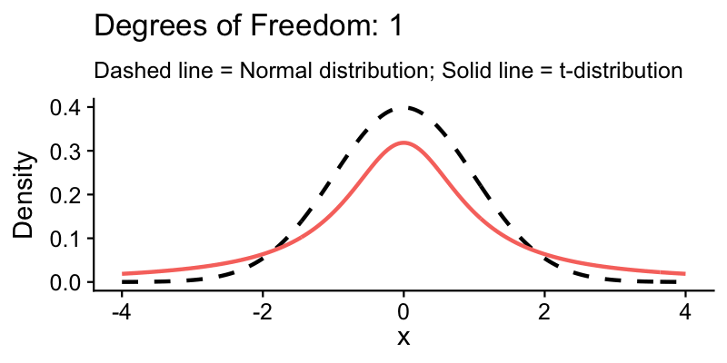

```{r setup, include=FALSE}
pacman::p_load(tidyverse, gt, gganimate, cowplot)
theme_set(theme_cowplot())
```

# Last week

## Key concepts we covered

- [ ] **Population vs. sample**: the complete set vs. the subset we measure
- [ ] **Parameters** ($\mu$, $\sigma$) vs. **statistics** ($\bar{x}$, $s$)
- [ ] **Central tendency and spread**: mean, variance, standard deviation
- [ ] **Standard error**: how precisely we estimate the mean — decreases with larger samples
- [ ] **Confidence intervals** -- we will build on last week's introduction today

# Today

## By the end of today

1. Calculate and interpret confidence intervals for a population mean
2. Compare simple random and stratified random sampling designs
3. Determine how to estimate change over time using monitoring data

# Observational studies

## Overview

:::: columns
::: {.column width="50%"}
### Observational study
- We **measure** the world as it is
- Can show **association**, not causation
- E.g. surveys, monitoring studies
:::
::: {.column width="50%"}
### Controlled experiment
- We **manipulate** conditions
- Can establish **causation**
- E.g. clinical trials, field experiments
:::
::::

We focus on observational studies this week to understand how sampling studies work in practice.


## Observational studies: two common types

We do not manipulate anything — we measure what is already there.

::: {.fragment}
:::: columns
::: {.column width="50%"}
### Surveys
- A snapshot at one point in time
- Estimate a statistic (e.g. mean)
- *Measuring species richness in a forest*
:::
::: {.column width="50%"}
### Monitoring studies
- Multiple snapshots over time
- Estimate a **change** in a statistic
- *Measuring species richness **before and after a fire***
:::
::::
:::

## Sampling designs

A sampling design specifies the rules for how we select units from a population. There are several approaches — here are two common ones.

### 1. Simple random sampling
- Each unit has an equal chance of being selected.
- **Randomly sample units from the entire population.**
- *Like putting all names in a hat and drawing some out randomly.*


## Sampling designs

A sampling design specifies the rules for how we select units from a population. There are several approaches — here are two common ones.

### 2. Stratified random sampling
- The population is first divided into *strata* (groups with similar characteristics).
- **Randomly sample units within each stratum using simple random sampling.**
- *Like separating students by year level, then randomly selecting some from each year.*


## What is "random" sampling?

::: fragment
Random does **not** mean haphazard or arbitrary. In statistics, random sampling means every unit in the population has a known, non-zero chance of being selected.
:::

::: {.fragment .fade-up}
### So what makes a sample truly "random"?
:::

::: fragment
Within a population, **all** units must have a probability greater than zero of being selected — that is, nothing can be excluded by design.

- For **simple random sampling**, this probability is **equal** for every unit.
- We call this probability the **inclusion probability**.
:::

## How do we achieve random sampling?

::: fragment
Random sampling requires a formal procedure — not just picking samples that "feel" representative.
:::

::: fragment
### Tools for random selection
- **Random number generator** -- for example, R's `sample()` function
- **Random number table** -- a pre-generated list of random digits
- The selection method must be **reproducible** and **unbiased**
:::


# Interpreting sampled data


## How much should we trust an estimate?

Two studies both report a mean soil carbon of 67 t/ha. One measured 5 sites, the other 500.

::: fragment
Should we trust them equally?
:::

::: fragment

### The problem of a *single* estimate
A single number on its own does not tell us anything about uncertainty. We need a way to combine our estimate with how precise it is — and that is what confidence intervals do.
:::

# Confidence intervals


## Combining an estimate with its precision

A **confidence interval (CI)** gives us a range of plausible values for the population parameter — not just a single best guess.

It combines three things:

1. Our estimate (the sample mean)
2. How precise that estimate is (the standard error)
3. How confident we want to be (the critical value)

## Calculating confidence intervals

### The three ingredients, formally

1. [**Sample mean** ($\bar{x}$)]{style="color: #e64626;"} — our estimate of the population parameter

2. [**Standard error of the mean** ($SE_{\bar{x}} = s / \sqrt{n}$)]{style="color: #e64626;"} — how precise that estimate is

3. [**Critical value** ($t_{n-1}$)]{style="color: #e64626;"} — from the *t*-distribution at our chosen confidence level (e.g. 95%). We use *t* rather than the normal distribution because we estimate $\sigma$ from the sample.

## CI formula

These three ingredients combine into:

$$
\bar{x} \pm \left(t_{n-1} \times \frac{s}{\sqrt{n}}\right)
$$

The $t_{n-1} \times SE_{\bar{x}}$ part is the **margin of error** — the "plus or minus" value you often see in survey results (±3%).

::: fragment
To use this formula, we need to understand two things: **degrees of freedom** and the ***t*-distribution**.
:::

## Degrees of freedom

The number of values in a sample that are free to vary while still maintaining the same statistic.

$$
\text{df} = n - 1
$$

where $n$ is the sample size.

::: fragment
### Example
Imagine you have 4 numbers with a mean of 5:

- You can freely choose the first three numbers: 3, 10, and 7
- But the fourth number MUST be 0 to make the mean equal 5
  - (3 + 10 + 7 + 0) ÷ 4 = 5
- So only 3 numbers ($n - 1$) can be freely chosen = 3 degrees of freedom
:::

## The *t*-distribution and critical value

The *t*-distribution accounts for uncertainty when estimating from small samples. It looks like the normal "bell curve" but with **heavier tails** — more probability in the extremes.

- With few samples (small $n$), the *t*-distribution is wider (more uncertainty)
- As sample size increases, it approaches the normal distribution
- The **critical value** $t_{n-1}$ comes from this distribution and determines how wide the CI is

## The *t*-distribution in action

{fig-align="center"}

```{r}
#| code-fold: true
#| eval: false
#| code-summary: "Code used to generate the animation above"

anim_speed <- 1
x <- seq(-4, 4, length.out = 400)
dfs <- c(1:5, seq(6, 30, by = 2))

t_curves <- do.call(rbind, lapply(dfs, function(df) {
    data.frame(x = x, density = dt(x, df), df = df)
}))

normal_curve <- data.frame(x = x, density = dnorm(x))

p <- ggplot() +
    geom_line(
        data = normal_curve, aes(x = x, y = density),
        color = "black", linetype = "dashed", linewidth = 1
    ) +
    geom_line(
        data = t_curves, aes(x = x, y = density, color = factor(df)),
        linewidth = 1
    ) +
    labs(
        title = "Degrees of Freedom: {closest_state}",
        x = "x", y = "Density",
        subtitle = "Dashed = Normal distribution; Solid = t-distribution"
    ) +
    theme(legend.position = "none") +
    transition_states(states = df, transition_length = anim_speed, state_length = anim_speed)

anim_save("images/t-distribution.gif", p, width = 800, height = 400, res = 150)
```

## Step-by-step calculation

$$
\bar{x} \pm \left(t_{n-1} \times \frac{s}{\sqrt{n}}\right)
$$

::: incremental
1. Calculate the sample mean, $\bar{x}$
2. Calculate the sample standard deviation, $s$
3. Determine the standard error of the mean, $SE_{\bar{x}} = \frac{s}{\sqrt{n}}$
4. Look up the *t*-critical value, $t_{n-1}$, for 95% confidence and $n - 1$ degrees of freedom
5. Compute the margin of error: $\text{ME} = t_{n-1} \times SE_{\bar{x}}$
6. The 95% CI is: $\bar{x} \pm \text{ME}$
:::

::: fragment
**You need to be able to calculate this by hand or with a calculator.**
:::

## Interpreting confidence intervals

A confidence interval is like a fishing net:

- A wider net (interval) is more likely to catch the fish (true value)
- A spear (single point estimate) is *less* likely to catch the fish
- The net width represents our uncertainty about the true value

Of course, the true value does not move — it is our interval that shifts from sample to sample.

**Common misunderstanding**: A 95% CI does NOT mean there is a 95% chance the true value is inside the interval. It means that if you took 100 different samples and built 100 different CIs, about 95 of them would contain the true value.


# Data story: soil carbon
## Soil carbon


A farmer wants to estimate the average soil carbon across their property. Budget allows for only 7 sites, so we use simple random sampling.

The measurements: 48, 56, 90, 78, 86, 71, 42 t/ha.

```{r}
soil <- c(48, 56, 90, 78, 86, 71, 42)
soil
```

**What is the mean soil carbon content and how confident are we in this estimate?**

## Mean and 95% CI

::: incremental
1. Mean: $\bar{x} \approx 67.3$ t/ha
2. Standard error: $SE = s / \sqrt{n} \approx 7.12$ t/ha
3. *t*-critical value (df = 6): $t_{0.975,6} \approx 2.447$
4. 95% CI: $67.3 \pm (2.447 \times 7.12) = (49.87,\ 84.73)$ t/ha
:::

::: fragment
We report: **67.3 t/ha with a 95% CI of (49.87, 84.73).**

The interval is wide — about ±26% of the mean — so there is quite a bit of uncertainty in our estimate.
:::

## In R

```{r}
#| code-fold: false

mean_soil <- mean(soil)
se_soil <- sd(soil) / sqrt(length(soil))
t_crit <- qt(0.975, df = length(soil) - 1)
ci <- mean_soil + c(-1, 1) * (t_crit * se_soil)
ci
```

Most statistical functions in R already compute confidence intervals because of how central they are to inference. Understanding the manual calculation is still important — it is what these functions do behind the scenes.

::: {.callout-tip}
## R connection
`mean()`, `sd()`, and `qt()` are the key functions for CI calculations — you will use them in Lab 02.
:::

## Questions

- Our margin of error is about 17.43 t/ha. Is that precise enough?
- What drives CI width — sample size, variability, or both?
- **Can we do better with a smarter sampling design?**

# Break (10-15 minutes)
*When we return, we will explore stratified random sampling, and how dividing our sampling area into meaningful groups can improve our precision.*

## Thanks
This presentation is based on the [SOLES Quarto reveal.js template][soles-revealjs] and is licensed under a [Creative Commons Attribution 4.0 International License][cc-by] 


<!-- Links -->
[soles-revealjs]: https://github.com/usyd-soles-edu/soles-revealjs
[cc-by]: http://creativecommons.org/licenses/by/4.0/