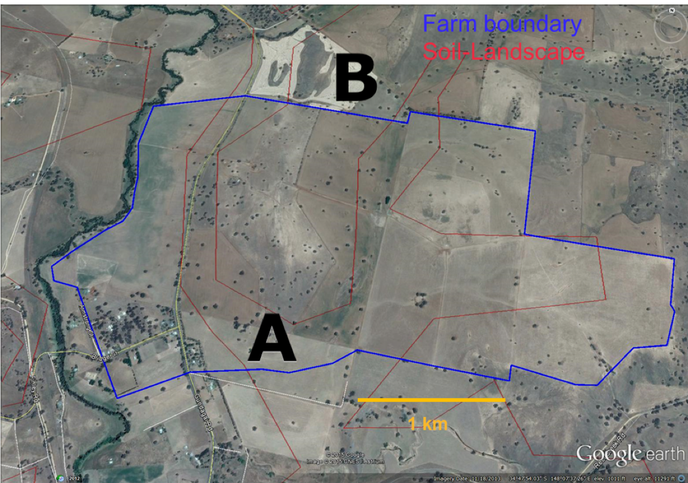

# Welcome back!

# In the last lecture...

::: incremental
- We learned about **simple random sampling**
- Each unit had an equal chance of being selected
- We calculated confidence intervals for population estimates
- We saw some limitations of this approach (not always representative)
:::


## Simple random sampling {auto-animate=true}


::: fragment
**Each unit has an equal chance of being selected.**
:::

::: fragment
### Not always the best approach, but still a good starting point.
:::


## Simple random sampling {auto-animate=true}
**Each unit has an equal chance of being selected.**

### Not always the best approach, but still a good starting point.

## Simple random sampling: potential problems

::: fragment
Imagine tossing 10 random points onto a landscape.
:::

::: fragment
### By pure chance...
- We might miss some important areas entirely
- Or sample some areas too much
:::

::: fragment
### This is more likely when:
- Sample size is small
- The landscape has distinct zones
:::


## Simple random sampling: theoretical example

::: fragment
If an area has:

- 80% grassland
- 20% wetland
:::

::: fragment
With simple random sampling:

- We expect ~8 samples in grassland, ~2 in wetland
- But by chance, we might get:
  - 10 grassland, 0 wetland! 
  - Or 6 grassland, 4 wetland
:::

::: fragment
### But what if we have more information about the population?
:::

## Soil carbon example

::: fragment
### Soil carbon
{width="50%"}
:::

::: fragment
### Different land types
- Land type A covers 62% of the area, land type B covers 38%
- With simple random sampling, we would expect more samples from Type A simply because it covers a larger area — but this is not guaranteed
- **Can we use this information to our advantage?**
:::


# ~~Simple~~ Stratified random sampling
## Stratified random sampling

### 3 steps

::: incremental
1. **Divide** the population into **homogeneous** subgroups (strata).
2. **Sample** from each stratum using simple random sampling.
3. **Pool** (or **combine**) the estimates from each stratum to get an overall population estimate.
:::

::: fragment
### Real-world example
If studying plant biodiversity in a national park:

- Step 1: Divide park into strata (e.g., forest, grassland, wetland)
- Step 2: Take random samples within each habitat type
- Step 3: Combine data to estimate overall biodiversity, giving proper weight to each habitat's area
:::

## Strata rules 

### Strata are...

::: incremental
- **Mutually exclusive and collectively exhaustive** (simple explanation: every sample belongs to exactly one stratum -- no overlaps, no leftovers)
- **Homogeneous** - Samples within a stratum should be similar to each other (less variable than the overall population)
- **Each stratum must be sampled** - The goal is to ensure every important group is represented
:::

::: fragment

:::

## Good vs. poor stratification choices

::: fragment
### Everyday examples

:::: {.columns}
::: {.column width="50%"}
#### Good strata
- **University students**: Undergrad, Masters, PhD
- **Forest types**: Deciduous, Coniferous, Mixed
- **Income levels**: Low, Medium, High
:::

::: {.column width="50%"}
#### Poor strata choices
- **Interests**: Sports fans, Music lovers, Foodies (a person can be in multiple groups)
- **Water quality**: Clean, Somewhat polluted (too subjective, not clearly defined)
:::
::::
:::
## Advantages

### We address:


- **Bias**. Each stratum is sampled, so the sample is representative of the population.
- **Accuracy**. Each stratum is represented by a minimum number of sampling units.
- **Insight**. We can compare strata and make inferences about the population.

:::fragment
### Does this make simple random sampling obsolete?

- **No**. *Still* a good technique.
- With large enough samples, the two methods will converge.
- Chance of *not* selecting a unit from a stratum is always there, but reduces as the sample size increases.

:::

# Stratified random sampling: estimates

## What are we trying to achieve with our calculations?

### The statistical journey

::: fragment
Once we have our stratified sample, we need to:

1. **Estimate the population central tendency**: Calculate the pooled mean
2. **Quantify our uncertainty**: Calculate the pooled standard error
3. **Create an inference tool**: Build a confidence interval
4. **Make decisions**: Compare estimates, test hypotheses

All of these steps must account for our stratified design.
:::


::: {.callout-note}
From here we use $\bar{y}$ rather than $\bar{x}$ for the sample mean — this is conventional in sampling design literature and helps distinguish stratified estimates from simple estimates.
:::

## The statistical workflow for stratified sampling

### Four key steps:

1. **Pooled Mean ($\bar{y}_{s}$)**: Sum of (stratum weight × stratum mean)
   - Best estimate of the population parameter

2. **Pooled Standard Error**: $$SE(\bar{y}_{s}) = \sqrt{\sum w_i^2 \times \frac{s_i^2}{n_i}}$$
   - Accounts for stratum weights and within-stratum variability

3. **t-Critical Value**: Based on $df = n - L$ and α = 0.05
   - Accounts for sample size in uncertainty estimates

4. **Confidence Interval**: $$\text{Pooled mean} \pm (t-\text{critical} \times SE(\bar{y}_{s}))$$
   - Range likely containing true population mean


## Accounting for strata using "weight"

### Weighted estimates

- We need to "weigh" the estimates from each stratum to account for the different stratum sizes and inclusion probabilities.
- Most of the time, we use the stratum size as the weight to calculate **weighted estimates**.
- The *overall* population estimate is the sum of the weighted estimates from each stratum, that is, we *pool the individual strata information into a single, overall population estimate*.

::: fragment
### Example
::: incremental

- A forest contains two types of trees: A and B, with 60% and 40% of the population, respectively.
- We want to estimate the **mean height** of the trees.
- Take **10** height measurements, of which 7 are randomly selected from type A and 3 are randomly selected from type B.
- The **pooled estimate** for the *mean height* of the trees is: $$0.6 \times \text{average height of A} + 0.4 \times \text{average height of B}$$
:::
:::

# Data story: soil carbon

## Soil carbon data

### Our case study

Soil carbon content was measured at 7 locations across the area. The amounts were:
48, 56, 90, 78, 86, 71, 42 tonnes per hectare (t/ha).

{width="60%"}

::: fragment
### Setting up the data in R

We know which land type each sample came from:

```{r}
#| code-fold: false
landA <- c(90, 78, 86, 71)  # stratum A samples (62% of the area)
landB <- c(48, 56, 42)      # stratum B samples (38% of the area) 
```
:::

## Pooled mean $\bar y_{s}$

> The pooled mean is our best estimate of the overall population mean, taking into account the different stratum sizes.

::: fragment
$$\bar{y}_{s} = \sum_{i=1}^L \bar{y}_i \times w_i$$

**In simple terms:**

- We calculate the mean for each stratum separately ($\bar{y}_i$)
- We multiply each stratum's mean by its weight ($w_i$)
- We add these weighted means together to get the overall pooled mean
:::

## Calculating pooled mean: soil carbon example

::: fragment
We first define the weights $w_i$ for each stratum based on their area:

```{r}
weight <- c(0.62, 0.38)  # 62% of area is land type A, 38% is land type B
```
:::

::: fragment
Then we calculate the weighted mean:

```{r}
weighted_mean <- mean(landA) * weight[1] + mean(landB) * weight[2]
weighted_mean
```

This is like saying: "62% of our land has soil carbon like land type A, and 38% has soil carbon like land type B, so our overall estimate takes both into account in these proportions."
:::

## Pooled standard error of the mean $SE(\bar y_{s})$

### The formula looks similar to a standard error...

$$SE(\bar y_{s}) = \sqrt{\color{blue}{{\sum_{i=1}^L w_i^2}} \times \frac{s_i^2}{n_i}}$$

::: {.callout-note}
### What is different?
- Instead of a single variance term, we use the sum of weighted variances from each stratum
- The $\color{blue}{w_i^2}$ term ensures we account for the relative size of each stratum
- Each stratum contributes its own variance ($s_i^2$) and sample size ($n_i$)
:::


## $t$-critical value
### Degrees of freedom $df$

$$df = n - L$$

where $n$ is the total number of samples and $L$ is the number of strata.

::: fragment
- The degrees of freedom tells us how much independent information we have for estimating uncertainty
- For stratified sampling, we lose one degree of freedom for each stratum mean we estimate
- **Example:** If we have 12 samples across 3 strata:
  - $df = 12 - 3 = 9$
  - We lose 3 degrees of freedom because we estimate one mean per stratum
:::

::: fragment
### In R
```{r}
df <- length(landA) + length(landB) - 2
t_crit <- qt(0.975, df)
t_crit
```

:::

## 95 % Confidence interval for stratified random sampling

### The formula
$$95\%\ CI = \bar y_{s} \pm t^{0.025}_{n-L} \times SE(\bar y_{s})$$

where $L$ is the number of strata, $n$ is the total number of samples, and $\bar y_{s}$ is the weighted mean of the strata. 

**In simple terms:**

::: incremental 
- We are creating a range where we are 95% confident the true population mean lies
- We start with our best estimate (the pooled mean $\bar y_{s}$)
- We add and subtract a "margin of error" (which depends on our sample size and variability)
- The margin of error = $t$-critical value × standard error
:::

### Visualising this:
```
Lower bound ← [Pooled mean - Margin of error] ... [Pooled mean + Margin of error] → Upper bound
```

## 95 % Confidence interval for stratified random sampling

### Putting it all together

```{r}
varA <- var(landA) / length(landA)  # variance of the mean for A
varB <- var(landB) / length(landB)  # variance of the mean for B
weighted_var <- weight[1]^2 * varA + weight[2]^2 * varB
weighted_se <- sqrt(weighted_var)
ci <- c(
  L95 = weighted_mean - t_crit * weighted_se,
  u95 = weighted_mean + t_crit * weighted_se
)
ci
```

# Comparison


## Simple random vs. stratified random sampling

What if we had used stratified random sampling instead of simple random sampling (and collected the same amount of data)?

### What differences can you see?

```{r}
#| code-fold: true

library(tidyverse)
# Manually printing the results below as SRS data is in previous lecture
compare <- tibble(
  Design = c("Simple Random", "Stratified Random"),
  Mean = c(67.29, 68.9), 
  `Var (mean)` = c(50.83, 9.30),
  L95 = c(49.85, 61), 
  U95 = c(84.73, 76.7), 
  df = c(6, 5))
knitr::kable(compare)

```

## Visual comparison of 95% confidence intervals

```{r}
#| code-fold: true
#| fig-height: 4
#| fig-width: 10
#| fig-align: center

# Creating a visual comparison of confidence intervals
ggplot(compare, aes(x = Design, y = Mean)) +
  geom_point(size = 3) +
  geom_errorbar(aes(ymin = L95, ymax = U95), width = 0.2, linewidth = 1) +
  labs(title = "95% Confidence Intervals by Sampling Design",
       y = "Soil Carbon (tonnes/ha)",
       x = "") +
  theme_minimal(base_size = 14) +
  annotate("text", x = 2, y = 55, 
           label = "Stratified sampling gives a\nnarrower confidence interval\n(more precise estimate)", 
           color = "blue")
```


::: fragment
### Key insights:
- Both methods give similar estimates of the mean
- Stratified sampling produces a much narrower confidence interval
- The variance of the mean is about 5 times smaller with stratified sampling
- This means stratified sampling is much more precise with the same number of samples
:::

## Efficiency

### What is sampling efficiency?
- A measure of how much "bang for your buck" you get with different sampling methods
- Calculated as a ratio:
  $$\text{Efficiency} = \frac{\text{Variance of SRS}}{\text{Variance of Stratified}}$$

::: fragment
### In simple terms:
- Efficiency > 1: Stratified sampling is better (more precise with same sample size)
- Efficiency = 5 means: You'd need 5 times as many samples with simple random sampling to get the same precision as stratified sampling
:::

::: fragment
### In R

```{r}
efficiency <- 50.83 / 9.30
efficiency
```

How many samples would we have had to collect using simple random sampling to achieve the same precision as our stratified sample?

```{r}
round(7 * efficiency, 0)
```
So we would need about 38 samples with simple random sampling to get the same precision that we achieved with just 7 samples using stratified sampling!
:::

## Tips on implementation

- The most difficult part is to **identify** the strata and **assign** the sampling units to the strata
- Common stratification variables in environmental science:
  - **Spatial**: elevation bands, soil types, vegetation zones
  - **Temporal**: seasons, time of day, growth stages
  - **Management**: treatment types, land-use history
- **Strata sampling size**: allocate samples to strata based on the size of the strata, either proportional to:
  - the size of the strata (e.g. 60% of area = 60% of samples)
  - the variance of the strata (more samples where variation is higher)
  
# Monitoring
What if we come back and do another set of soil carbon measurements?

## The change in mean $\Delta \bar y$

### Important considerations

::: incremental
- We want to measure change in soil carbon over time
- Key question: **How do we select sites for the second measurement?**
  1. Return to the **same sites**?
  2. Select completely **new sites**?
- This choice affects our statistical analysis (covariance)
:::


## Monitoring estimates

### Change in mean $\Delta \bar y$

> The difference between the means of the two sets of measurements.

$$\Delta \bar y = \bar y_2 - \bar y_1$$

where $\bar y_2$ and $\bar y_1$ are the means of the second and first set of measurements, respectively.

## Uncertainty in change estimates

::: fragment
### Variance *of the change in mean* $Var(\Delta{\bar y})$

This tells us how precise our estimate of the change is. It depends on:

$$Var(\Delta{\bar y}) = Var(\bar y_2) + Var(\bar y_1) - 2 \times Cov(\bar y_2, \bar y_1)$$

**In simple terms:**

- The uncertainty in our change estimate comes from the uncertainties in both measurements
- However, if we sample the same sites twice, they are related to each other (covariance — we will define this shortly)
- This relationship usually reduces the overall uncertainty in our change estimate
:::

::: fragment
**Important:** Visiting the same sites twice (paired sampling) usually gives more precise estimates of change than visiting different sites each time!
:::

## Covariance and site selection

### Quick decision guide

1. **Same sites?** Use paired approach:
   - Sites are the same in both visits
   - Use paired t-test
   - Account for covariance between visits

2. **Different sites?** Use independent approach:
   - New random sites in second visit
   - Use two-sample t-test
   - No covariance between visits

## What is covariance?

::: fragment
Covariance measures how two measurements relate to each other:

**Example with soil carbon:**

- Site 1: First visit = 90 t/ha, Second visit = 95 t/ha
- Site 2: First visit = 48 t/ha, Second visit = 52 t/ha
- Site 3: First visit = 71 t/ha, Second visit = 75 t/ha
:::

::: fragment
**What do you notice?** Sites with high carbon in the first measurement still have high carbon in the second measurement (positive covariance).

**Why this matters:** Knowing the first measurement helps us predict the second one, reducing uncertainty in our estimate of change.
:::

::: fragment
**Practical takeaway:** When measuring change over time, returning to the same sites usually gives more precise results because it removes site-to-site variation.
:::

## Calculating the 95% CI for the change in mean

### The formula looks similar to before:
$$95\%\ CI = \Delta \bar y \pm t^{0.025}_{n-1} \times SE(\Delta \bar y)$$

::: fragment
### In plain language:
- We have our best estimate of the change (the difference between the two means)
- We add and subtract a margin of error to create a range
- We are 95% confident that the true change falls within this range
:::

::: fragment
### The standard error of the change $SE(\Delta \bar y)$
- This tells us how precise our estimate of the change is
- It is complicated to calculate by hand, especially when we visit the same sites twice
- If we visit the same sites twice, we need to account for their relationship (covariance)
:::

::: fragment
**Good news!** You do not need to calculate this by hand.

- R handles these calculations using the `t.test()` function
- For same sites: use `paired = TRUE`
- For different sites: use `paired = FALSE`
:::

::: {.callout-tip}
## R connection
`t.test()` with `paired = TRUE` performs a paired *t*-test — you will use this in Lab 02 to analyse monitoring data.
:::


## Thanks!
### Questions?
This presentation is based on the [SOLES Quarto reveal.js template](https://github.com/usyd-soles-edu/soles-revealjs) and is licensed under a [Creative Commons Attribution 4.0 International License][cc-by].

[cc-by]: http://creativecommons.org/licenses/by/4.0/
