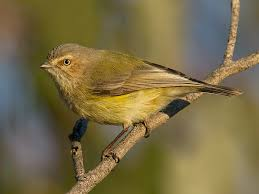

```{r setup, include=FALSE}
knitr::opts_chunk$set(echo = TRUE, message = FALSE, warning = FALSE)
```

# Dissimilarity Matrices and Hierarchical Clustering

In this tutorial we will use bird assemblage data from Mac Nally's forest and woodland bird study.

Mac Nally (1989) examined forest and woodland birds along a broad environmental gradient in south-eastern Australia. The paper focused on habitat breadth, habitat position and abundance, but the same dataset is also useful for exploring whether sites with similar bird assemblages cluster together.



Here, each row is a **site**, and each bird species column contains an abundance or density estimate for that species at that site.

We will use hierarchical clustering to ask:

> Which sites have similar bird communities?

---

## Load packages

We need the `vegan` package because it contains the `vegdist()` function for ecological dissimilarity matrices.

```{r}
library(vegan)
```

---

## Load the data

The file `macnally.csv` contains the bird assemblage data.


If your file is in the same folder as this Quarto document use this :

```{r}
macnally <- read.csv("data/macnally.csv", row.names = 1)
```

---

## Examine the structure of the data

```{r}
str(macnally)
```

The first columns describe the site or habitat type. The remaining columns are bird species abundances.

```{r}
ncol(macnally)
nrow(macnally)
```

---

## Separate site information from species data

The `HABITAT` column describes the broad habitat category. The bird species data begin after the habitat column.

```{r}
site_info <- macnally[, 1, drop = FALSE]
species_data <- macnally[, 2:ncol(macnally)]

head(site_info)
head(species_data[, 1:6])
```

Check that the species data are numeric:

```{r}
species_data <- as.data.frame(lapply(species_data, as.numeric))
rownames(species_data) <- rownames(macnally)
```

---

# Bray-Curtis Dissimilarity

## Calculate Bray-Curtis dissimilarity

Bray-Curtis dissimilarity is commonly used for ecological community data because it compares sites using species abundances.

Values range from:

- **0** = sites have identical assemblages
- **1** = sites share no species in common

```{r}
Braydistance <- vegdist(species_data, method = "bray")
Braydistance
```

---

# Hierarchical Clustering

## Run hierarchical clustering

We will use UPGMA clustering, which is specified by `method = "average"` in `hclust()`.

```{r}
hc <- hclust(Braydistance, method = "average")
hc
```

---

## Plot the dendrogram

```{r}
plot(hc)
```

The dendrogram shows how sites are progressively joined into clusters.

Sites joined low on the dendrogram are more similar. Sites joined high on the dendrogram are more different.

---

## Improved dendrogram with labels

```{r}
plot(hc,
     las = 1,
     main = "Hierarchical clustering of bird assemblages",
     xlab = "Site",
     ylab = "Bray-Curtis dissimilarity")
```

---

## Add cluster rectangles

We can draw rectangles around possible cluster solutions.

```{r}
plot(hc,
     las = 1,
     main = "Cluster diagram of bird assemblages",
     xlab = "Site",
     ylab = "Bray-Curtis dissimilarity")

rect.hclust(hc, k = 2, border = "red")
rect.hclust(hc, k = 5, border = "darkgreen")
```

The rectangles show possible groupings:

- **Red rectangles** = 2 broad clusters
- **Green rectangles** = 5 finer clusters

There is no single correct number of clusters. The appropriate choice depends on the ecological question.

---

# Extracting Cluster Membership

## Cut the tree into clusters

Cut the tree into 5 clusters:

```{r}
clusters5 <- cutree(hc, k = 5)
clusters5
```

Add the cluster identity back to the site information:

```{r}
cluster_summary <- data.frame(
  Site = rownames(macnally),
  Habitat = macnally$HABITAT,
  Cluster = clusters5
)

cluster_summary
```

---

## How many sites are in each cluster?

```{r}
table(cluster_summary$Cluster)
```

---

## Do clusters correspond to habitat types?

```{r}
table(cluster_summary$Habitat, cluster_summary$Cluster)
```

This table helps us ask whether bird assemblage clusters correspond to habitat categories.

If sites from the same habitat type mostly fall into the same cluster, then bird communities are strongly structured by habitat.

If habitat types are spread across several clusters, then bird assemblages may be influenced by other factors as well.

---

# Optional: Compare Clustering Methods

## Single linkage

```{r}
hc_single <- hclust(Braydistance, method = "single")

plot(hc_single,
     las = 1,
     main = "Single linkage clustering",
     xlab = "Site",
     ylab = "Bray-Curtis dissimilarity")
```

Single linkage can produce chaining, where sites are joined one at a time into long strings.

---

## Complete linkage

```{r}
hc_complete <- hclust(Braydistance, method = "complete")

plot(hc_complete,
     las = 1,
     main = "Complete linkage clustering",
     xlab = "Site",
     ylab = "Bray-Curtis dissimilarity")
```

Complete linkage tends to produce more compact clusters.

---

## Average linkage

```{r}
hc_average <- hclust(Braydistance, method = "average")

plot(hc_average,
     las = 1,
     main = "Average linkage clustering / UPGMA",
     xlab = "Site",
     ylab = "Bray-Curtis dissimilarity")
```

Average linkage is often a useful compromise and is commonly used in ecological community analysis.

---

# Student Questions

## Question 1

What does Bray-Curtis dissimilarity measure in this analysis?

### Answer guide

It measures how different two sites are in their bird assemblages, based on species abundances.

A value near 0 means sites are very similar. A value near 1 means sites are very different.

---

## Question 2

What does it mean when two sites join low on the dendrogram?

### Answer guide

They have similar bird assemblages.

The lower the joining point, the smaller the dissimilarity between the sites.

---

## Question 3

Why might we compare 2-cluster and 5-cluster solutions?

### Answer guide

A 2-cluster solution shows very broad differences among sites.

A 5-cluster solution shows finer ecological structure.

The best level depends on whether we want a broad or detailed interpretation.

---

## Question 4

Why might clusters not perfectly match habitat categories?

### Answer guide

Bird assemblages may respond to more than broad habitat type.

They may also be influenced by vegetation structure, geographic location, resource availability, disturbance, or species interactions.

---

# Key Take-home Message

Hierarchical clustering groups sites according to similarity in bird assemblages.

For the Mac Nally bird data, this lets us explore whether woodland and forest sites form distinct community types.

The method does not tell us the “true” number of ecological groups. Instead, it gives a visual and quantitative way to explore patterns in community composition.
